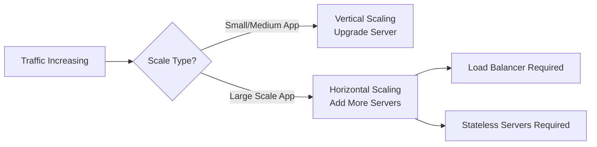

# ⚡ Scaling

Scaling is the ability of a system to handle increasing load.

## Topics

| File | Description |
|------|-------------|
| [Vertical Scaling](./vertical-scaling.md) | Upgrading a single server's resources (Scale Up) |
| [Horizontal Scaling](./horizontal-scaling.md) | Adding more servers to distribute load (Scale Out) |
| [Stateless Servers](./stateless-servers.md) | Designing servers without session state |

---

## Quick Comparison

---

## When to Use What

| Scenario | Recommendation |
|----------|---------------|
| MVP / Internal Tool | Vertical Scaling |
| E-commerce / Social Media | Horizontal Scaling |
| Millions of users | Horizontal + Stateless |
