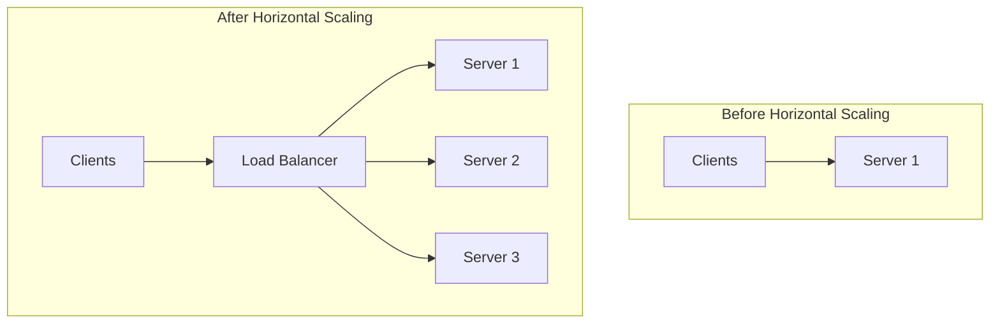
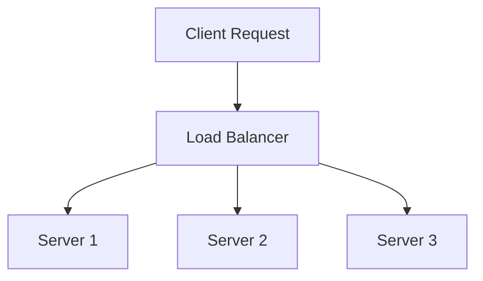
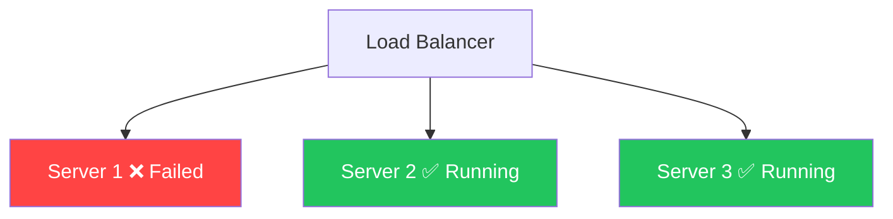
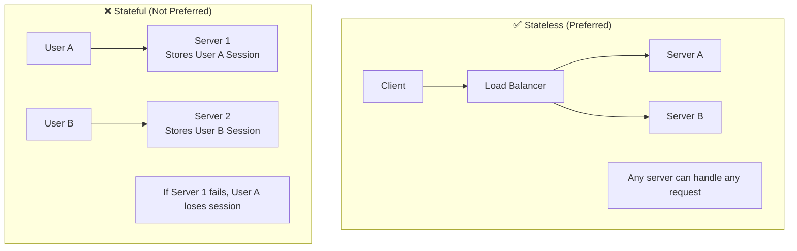

# ↔️ Horizontal Scaling (Scale Out)

**Horizontal Scaling (Scale Out)** is the process of increasing the number of servers to handle more traffic and workload.

Instead of upgrading a single server, we **add multiple servers** and distribute requests among them.

---

## How is Horizontal Scaling Done?

New servers are added to the existing infrastructure and a **Load Balancer** routes traffic across all servers.

Instead of making **Server 1** more powerful, we add **Server 2** and **Server 3**.

---

## Why Do We Need Horizontal Scaling?

When a single server reaches its hardware limit, adding more CPU or RAM is no longer sufficient.

Instead, we distribute traffic across multiple servers to:

- Handle more concurrent users
- Increase system capacity
- Improve availability
- Improve fault tolerance

---

## What is a Load Balancer?

A **Load Balancer** sits between clients and servers. Its job is to distribute incoming requests across multiple servers.

Without a Load Balancer, one server may become overloaded while others remain idle.

---

## ✅ Advantages

### 1. Almost Unlimited Scalability

If traffic increases, simply add more servers.

### 2. High Availability

If one server fails, other servers continue serving requests. The application remains available.

### 3. Fault Tolerance
Failure of one server does not bring down the entire system. Traffic is automatically routed to healthy servers.

### 4. Better Performance
Requests are divided among multiple servers, reducing the load on each server.

| 1 Server | 3 Servers (Distributed) |
|----------|--------------------------|
| 3000 req/sec | Server1: 1000 req/sec |
| | Server2: 1000 req/sec |
| | Server3: 1000 req/sec |

### 5. Zero/Minimal Downtime
Servers can be added or removed without shutting down the application.

---

## ❌ Disadvantages

| Disadvantage | Description |
|--------------|-------------|
| **Complex Architecture** | Requires Load Balancer, Health Checks, Monitoring, Auto Scaling |
| **Higher Operational Complexity** | Managing multiple servers is difficult |
| **Data Consistency Challenges** | Keeping data synchronized across servers is hard |
| **Requires Stateless Apps** | Any server must handle any request |
| **Increased Cost** | More servers = higher compute/networking/maintenance costs |

---

## Stateless vs Stateful

**Stateless** — Every request is independent. Any server can handle any request.

**Stateful** — A user's session is stored on a specific server. If that server fails, the user's session is lost. Scaling and failover become difficult.

---

## 🕐 When to Use Horizontal Scaling

| ✅ Use Horizontal Scaling | ❌ Avoid Horizontal Scaling |
|--------------------------|----------------------------|
| High traffic applications | Small applications |
| Millions of users | MVPs |
| Cloud-native applications | Internal tools |
| Microservices | Low traffic systems |
| E-commerce platforms | Simple single-server apps |
| Social media platforms | |
| Streaming services | |

---

## Vertical vs Horizontal Scaling

| Feature | Vertical Scaling | Horizontal Scaling |
|---------|------------------|--------------------|
| Method | Upgrade existing server | Add more servers |
| Number of Servers | One | Multiple |
| Load Balancer | Not Required | Required |
| Scalability | Limited by hardware | Nearly unlimited |
| High Availability | No | Yes |
| Fault Tolerance | Low | High |
| Single Point of Failure | Yes | No (if designed correctly) |
| Downtime During Scaling | Usually Yes | Minimal or No |
| Complexity | Low | High |
| Best For | Small/Medium Applications | Large-scale Applications |

---

## 💡 30-Second Interview Answer

> **Horizontal Scaling (Scale Out)** is the process of adding multiple servers to distribute traffic and increase system capacity. A **Load Balancer** routes requests among the servers, improving scalability, availability, and fault tolerance. It is the preferred approach for large-scale distributed systems because it can handle increasing traffic by simply adding more servers.

---

## 🔑 Key Interview Points

- **Scale Out = Add more servers**
- Requires a **Load Balancer**
- Distributes requests across multiple servers
- Provides **High Availability**
- Provides **Fault Tolerance**
- Supports nearly unlimited scalability
- More complex than Vertical Scaling
- Preferred for large-scale systems like Netflix, Amazon, and Google
- Applications should ideally be **stateless**
- Foundation of modern distributed system design

---

## 🔗 Related Topics

- [Vertical Scaling](./vertical-scaling.md) — The simpler alternative
- [Stateless Servers](./stateless-servers.md) — Prerequisite for horizontal scaling
- [Load Balancer](../02-load-balancing/load-balancer.md) — Required component
