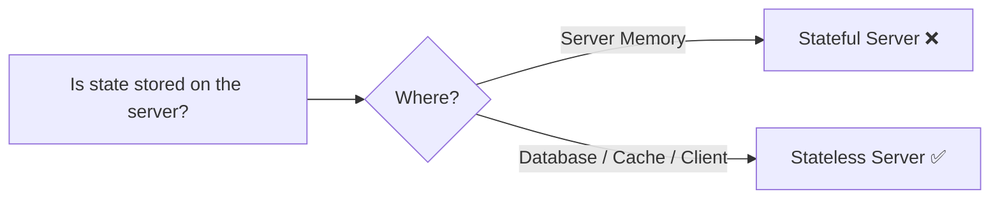
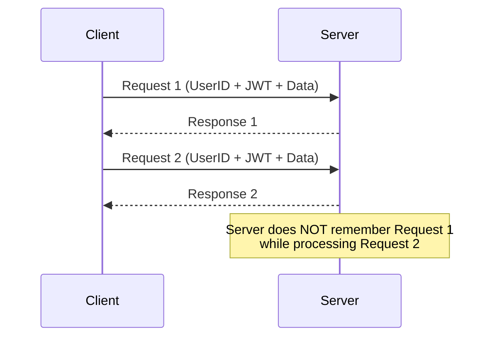
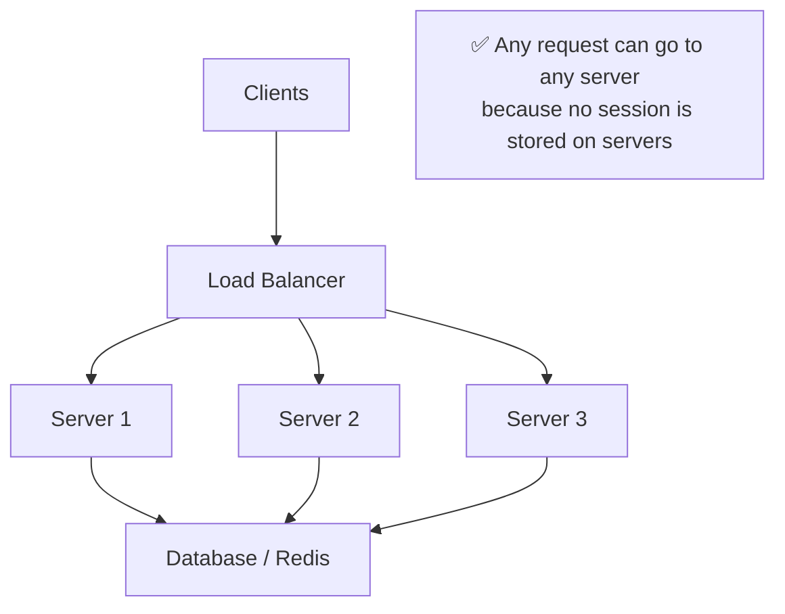
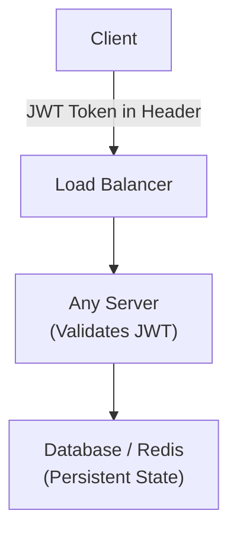

# 🔄 Stateless Servers

A **Stateless Server** is a server that **does not store any client-specific information (state)** between requests.

Every request contains all the information needed to process it.

**Each request is treated as a completely new request.**

---

## What is "State"?

**State** refers to any information about a user or previous requests that the server remembers.

Examples of state:
- User login session
- Shopping cart
- User preferences
- OTP verification status
- Game progress



---

## How Does a Stateless Server Work?

Every request contains everything the server needs — a JWT token carries the user's identity.



---

## Example

### Login Request

```
POST /login
Body: { username, password }

→ Server verifies credentials
→ Returns: JWT Token
```

### Fetch Profile

```
GET /profile
Authorization: Bearer <JWT>

→ Server validates JWT
→ Returns profile data
```

The server doesn't remember the user from the login request — it simply validates the JWT on each request.

---

## Why Do We Need Stateless Servers?

Stateless servers make **Horizontal Scaling** possible.



Since no server stores user-specific data:
- Request 1 → Server 1
- Request 2 → Server 3
- Request 3 → Server 2

Everything still works.

---

## Where is the State Stored?

Instead of storing state on the server, it is stored externally:



| Storage Type | Example | Used For |
|-------------|---------|----------|
| **Client** | JWT Token | Authentication |
| **Database** | PostgreSQL / MySQL | User data, orders |
| **Cache** | Redis | Sessions, frequently accessed data |

---

## ✅ Advantages

| Advantage | Description |
|-----------|-------------|
| **Easy Horizontal Scaling** | Any server can process any request |
| **High Availability** | If one server fails, another handles the next request |
| **Better Load Distribution** | Load Balancer can send requests to any available server |
| **Easy Deployment** | Servers can be added or removed without affecting users |
| **Fault Tolerance** | Server failure does not cause users to lose their session |

---

## ❌ Disadvantages

| Disadvantage | Description |
|--------------|-------------|
| **Extra Data Per Request** | Every request must include auth info (e.g. JWT), making requests slightly larger |
| **Repeated Authentication** | Server validates the token on every request — small overhead |
| **External Storage Required** | State must be stored in DB, Redis, or client |

---

## Stateless vs Stateful Comparison

| Feature | Stateless | Stateful |
|---------|-----------|----------|
| Stores user session | ❌ No | ✅ Yes |
| Horizontal Scaling | ✅ Easy | ❌ Difficult |
| Load Balancer | Can route to any server | May require sticky sessions |
| Server Failure | User unaffected | User session may be lost |
| Fault Tolerance | High | Lower |
| Preferred for Distributed Systems | ✅ Yes | ❌ No |

---

## Real-World Examples

Stateless services are commonly used in:

- **REST APIs**
- **Microservices**
- **Cloud-native applications**
- **Kubernetes deployments**
- **AWS Lambda functions**

---

## 💡 30-Second Interview Answer

> **A Stateless Server** is a server that does not store client-specific information between requests. Every request contains all the information needed to process it, allowing any server in the system to handle any request. This makes stateless servers ideal for horizontally scalable and highly available distributed systems.

---

## 🔑 Key Interview Points

- Does **not** store user session or request history
- Every request is independent
- Request contains **all required information** (JWT, headers, etc.)
- Works well with Load Balancers
- Enables **Horizontal Scaling**
- Improves **High Availability** and **Fault Tolerance**
- State is stored in a Database, Redis, or Client (JWT)
- Preferred architecture for modern distributed systems

---

## 🔗 Related Topics

- [Horizontal Scaling](./horizontal-scaling.md) — Requires stateless servers
- [Load Balancer](../02-load-balancing/load-balancer.md) — Works seamlessly with stateless servers
- [Caching Basics](../04-caching/caching-basics.md) — Redis as external session store
