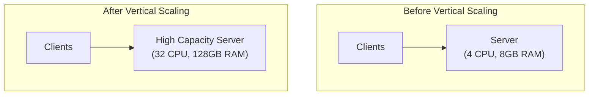
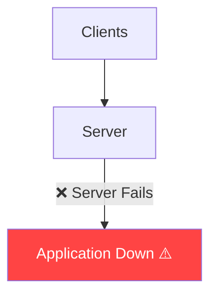

# ⬆️ Vertical Scaling (Scale Up)

**Vertical Scaling (Scale Up)** is the process of increasing the resources of an **existing server** to handle more traffic and workload.

Instead of adding more servers, we make the **same server more powerful**.

---

## How is Vertical Scaling Done?

The resources of the existing server are upgraded, such as:

- **CPU** — More cores
- **RAM** — More memory
- **Storage** — SSD → NVMe SSD
- **Network Bandwidth**

Only the server's hardware/resources are upgraded.

---

## Architecture

There is still only **one server**.

---

## Why Do We Need Vertical Scaling?

As the number of users increases, the server may experience:

- High CPU utilization
- High memory usage
- Slow disk operations
- Network bottlenecks

Instead of redesigning the architecture, we increase the server's capacity.

---

## ✅ Advantages

| Advantage | Description |
|-----------|-------------|
| **Simple to Implement** | No architectural changes required |
| **No Code Changes** | Application usually runs without modification |
| **Better Performance** | More CPU/RAM improves response time & throughput |
| **Easy to Manage** | Only one server needs monitoring |
| **No Load Balancer** | Single server receives all requests directly |

---

## ❌ Disadvantages

| Disadvantage | Description |
|--------------|-------------|
| **Hardware Limit** | Server can only be upgraded to its maximum supported capacity |
| **Single Point of Failure (SPOF)** | If the one server fails, entire app goes down |
| **Downtime** | Hardware upgrades often require server restart |
| **Expensive** | High-end enterprise servers become increasingly costly |
| **Limited Scalability** | Cannot scale beyond hardware limits |

### Single Point of Failure

---

## 🕐 When to Use Vertical Scaling

| ✅ Use Vertical Scaling | ❌ Avoid Vertical Scaling |
|------------------------|--------------------------|
| Small applications | Applications with millions of users |
| Medium-sized applications | Systems requiring high availability |
| Development/testing environments | Global applications |
| MVPs (Minimum Viable Products) | Applications requiring fault tolerance |
| Internal company tools | Very high traffic systems |
| Low to moderate traffic | |

---

## 💡 30-Second Interview Answer

> **Vertical Scaling (Scale Up)** is the process of increasing the computing resources (CPU, RAM, Storage, or Network Bandwidth) of an existing server to handle increased traffic. It is simple to implement and provides better performance but is limited by hardware capacity and introduces a Single Point of Failure (SPOF).

---

## 🔑 Key Interview Points

- **Scale Up = Upgrade the existing server**
- Only **one server** is used
- Increase CPU, RAM, Storage, or Network
- **No load balancer** required
- Minimal or no application code changes
- Easy to implement and manage
- Limited by hardware capacity
- **Single Point of Failure (SPOF)**
- Suitable for small to medium-scale applications
- Not suitable for internet-scale systems with millions of users

---

## 🔗 Related Topics

- [Horizontal Scaling](./horizontal-scaling.md) — The alternative approach
- [Load Balancer](../02-load-balancing/load-balancer.md) — Required for horizontal scaling
- [Stateless Servers](./stateless-servers.md) — Prerequisite for horizontal scaling
