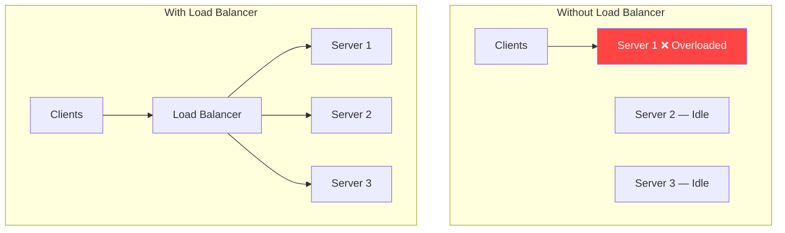
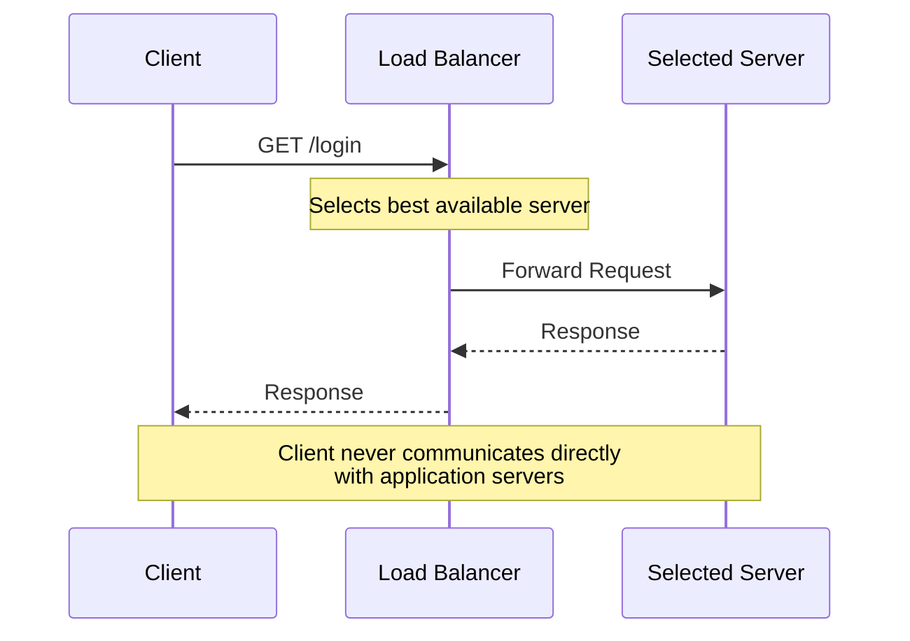
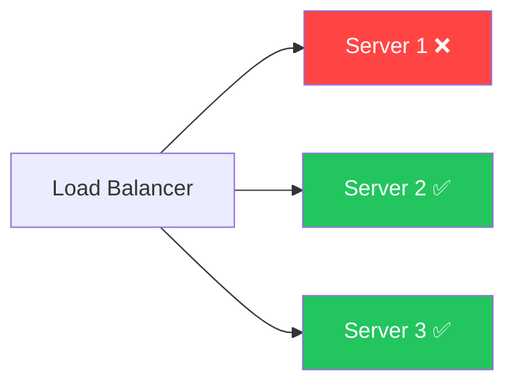
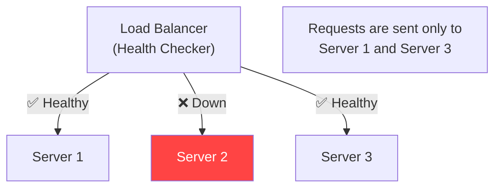
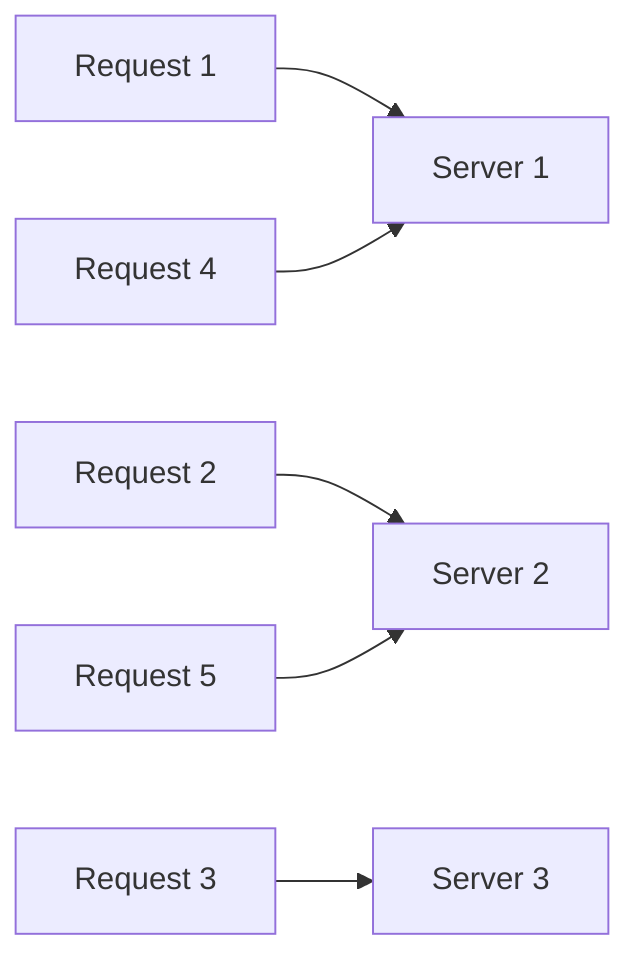
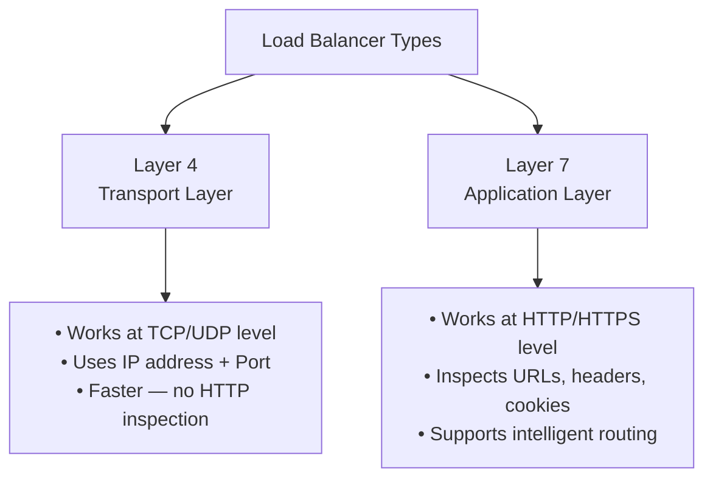
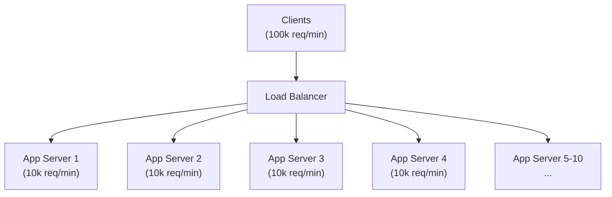

# ⚖️ Load Balancer

A **Load Balancer** is a component that sits between clients and servers and distributes incoming requests across multiple servers.

Its main goal is to ensure that **no single server becomes overloaded**.

---

## Why Do We Need a Load Balancer?



Without a Load Balancer, one server handles most requests while others remain underutilized.

---

## Responsibilities of a Load Balancer

- Distributes incoming requests
- Prevents server overload
- Improves availability
- Detects unhealthy servers (Health Checks)
- Routes traffic only to healthy servers
- Supports horizontal scaling

---

## How Does It Work?



---

## Benefits of Using a Load Balancer

### 1. Better Resource Utilization
Traffic is evenly distributed across servers.

### 2. High Availability



If one server fails, requests are routed to healthy servers. Users usually don't notice the failure.

### 3. Fault Tolerance
Failure of one server doesn't bring down the application.

### 4. Horizontal Scalability
New servers can be added easily. The Load Balancer automatically starts routing traffic to them.

### 5. Reduced Response Time
Traffic is shared among servers, reducing the load on each server.

---

## Health Checks

A Load Balancer continuously checks whether servers are healthy.



---

## Load Balancing Algorithms

### 1. Round Robin
Requests are distributed one after another in sequence.



✅ Simple and commonly used.

---

### 2. Least Connections
The server with the **fewest active connections** receives the next request.

| Server | Active Connections |
|--------|-------------------|
| Server 1 | 20 |
| Server 2 | **8** ← Next request goes here |
| Server 3 | 15 |

✅ Useful when request processing times vary.

---

### 3. Weighted Round Robin
Servers with higher capacity receive more requests.

| Server | Weight | Distribution |
|--------|--------|-------------|
| Server 1 | 3 | S1, S1, S1, S2, S2, S3 → repeat |
| Server 2 | 2 | |
| Server 3 | 1 | |

✅ Useful when servers have different hardware configurations.

---

### 4. IP Hash
The client's IP address determines which server handles the request.

```
User A (IP: 1.2.3.4) → hash → Server 2 (always)
User B (IP: 5.6.7.8) → hash → Server 1 (always)
```

✅ Useful for **session persistence** (sticky sessions).

---

## Types of Load Balancers



### Layer 4 (Transport Layer)
- Works at the **TCP/UDP** level
- Uses IP address and Port Number
- Faster because it doesn't inspect HTTP data

### Layer 7 (Application Layer)
- Works at the **HTTP/HTTPS** level
- Can inspect URLs, headers, cookies, and HTTP methods
- Supports intelligent routing (e.g., route `/api/` to API servers, `/static/` to CDN)

---

## Hardware vs Software Load Balancers

| Type | Hardware LB | Software LB |
|------|------------|-------------|
| Form | Physical networking device | Runs as software |
| Performance | Very high | High |
| Cost | Very expensive | Free/Cheap |
| Examples | F5 BIG-IP, Citrix ADC | Nginx, HAProxy, Envoy, Traefik |
| Used In | Traditional data centers | Cloud/modern deployments |

---

## Real-World Example

An e-commerce website receives **100,000 requests per minute**:



If one server crashes, traffic is automatically redirected to the remaining servers.

---

## 💡 30-Second Interview Answer

> A **Load Balancer** is a component that distributes incoming client requests across multiple application servers to prevent overload, improve availability, enable horizontal scaling, and ensure fault tolerance. It also performs health checks and routes traffic only to healthy servers.

---

## 🔑 Key Interview Points

- Sits **between clients and servers**
- Distributes incoming requests
- Prevents server overload
- Enables **Horizontal Scaling**
- Provides **High Availability**
- Improves **Fault Tolerance**
- Performs **Health Checks**
- **Common algorithms**: Round Robin, Least Connections, Weighted Round Robin, IP Hash
- **Layer 4** works with TCP/UDP; **Layer 7** works with HTTP/HTTPS
- Common software load balancers: **Nginx, HAProxy, Envoy**

---

## 🔗 Related Topics

- [Horizontal Scaling](../01-scaling/horizontal-scaling.md) — Requires a Load Balancer
- [Stateless Servers](../01-scaling/stateless-servers.md) — Works best with Load Balancers
- [Rate Limiting](../10-rate-limiting/rate-limiting-basics.md) — Often sits in front of load balancer
