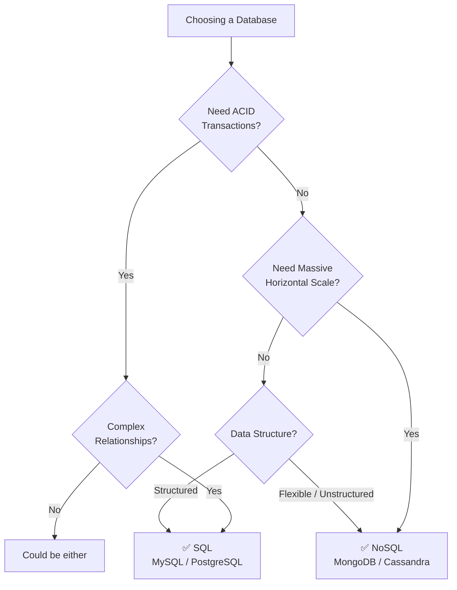

# 🗄️ Databases

A **database** is an organized collection of data that allows applications to **store, retrieve, update, and delete data efficiently**.

---

## Topics

| File | Description |
|------|-------------|
| [SQL vs NoSQL](./sql-vs-nosql.md) | Choosing the right database type |
| [ACID Properties](./acid-properties.md) | Transaction reliability guarantees |
| [Indexing](./indexing.md) | Speeding up queries with indexes |
| [Sharding](./sharding.md) | Splitting data horizontally |
| [Replication](./replication.md) | Copying data for availability |

---

## Quick Decision Guide

---

## ⭐ FAANG Quick Revision

**SQL**
- Relational Database
- Tables with rows & columns
- Primary Key & Foreign Key
- Fixed Schema
- Supports JOINs
- ACID compliant
- Vertical Scaling preferred
- Best for: Banking, Payments, Inventory

**NoSQL**
- Non-Relational
- Flexible Schema
- Horizontal Scaling
- Documents / Key-Value / Graph / Column
- Best for: Chat, Social Media, Product Catalogs
