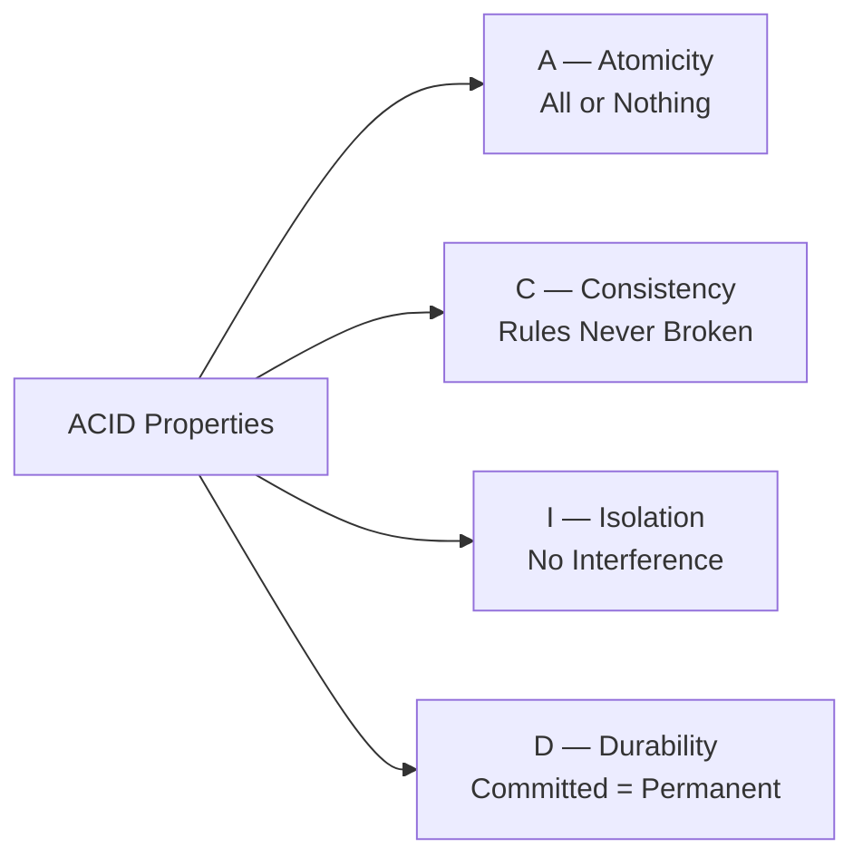
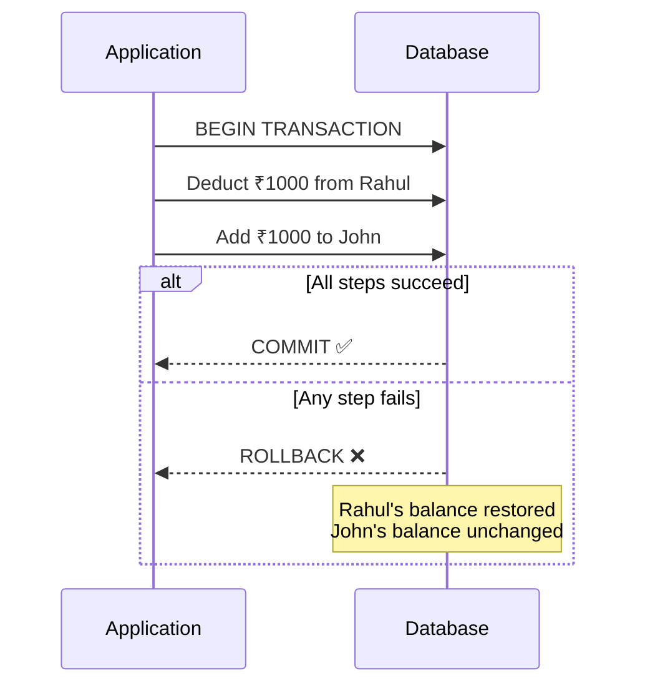
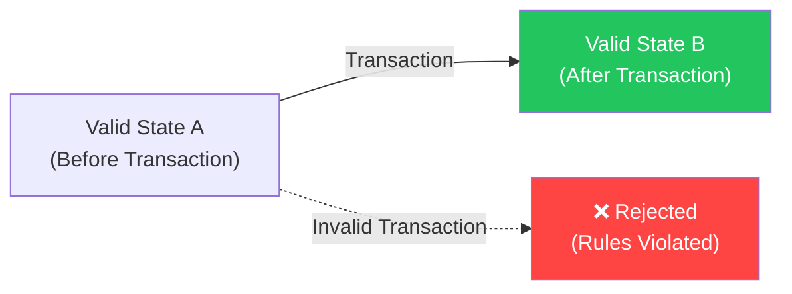
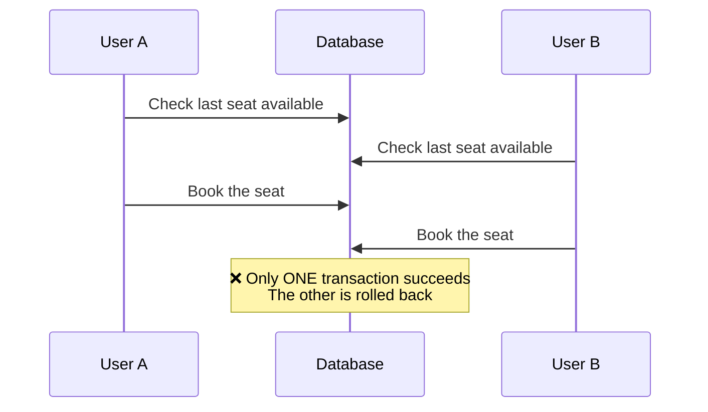
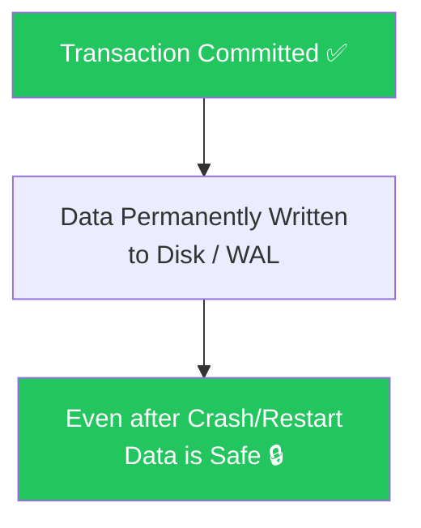

# 🔒 ACID Properties

ACID ensures database transactions are **reliable, consistent, and safe**, even during failures.

---

## Overview

---

## A — Atomicity (All or Nothing)

A transaction is treated as a **single unit**.

Either:
- ✅ Every operation succeeds, OR
- ❌ Everything is rolled back

### Example — Bank Transfer

**Memory Trick: All or Nothing**

---

## C — Consistency (Rules are Never Broken)

Every transaction must preserve database rules and constraints.

The database always moves from one **valid state** to another **valid state**.

### Examples of Consistency Rules

| Rule | Example |
|------|---------|
| Balance constraint | Account balance cannot become negative |
| Type constraint | Age column cannot store text |
| Uniqueness | Primary Key cannot be duplicated |
| Referential integrity | Foreign key must reference a valid row |

**Memory Trick: Rules are Never Broken**

---

## I — Isolation (Transactions Don't Interfere)

Multiple transactions executing simultaneously should behave as if they were executed **one after another**.

### Example — Movie Ticket Booking

Without isolation, both users might book the same last seat simultaneously.

**Memory Trick: Transactions Don't Interfere**

---

## D — Durability (Committed Data Never Disappears)

Once the database confirms `Transaction Successful`, the data is **permanently stored**.

Even if:
- Server crashes
- Power failure occurs
- Database restarts

The committed data remains safe.

**Memory Trick: Committed = Permanent**

---

## ACID Memory Trick Summary

| Property | Memory Trick | What It Means |
|----------|-------------|---------------|
| **Atomicity** | All or Nothing | Entire transaction succeeds or entire transaction rolls back |
| **Consistency** | Rules Never Broken | DB stays in a valid state before and after every transaction |
| **Isolation** | No Interference | Concurrent transactions behave as if sequential |
| **Durability** | Committed = Permanent | Committed data survives crashes and failures |

---

## Why Banks Prefer SQL (with ACID)

Banks use ACID-compliant SQL databases because they require:

- ✅ **Strong consistency** — Money must always be in exactly one account
- ✅ **Atomicity** — Transfers are all-or-nothing
- ✅ **Isolation** — Two transfers at the same time don't corrupt data
- ✅ **Durability** — Once a transaction is confirmed, it's permanent

---

## 💡 30-Second Interview Answer

> ACID properties ensure that database transactions are reliable. **Atomicity** means a transaction is all-or-nothing. **Consistency** ensures the database remains in a valid state. **Isolation** prevents concurrent transactions from interfering with each other. **Durability** guarantees that committed data survives system failures.

---

## 🔑 Key Interview Points

- **A — Atomicity**: All or Nothing — no partial updates
- **C — Consistency**: Rules are never violated — DB stays valid
- **I — Isolation**: Concurrent transactions don't see each other's intermediate states
- **D — Durability**: Committed data is permanent even after crashes
- SQL databases are **ACID-compliant** by default
- NoSQL databases often sacrifice ACID for performance (BASE model)
- Banks, payment systems, and airline bookings require ACID

---

## 🔗 Related Topics

- [SQL vs NoSQL](./sql-vs-nosql.md) — When ACID matters
- [Replication](./replication.md) — How durability is maintained across replicas
