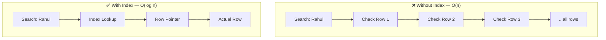
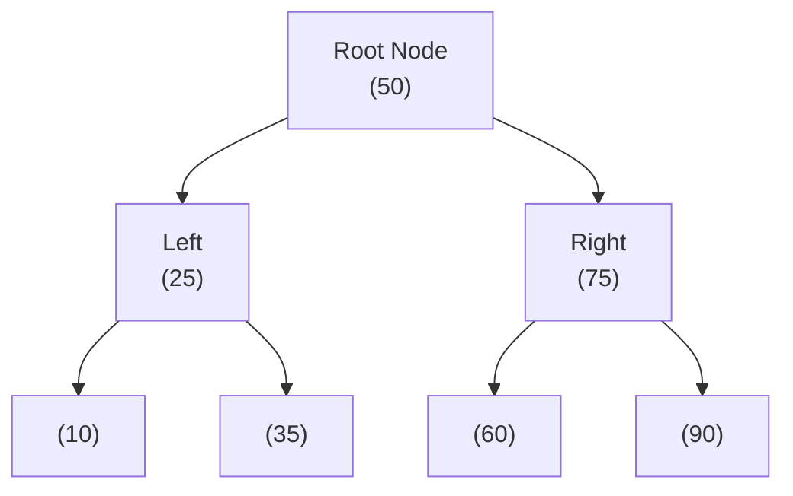
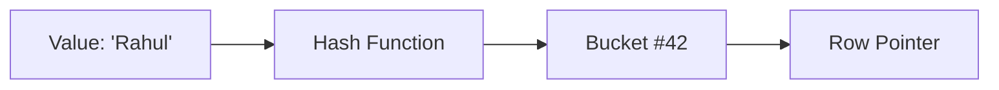
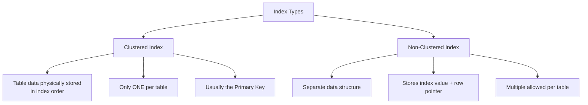
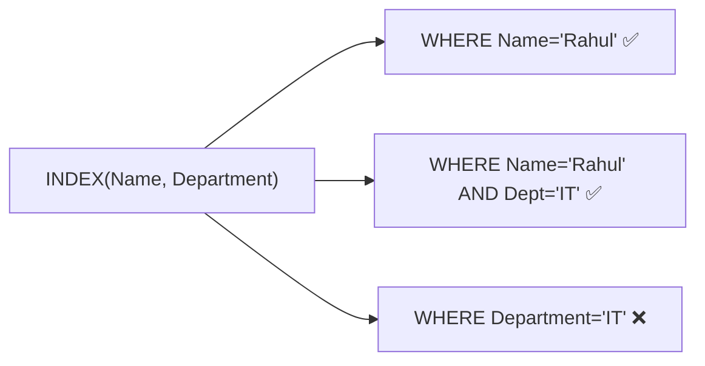

# 📑 Indexing

An index is a separate data structure that stores a **pointer to the actual row** alongside the indexed column value. It speeds up data retrieval and avoids a Full Table Scan.

---

## Why Do We Need Indexing?



| Without Index | With Index |
|--------------|-----------|
| Full Table Scan | Jumps directly to the row |
| O(n) time | O(log n) time (B-Tree) |
| Slow for large tables | Fast for large tables |

---

## Why INSERT is Slower With Indexes

Whenever data changes, **both** the table and the index must be updated.

```
INSERT / UPDATE / DELETE
    │
    ├── Update Table
    └── Update Index (all indexes that exist)
```

> **Rule:** More indexes = More write operations. Only index columns you frequently query.

---

## When to Create an Index

**✅ Good candidates for indexing:**
- Columns used in `WHERE` clauses
- Columns used in `JOIN` conditions
- Columns used in `ORDER BY`
- Columns used in `GROUP BY`
- High cardinality columns (many unique values): `email`, `userID`, `productID`

**❌ Avoid indexing:**
- Small tables (full scan is fast anyway)
- Frequently updated columns (index rebuilds often)
- Low cardinality columns: `gender` (M/F), `status` (active/inactive)

---

## B-Tree Index

The **default index** used by most SQL databases (MySQL, PostgreSQL, Oracle).



### Characteristics

| Property | Value |
|----------|-------|
| Structure | Balanced Tree |
| Search Time | O(log n) |
| Data Order | Sorted |

### Supports:
- `=` (equality)
- `<`, `>`, `<=`, `>=` (range queries)
- `BETWEEN`
- `ORDER BY`
- `LIKE 'abc%'` (prefix match)

---

## Hash Index

Uses a **Hash Function** to map values directly to row pointers.



### Characteristics

| Property | Value |
|----------|-------|
| Lookup | O(1) average |
| Search Type | Exact match only (`=`) |

### Does NOT support:
- Range queries (`<`, `>`, `BETWEEN`)
- `ORDER BY`
- `LIKE` prefix searches

### Why B-Tree is Preferred Over Hash Index?

B-Tree supports **both** exact searches **and** range/ordered queries, making it suitable for general-purpose indexing.

---

## Clustered vs Non-Clustered Index



| | Clustered Index | Non-Clustered Index |
|--|-----------------|---------------------|
| Storage | Data stored in index order | Separate from table data |
| Per Table | Only **1** | Multiple allowed |
| Speed | Fastest (data is co-located) | Slightly slower (extra lookup) |
| Example | Primary Key | Email, UserID, ProductID |

---

## Composite (Compound) Index

An index created on **multiple columns**.

```sql
CREATE INDEX idx_name_dept ON employees (Name, Department);
```

### Leftmost Prefix Rule

For `INDEX(A, B, C)`:

| Query | Uses Index? |
|-------|-------------|
| `WHERE A = ...` | ✅ Yes |
| `WHERE A = ... AND B = ...` | ✅ Yes |
| `WHERE A = ... AND B = ... AND C = ...` | ✅ Yes |
| `WHERE B = ...` | ❌ No (skips A) |
| `WHERE C = ...` | ❌ No (skips A, B) |
| `WHERE B = ... AND C = ...` | ❌ No (skips A) |



> **Rule:** The index is only effective if you include the **leftmost column** in your query.

---

## ⭐ FAANG One-Liners

| Concept | One-Liner |
|---------|-----------|
| **Index** | Speeds up reads but slows writes |
| **B-Tree** | Default SQL index; supports range queries and sorting |
| **Hash Index** | Best for exact-match lookups only |
| **Composite Index** | Multi-column index; follows Leftmost Prefix Rule |
| **Clustered Index** | Table data stored in index order; only one per table |

---

## 💡 30-Second Interview Answer

> An **index** is a data structure that stores column values with pointers to the actual table rows, allowing the database to find rows quickly without scanning the entire table. B-Tree indexes are the default and support both equality and range queries. Hash indexes are fast only for exact matches. Composite indexes follow the Leftmost Prefix Rule — they're effective only when the query includes the leading columns.

---

## 🔗 Related Topics

- [SQL vs NoSQL](./sql-vs-nosql.md) — Indexing context
- [Sharding](./sharding.md) — Scaling beyond a single database
- [Replication](./replication.md) — Indexes on replicas
