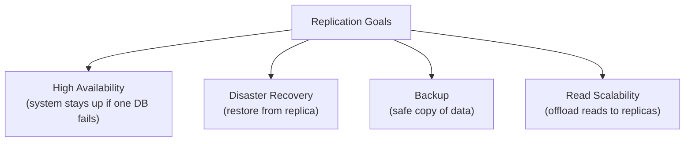
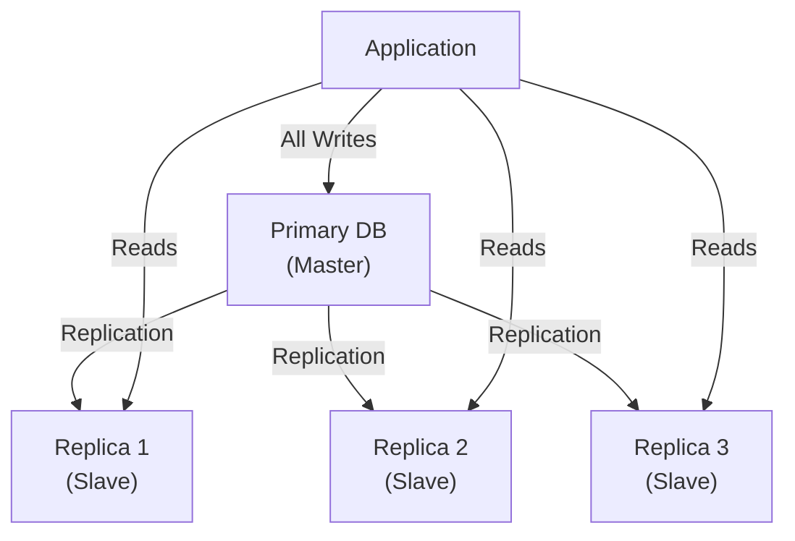
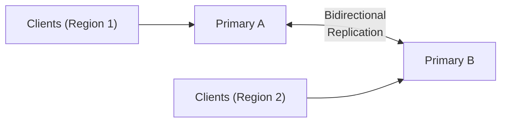
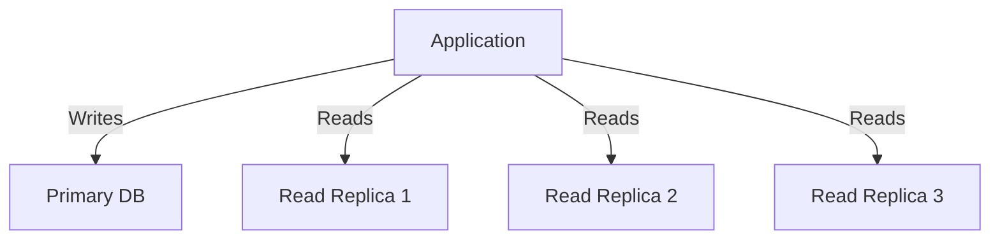
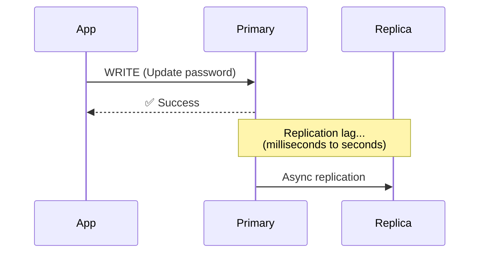
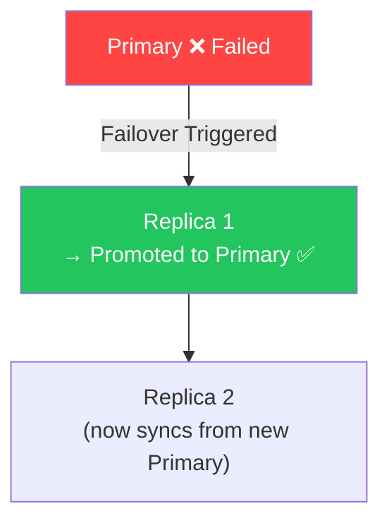

# 🔁 Replication

**Replication** is the process of keeping **multiple copies of the same database** across different servers.

> **Memory Trick:**
> - Replication = **Copy** Data
> - Sharding = **Split** Data

---

## Why Do We Need Replication?

---

## Primary-Replica (Master-Slave) Replication

The most common replication pattern.

| Role | Handles |
|------|---------|
| **Primary (Master)** | All writes (INSERT, UPDATE, DELETE) |
| **Replica (Slave)** | All reads (SELECT) |

### ✅ Advantages
- Reduces read load on Primary
- Improves availability
- Simple architecture
- No write conflicts

### ❌ Disadvantage
- If Primary fails, **writes stop** until failover completes
- Single point of failure for writes

---

## Master-Master Replication

Both databases handle **reads and writes**.

### ✅ Advantages
- Lower latency for global users (each region writes to its local DB)
- No single write location (higher write availability)

### ❌ Disadvantages
- **Write conflicts** — what if both primaries update the same row simultaneously?
- Complex conflict resolution logic
- Harder to maintain consistency

---

## Read Replicas

Specifically adding replicas to **offload read traffic** from the Primary.

**Best for read-heavy workloads:**
- Product search
- News feed
- User profiles
- Analytics reports

---

## Replication Lag

**Definition:** The delay between data being written to the Primary and it being available on a Replica.

**Causes of Lag:**
- Network latency
- Disk writes
- Processing time

**Problem:** Replica may return **stale (old) data** for a period after a write.

### When to Use Primary vs Replica

| Use Primary | Use Replica |
|------------|-------------|
| Login after password change | Product catalog |
| Payment confirmation | News feed |
| Bank balance check | Search results |
| Recent order status | User profiles |

---

## Failover

**Definition:** When the Primary fails, a Replica is promoted to become the new Primary.

**Types of Failover:**
- **Automatic Failover** — System detects failure and promotes replica automatically
- **Manual Failover** — An engineer manually promotes the replica

**After failover:**
- Old Primary usually rejoins as a Replica after recovery

---

## Comparison: Primary-Replica vs Master-Master

| Feature | Primary-Replica | Master-Master |
|---------|----------------|---------------|
| Write Nodes | 1 (Primary only) | Multiple |
| Read Nodes | Replicas | Both |
| Write Conflicts | ❌ None | ✅ Possible |
| Consistency | Easier to maintain | Harder |
| Global Distribution | Limited | Better |
| Complexity | Low | High |

---

## ⭐ FAANG One-Liners

| Concept | One-Liner |
|---------|-----------|
| **Replication** | Copies the same data across databases for availability |
| **Primary-Replica** | Writes → Primary; Reads → Replicas |
| **Master-Master** | Multiple primaries handle writes; more complex due to conflicts |
| **Read Replica** | Handles read traffic to reduce load on Primary |
| **Replication Lag** | Delay before replicas receive latest updates |
| **Failover** | Promotes a Replica to Primary when the Primary fails |

---

## 💡 30-Second Interview Answer

> **Replication** is the process of maintaining multiple synchronized copies of a database to ensure high availability and fault tolerance. In **Primary-Replica** replication, all writes go to the Primary while reads are distributed across Replicas. In **Master-Master** replication, multiple nodes accept writes, improving global write availability but introducing write conflict complexity. **Replication Lag** is the delay between a write on the Primary and its availability on Replicas. When the Primary fails, **Failover** promotes a Replica to Primary.

---

## 🔑 Key Interview Points

- Replication = **copy** data (vs. sharding = split data)
- **Primary-Replica**: Writes → Primary, Reads → Replicas
- **Master-Master**: Both nodes handle reads and writes
- **Replication Lag**: Use Primary for critical reads (balance, password change)
- **Failover**: Replica is promoted to Primary when Primary fails
- Read replicas reduce load on Primary for read-heavy apps

---

## 🔗 Related Topics

- [Sharding](./sharding.md) — Splitting data (complements replication)
- [Consistency](../07-consistency/consistency.md) — Replication lag and consistency models
- [Caching](../04-caching/caching-basics.md) — Reduce replica read load further
