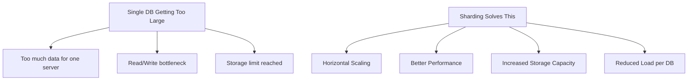
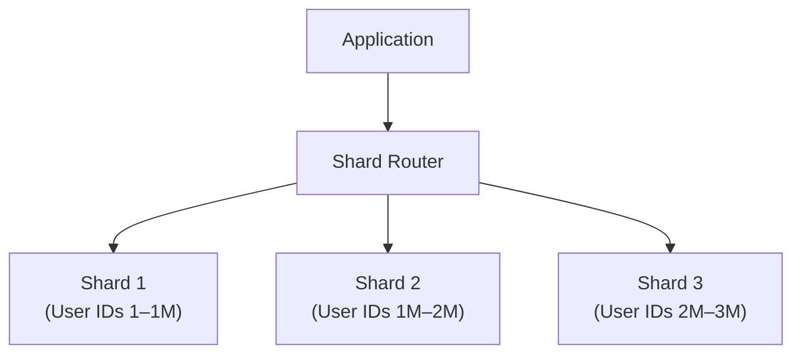
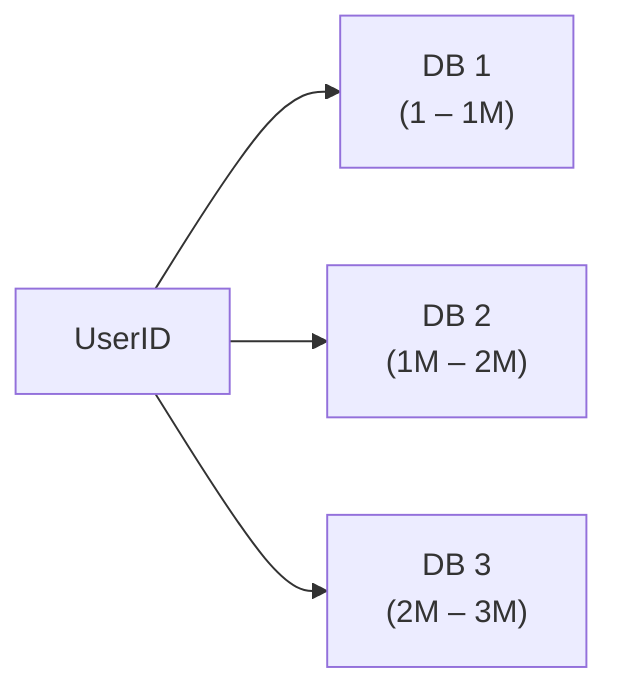
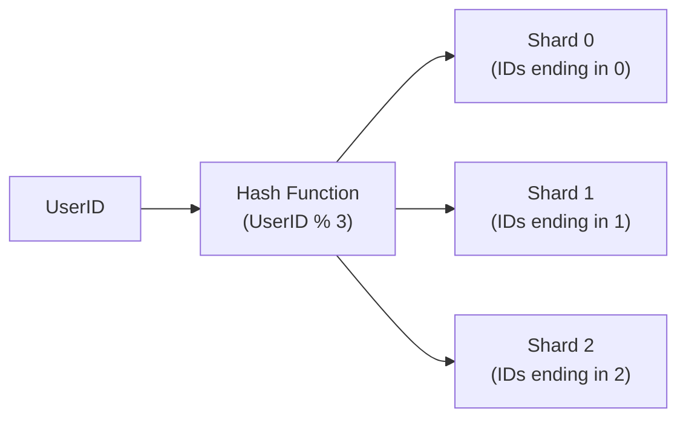
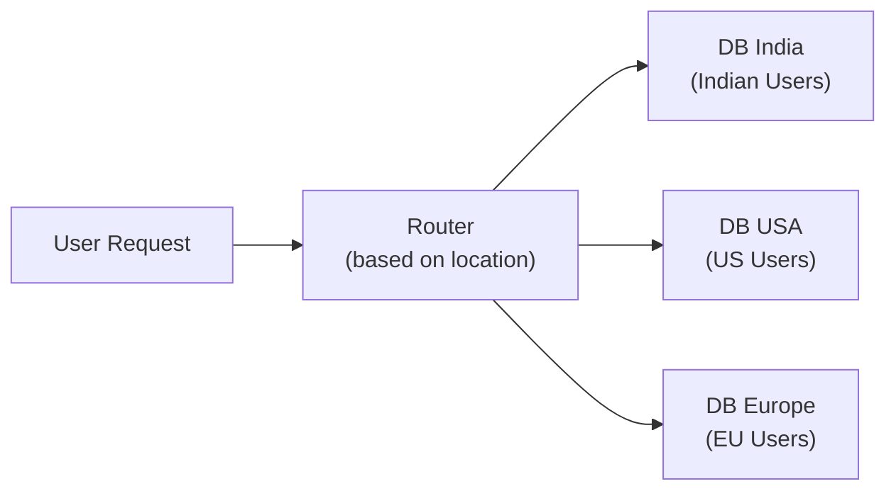

# 🔀 Sharding

**Sharding** is the process of splitting one large database into multiple smaller databases. Each database stores only a **portion** of the data.

> **Memory Trick:**
> - Sharding = **Split** Data (horizontal partitioning)
> - Replication = **Copy** Data

---

## Why Do We Need Sharding?



---

## Architecture



Each shard is an independent database containing only a subset of the total data.

---

## Shard Key

The **Shard Key** is the column used to decide which shard stores the data.

**Common shard keys:**
- `UserID`
- `CustomerID`
- `Region`

> Choosing the right shard key is critical — a bad shard key leads to uneven data distribution (hot shards).

---

## Types of Sharding

### 1. Range-Based Sharding



| ✅ Advantages | ❌ Disadvantages |
|--------------|----------------|
| Simple to implement | May create **hot shards** (popular ranges get more traffic) |
| Easy range queries | Uneven distribution possible |

---

### 2. Hash-Based Sharding

```
Shard = UserID % NumberOfShards
```



| ✅ Advantages | ❌ Disadvantages |
|--------------|----------------|
| Even data distribution | Range queries are hard |
| No hot shards | Resharding is complex when adding new shards |

---

### 3. Geographic Sharding



| ✅ Advantages | ❌ Disadvantages |
|--------------|----------------|
| Low latency for regional users | Cross-region queries are complex |
| Regulatory compliance (data residency) | Uneven distribution if one region is larger |

---

## ✅ Advantages of Sharding

| Advantage | Description |
|-----------|-------------|
| **Horizontal Scaling** | Add more shards as data grows |
| **Better Performance** | Each shard handles a smaller dataset |
| **More Storage** | Unlimited total capacity |
| **Reduced Load** | Write/read load split across shards |

---

## ❌ Disadvantages of Sharding

| Disadvantage | Description |
|-------------|-------------|
| **Complex JOINs** | Joining data across shards is difficult |
| **Distributed Transactions** | Transactions spanning multiple shards are hard |
| **Rebalancing Data** | Moving data when adding/removing shards is complex |
| **Increased App Complexity** | Application must know how to route to the correct shard |

---

## ⭐ FAANG One-Liner

> **Sharding** splits data across multiple databases for horizontal scaling. Each shard stores a portion of data determined by the **Shard Key**. Hash-based sharding provides even distribution; range-based is simpler but may create hot shards.

---

## 💡 30-Second Interview Answer

> **Sharding** is the process of horizontally partitioning a database into multiple smaller shards, each containing a subset of the data. A **shard key** (such as UserID or Region) determines which shard stores each record. Sharding enables horizontal scaling and improves performance, but introduces complexity in JOINs, distributed transactions, and data rebalancing.

---

## 🔑 Key Interview Points

- Sharding = **split** data across multiple databases
- Replication = **copy** data across multiple databases
- **Shard Key** determines which shard holds the data
- **Hash-based** → even distribution, hard range queries
- **Range-based** → simple, but risk of hot shards
- **Geographic** → low latency for regional users
- Main challenges: complex JOINs, distributed transactions, rebalancing

---

## 🔗 Related Topics

- [Replication](./replication.md) — Sharding vs Replication
- [SQL vs NoSQL](./sql-vs-nosql.md) — NoSQL databases often have built-in sharding
- [Indexing](./indexing.md) — Each shard has its own indexes
