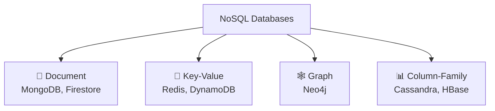
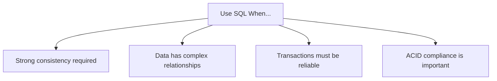
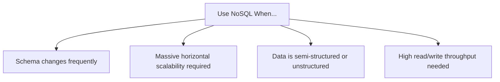

# 🗄️ SQL vs NoSQL

A comparison of Relational and Non-Relational databases — and how to choose between them.

---

## SQL (Relational Database)

A **SQL (Structured Query Language) database** stores data in **tables** consisting of rows and columns. Tables are connected using **relationships**, which is why SQL is called a **Relational Database**.

### Key Characteristics

- Data is stored in **tables**
- Uses **Primary Keys (PK)** and **Foreign Keys (FK)** to create relationships
- Supports **JOINs** to retrieve data from multiple related tables
- Follows a **fixed schema**
- Ensures **ACID** properties for reliable transactions
- Best suited for applications requiring strong consistency and complex relationships

### Example Schema

```
Users Table
┌──────────┬─────────┐
│ UserID   │ Name    │
│ (PK)     │         │
├──────────┼─────────┤
│ 1        │ Rahul   │
│ 2        │ John    │
└──────────┴─────────┘

Orders Table
┌─────────┬──────────┬────────┐
│ OrderID │ UserID   │ Amount │
│         │ (FK)     │        │
├─────────┼──────────┼────────┤
│ 101     │ 1        │ 500    │
│ 102     │ 2        │ 700    │
└─────────┴──────────┴────────┘
```

`Orders.UserID` references `Users.UserID`, creating a relationship.

---

## Why is SQL called a Relational Database?

Because data is divided into multiple tables that are **related** using **Primary Keys** and **Foreign Keys**. This reduces data duplication and maintains data integrity.

### Primary Key (PK)
- Uniquely identifies each row in a table
- Cannot contain duplicate values
- Cannot be NULL

### Foreign Key (FK)
- A column that references the Primary Key of another table
- Establishes relationships between tables
- Maintains referential integrity

### Fixed Schema

A **schema** defines the structure of a table (column names, data types, constraints). In SQL, the schema is defined **before** data is inserted.

```sql
-- Schema defined upfront
CREATE TABLE Users (
    ID   INT,
    Name VARCHAR(255),
    Age  INT
);

-- To add a new column, the schema must be modified first
ALTER TABLE Users ADD Address VARCHAR(255);
```

**Why SQL Uses Fixed Schema:**
- Ensures data consistency
- Prevents invalid data
- Makes relationships easier to maintain
- Ideal for structured data

---

## NoSQL (Non-Relational Database)

NoSQL databases do **not** require a fixed schema. Each record (document) can have different fields.

```json
// Document 1
{ "name": "Rahul", "age": 26 }

// Document 2 — completely different structure, still valid
{ "name": "John", "city": "Hyderabad", "hobbies": ["Bike", "Cricket"] }
```

### Why NoSQL?

Useful when data structure changes frequently.

**Example — Amazon Products:**

```
Laptop            Shirt           Phone
├── RAM           ├── Color       ├── Battery
├── Processor     ├── Size        ├── Camera
└── SSD           └── Fabric      └── Display
```

Different products have different attributes → NoSQL is a better choice.

### NoSQL Data Models



---

## SQL vs NoSQL Comparison

| Feature | SQL | NoSQL |
|---------|-----|-------|
| Type | Relational | Non-Relational |
| Storage | Tables | Documents / Key-Value / Graph / Column |
| Schema | Fixed | Flexible |
| JOINs | Supported | Limited or None |
| Transactions | ACID | Usually BASE / Eventual Consistency |
| Scaling | Vertical | Horizontal |
| Best For | Structured data | Unstructured / semi-structured |
| Examples | MySQL, PostgreSQL | MongoDB, Cassandra, Redis |

---

## When to Use SQL



**Real-world SQL use cases:**
- Banking
- Payment systems
- Airline booking
- Hospital systems
- Inventory management
- Payroll

---

## When to Use NoSQL



**Real-world NoSQL use cases:**
- Social media feeds
- Chat applications
- Product catalogs
- IoT data
- Logging systems
- Caching

---

## 💡 Interview Answer: SQL vs NoSQL

**Choose SQL** when your application requires strong consistency, complex relationships, JOIN operations, and ACID transactions (e.g., banking, payments, airline booking).

**Choose NoSQL** when your application requires flexible schemas, horizontal scalability, and can handle rapidly changing or semi-structured data (e.g., chat apps, social media feeds, product catalogs).

---

## 💡 Interview Answer: Why do Banks Prefer SQL?

Banks use SQL databases because they require:
- Strong consistency
- ACID-compliant transactions
- Reliable money transfers
- Complex relationships between accounts, customers, and transactions
- High data integrity and security

---

## ⭐ FAANG Quick Revision (30 Seconds)

**SQL:**
- Relational Database
- Tables, PK & FK
- Fixed Schema, JOINs, ACID
- Vertical Scaling
- Best for: Banking, Payments, Inventory

**NoSQL:**
- Non-Relational, Flexible Schema
- Horizontal Scaling
- Documents / Key-Value / Graph
- Best for: Chat, Social Media, Product Catalogs

---

## 🔗 Related Topics

- [ACID Properties](./acid-properties.md) — SQL transaction guarantees
- [Indexing](./indexing.md) — Optimizing SQL query performance
- [Sharding](./sharding.md) — Scaling NoSQL horizontally
- [Replication](./replication.md) — High availability for both SQL and NoSQL
