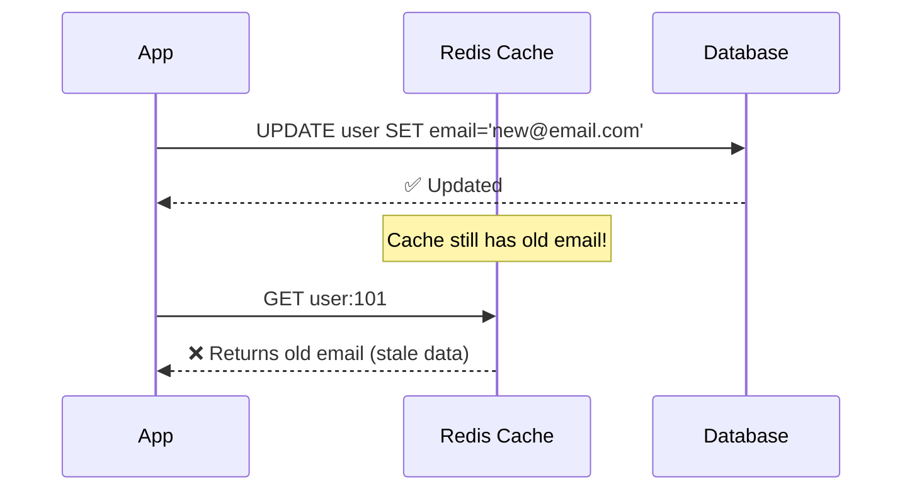
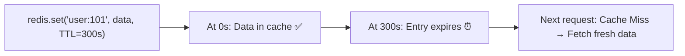
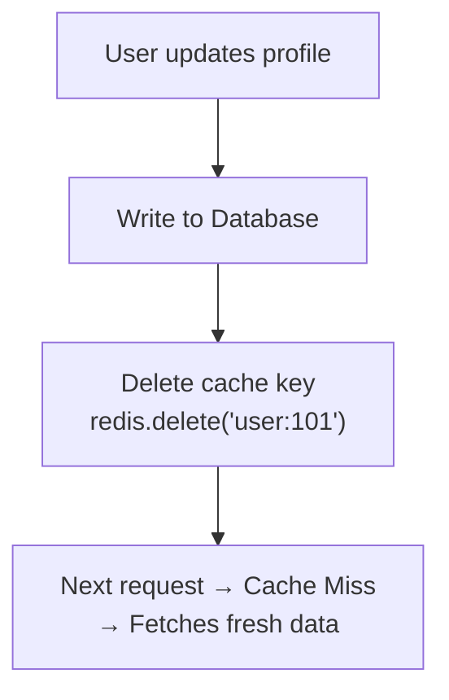

# 🔄 Cache Invalidation

Cache may contain **outdated (stale) data** after the database is updated. Cache invalidation is the process of keeping cached data fresh and consistent.

---

## The Problem



---

## TTL (Time To Live)

TTL defines how long a cache entry remains **before it expires automatically**.



### Example
```python
# Cache with 5-minute TTL
redis.set("user:101", user_data, ex=300)  # 300 seconds

# After 300 seconds, Redis automatically removes this key
# Next request becomes a Cache Miss → fetches fresh from DB
```

### TTL by Use Case

| Data Type | Recommended TTL |
|-----------|----------------|
| User profile | 5–15 minutes |
| Product details | 1–24 hours |
| Exchange rates | 1 minute |
| Session data | 30 minutes |
| Static country list | 24 hours |
| OTP | 5 minutes |

### ✅ Purpose
- Prevent stale data from persisting forever
- Free memory automatically

---

## Cache Invalidation Strategies

### Strategy 1 — Time-Based Expiry (TTL)

Set a TTL so data expires automatically.

```
redis.set("product:20", data, ex=3600)  # expires in 1 hour
```

✅ Simple to implement  
❌ Data can be stale for the entire TTL duration

---

### Strategy 2 — Event-Driven Invalidation

Whenever the database is updated, **immediately delete or update the cache entry**.



```python
# On update
db.update_user(101, new_data)
redis.delete("user:101")  # Invalidate cache immediately
```

✅ Cache is always fresh immediately after update  
❌ Requires discipline — every DB write must also invalidate cache

---

### Strategy 3 — Cache Busting (Versioning)

Instead of deleting the old cache entry, use a **new cache key** each time data changes.

```python
# Old key
redis.set("user:101:v1", data)

# After update, use new version key
redis.set("user:101:v2", updated_data)
```

✅ Old and new data can coexist during transitions  
✅ Very useful for static assets (CSS, JS, images)

---

## Cache Busting for Static Assets

Instead of replacing `style.css`, use versioned filenames:

```html
<!-- Old -->
<link href="style.css" />

<!-- Better — cache busting via query string -->
<link href="style.css?v=2" />

<!-- Best — content hash in filename -->
<link href="style.a3f7c2.css" />
```

**Benefits:**
- Users automatically receive the latest version
- No need to purge CDN cache
- Common practice in production deployments

---

## Cache Invalidation Comparison

| Strategy | Freshness | Complexity | Best For |
|----------|-----------|------------|----------|
| **TTL** | Eventually fresh | Low | Semi-static data (products, profiles) |
| **Event-Driven** | Immediately fresh | Medium | User-specific data, critical updates |
| **Cache Busting** | Always fresh | Low | Static assets (CSS, JS, images) |

---

## The Hard Problem of Cache Invalidation

> *"There are only two hard things in Computer Science: cache invalidation and naming things."*
> — Phil Karlton

This is because:
- Multiple services may update the same data
- Network failures can cause cache and DB to go out of sync
- Race conditions can cause stale data to be re-cached

---

## 💡 30-Second Interview Answer

> Cache invalidation ensures cached data stays fresh. The main strategies are: **TTL** (auto-expire after a time period — simplest), **Event-Driven Invalidation** (delete/update cache on every DB write — most accurate), and **Cache Busting** (use versioned keys/filenames — best for static assets). The right strategy depends on how critical data freshness is for your use case.

---

## 🔑 Key Interview Points

- **TTL** — Simplest; data auto-expires; may be stale within TTL window
- **Event-Driven** — Delete cache on every write; always fresh; requires discipline
- **Cache Busting** — New key/filename on change; ideal for static assets
- `redis.delete(key)` is the most common invalidation approach
- Cache invalidation is considered one of the hardest problems in CS

---

## 🔗 Related Topics

- [Caching Basics](./caching-basics.md) — Cache Hit, Miss, Redis
- [Cache Strategies](./cache-strategies.md) — Write-Through avoids staleness
- [CDN](../06-cdn/cdn.md) — Cache invalidation at the edge
