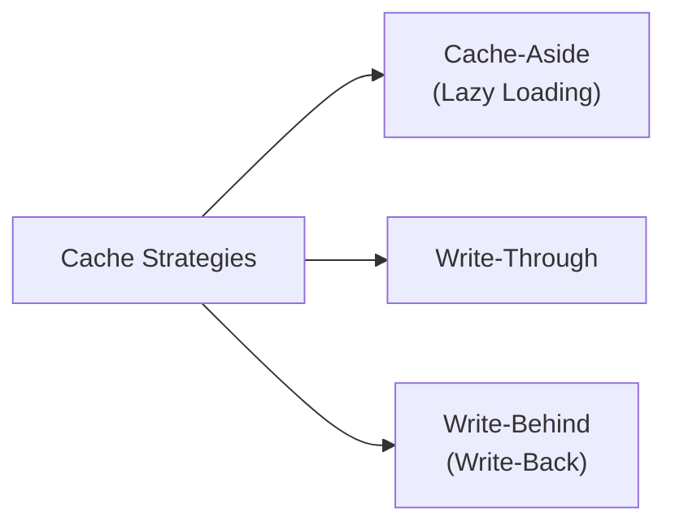
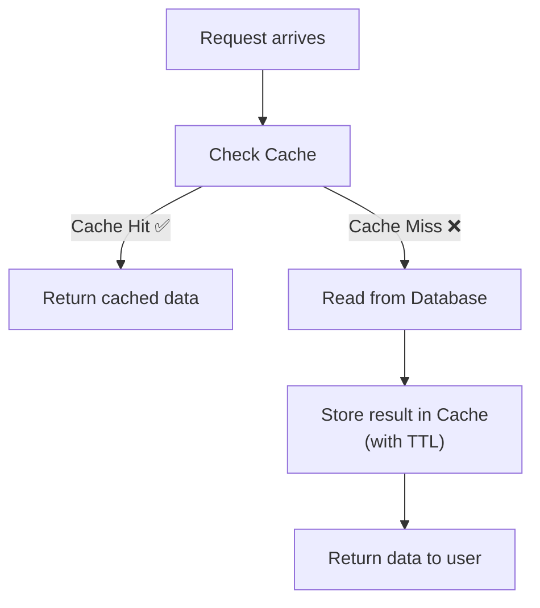
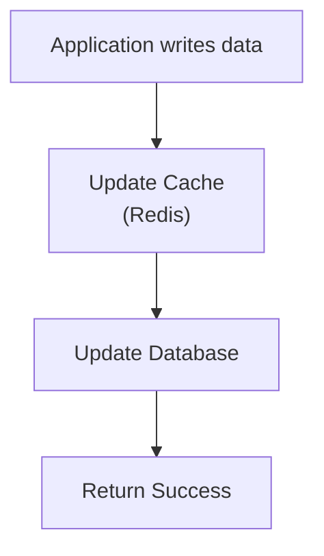
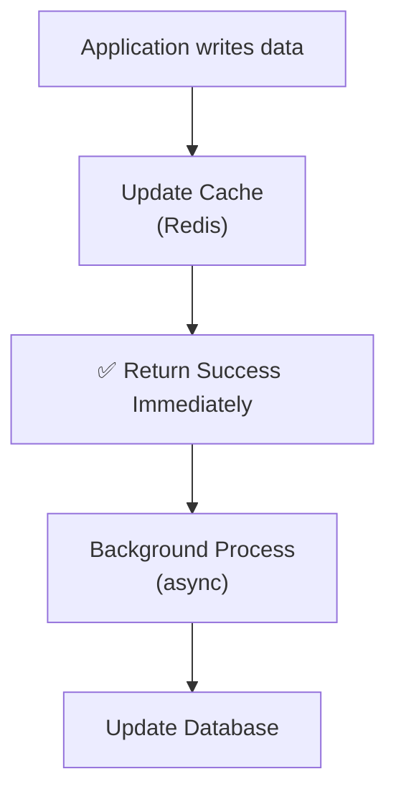

# 📋 Cache Strategies

Cache strategies define **how and when data is written to and read from the cache**.

---

## Overview

---

## 1. Cache-Aside (Lazy Loading) ⭐ Most Common

The application is responsible for managing the cache. Data is only loaded into the cache **on demand** (when there's a Cache Miss).

### How it works step-by-step:
1. Application receives a request
2. Check if data exists in Redis
3. **Cache Hit** → Return immediately from Redis
4. **Cache Miss** → Query the database → Store result in Redis → Return result

### ✅ Advantages
- Only caches data that is actually requested
- Saves memory (no unused data cached)
- Most commonly used strategy in production

### ❌ Disadvantages
- **First request is always slower** (always a Cache Miss for new data)
- Risk of **cache stampede** if many requests miss simultaneously

### Best Used For
- General-purpose API caching
- User profile data
- Product details

---

## 2. Write-Through

Whenever data is **written**, it is updated in **both the cache AND the database** synchronously.

### ✅ Advantages
- Cache always stays **up to date** with the database
- No stale data problem

### ❌ Disadvantages
- **Slower writes** — must write to both cache and database before responding
- May cache data that is never read (wastes memory)

### Best Used For
- Read-heavy applications where you always need fresh data
- Banking / financial data

---

## 3. Write-Behind (Write-Back)

Data is written to the **cache immediately** and the response is returned to the user. The database is updated **asynchronously** in the background.

### ✅ Advantages
- **Very fast writes** — user gets an immediate response
- Reduces database write pressure
- Good for burst writes

### ❌ Disadvantages
- **Risk of data loss** — if Redis crashes before writing to the database, data is lost
- More complex to implement

### Best Used For
- High-throughput write applications
- Gaming leaderboards
- Analytics counters

---

## Strategy Comparison

| Feature | Cache-Aside | Write-Through | Write-Behind |
|---------|------------|---------------|-------------|
| Read Performance | Fast (after first miss) | Fast | Fast |
| Write Performance | Normal | Slower | Very Fast |
| Data Freshness | May be stale | Always fresh | May be briefly inconsistent |
| Data Loss Risk | Low | Very Low | Higher |
| Complexity | Low | Medium | Higher |
| Most Common? | ✅ Yes | Sometimes | Rarely |

---

## 💡 30-Second Interview Answer

> The three main caching strategies are: **Cache-Aside** (lazy loading — only cache on miss, most common), **Write-Through** (update cache and DB together on write — always fresh but slower writes), and **Write-Behind** (update cache immediately, sync DB asynchronously — fastest writes but risk of data loss).

---

## 🔑 Key Interview Points

- **Cache-Aside** = most common; data loaded on demand; first request slow
- **Write-Through** = cache always fresh; writes are slower
- **Write-Behind** = fastest writes; risk of data loss on crash
- Cache-Aside is the **default choice** unless you have a specific reason

---

## 🔗 Related Topics

- [Caching Basics](./caching-basics.md) — Cache Hit, Miss, Redis
- [Cache Invalidation](./cache-invalidation.md) — TTL and keeping cache fresh
