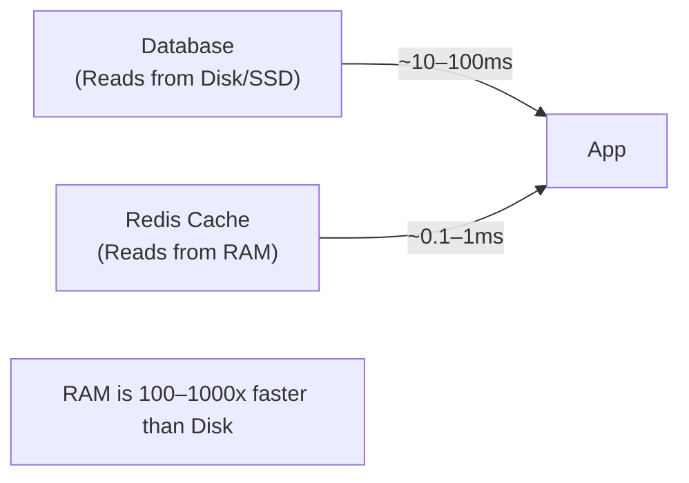
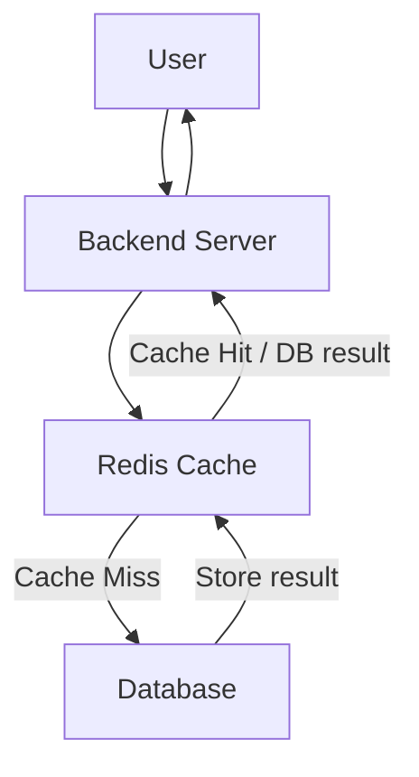
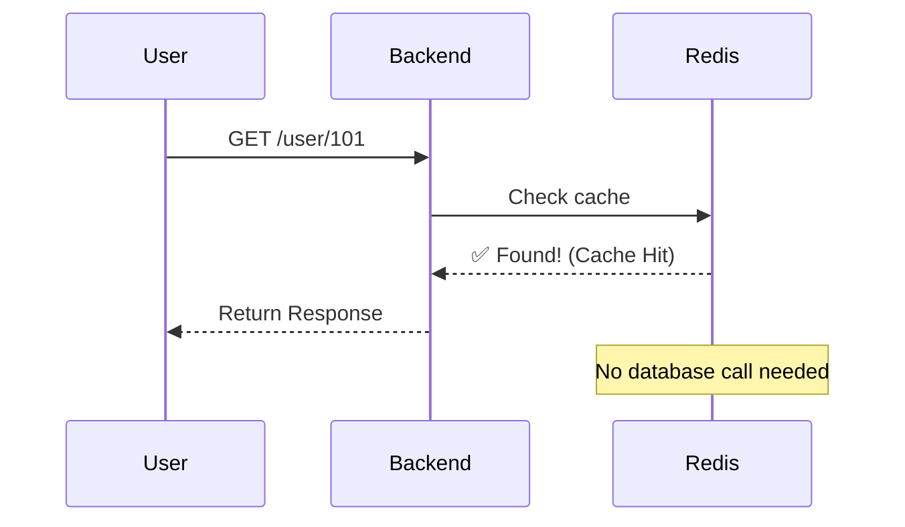
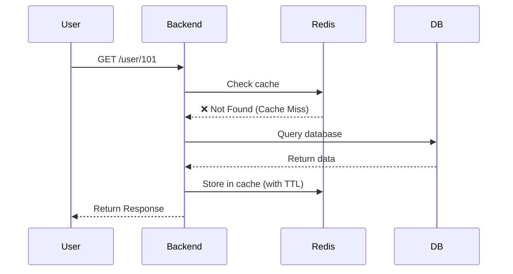
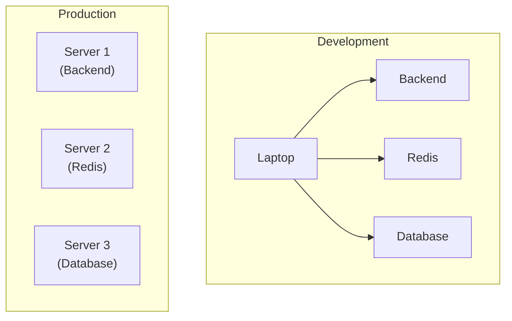
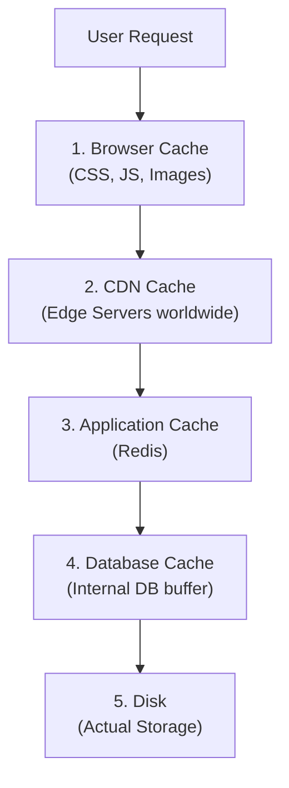

# 🚀 Caching Basics

**Cache** is a **temporary, fast storage** used to store **frequently accessed data** so future requests can be served faster without querying the database every time.

---

## Why Do We Need Cache?

- Reduce response time (low latency)
- Reduce database load
- Improve application performance
- Improve scalability

---

## Why is Cache Faster?



| Storage | Speed | Used By |
|---------|-------|---------|
| NVMe SSD | ~0.1ms | Databases |
| Redis (RAM) | ~0.1–1ms | Cache |
| HDD | ~10ms | Older databases |

---

## Basic Architecture



The backend always checks **Redis first**.

---

## Cache Hit

Requested data is **found** in the cache.



- ✅ No database call
- ✅ Very fast response

---

## Cache Miss

Requested data is **not found** in the cache.



---

## What is Redis?

Redis is an **in-memory database** (stores data in RAM).

Think of Redis like PostgreSQL or MySQL — it's another service that your backend connects to.

```
Python Backend
    │
    ├── Redis   (Cache)
    └── PostgreSQL  (Main Database)
```

### Redis stores data as Key-Value pairs

```
user:101      →  { name: "Rahul", age: 26 }
product:20    →  { name: "iPhone", price: 999 }
order:99      →  { status: "Delivered" }
```

```python
# Example usage
redis.set("user:101", user_data, ex=300)  # TTL = 300 seconds
redis.get("user:101")
```

---

## Is Redis a Separate Server?

Usually, **Yes**.



---

## Cache Levels



### Level 1 — Browser Cache (Client-side)
Stores static files in the user's browser: Images, CSS, JavaScript, Fonts.
**Purpose:** Avoid re-downloading the same static files.

### Level 2 — CDN Cache
Stores static content at servers located around the world.
**Purpose:** Serve content from the nearest geographical location.

### Level 3 — Application Cache (Redis)
Cache placed between the backend and the database.
**Purpose:** Cache API responses, user details, product information.

### Level 4 — Database Cache
Internal cache maintained by the database to reduce repeated disk reads. Usually automatic.

---

## ⭐ Interview Keywords

`Cache` · `Redis` · `RAM` · `Low Latency` · `Cache Hit` · `Cache Miss` · `Key-Value Store` · `TTL` · `Cache Invalidation`

---

## 💡 30-Second Interview Answer

> **Caching** stores frequently accessed data in a fast in-memory store like Redis to reduce database load and improve response time. The backend checks the cache first. If the data exists (Cache Hit), it returns immediately. Otherwise (Cache Miss), it fetches the data from the database, stores it in Redis, and returns it.

---

## 🔗 Related Topics

- [Cache Strategies](./cache-strategies.md) — Cache-Aside, Write-Through, Write-Behind
- [Cache Invalidation](./cache-invalidation.md) — TTL, event-driven invalidation
- [CDN](../06-cdn/cdn.md) — Level 2 cache (edge servers)
