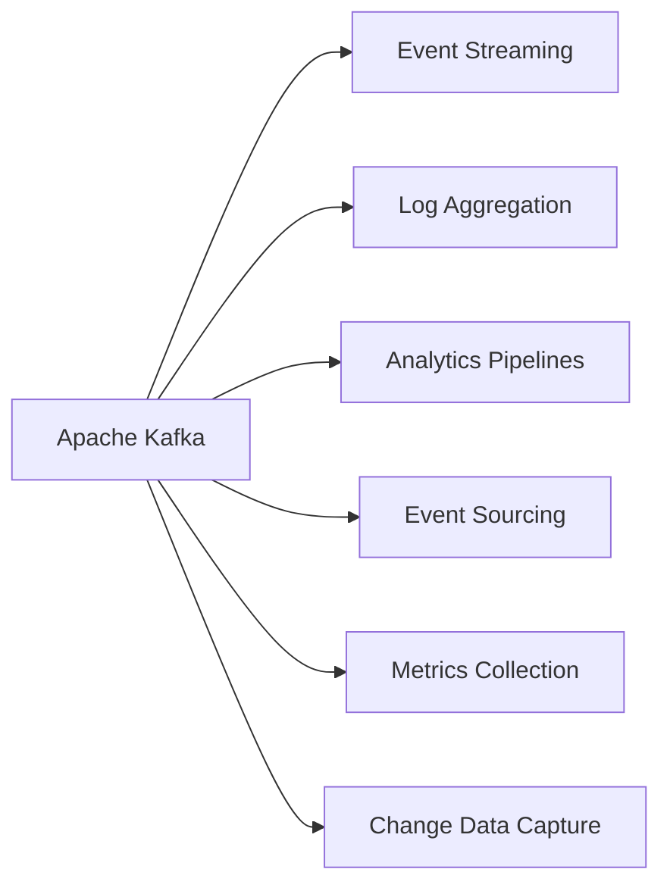
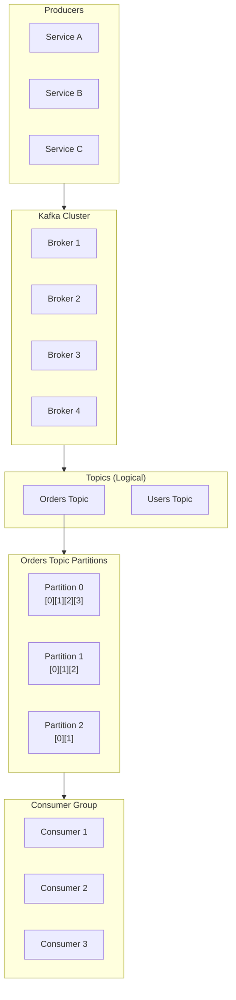
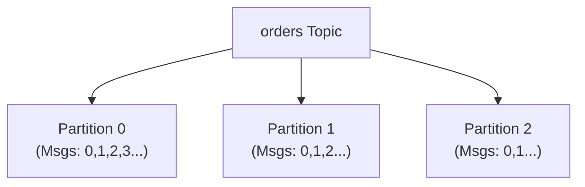
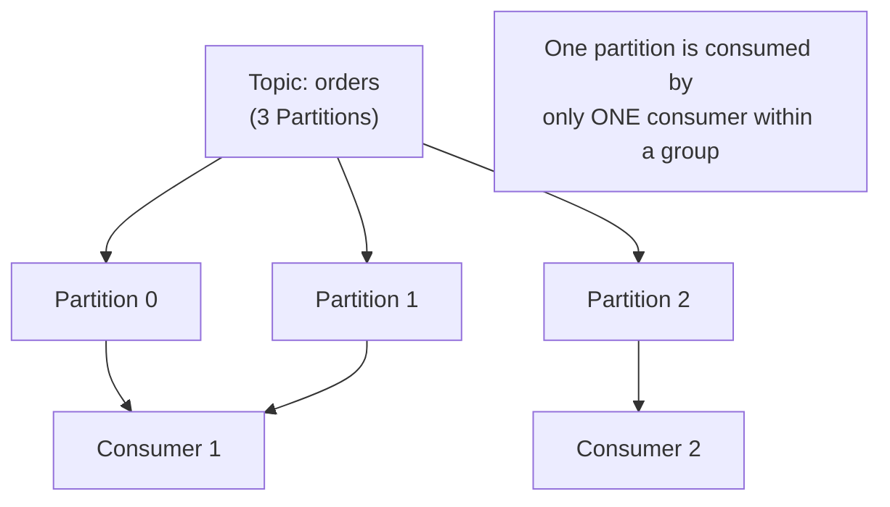
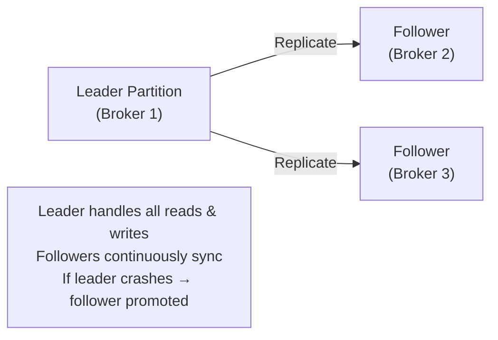
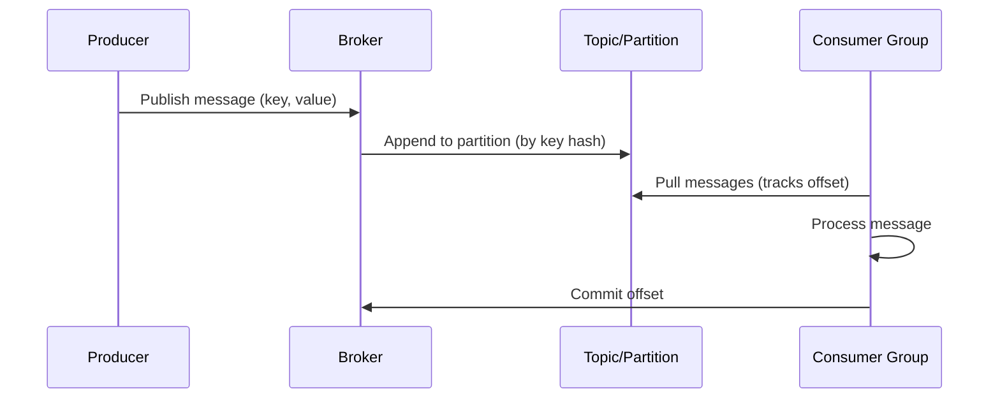

# 🔴 Apache Kafka

**Apache Kafka** is a distributed **event streaming platform** designed for high-throughput, fault-tolerant, and real-time data pipelines.

---

## What is Kafka Best For?



---

## Kafka Architecture



---

## Kafka Components

### Producer
- Publishes messages to **Topics**
- Can specify a **partition key** to control which partition receives the message

### Broker
A Kafka server. A cluster usually has multiple brokers.

**Responsibilities:**
- Store messages (persistent log)
- Handle replication
- Serve consumers
- Manage partitions

### Topic
A **logical category** of messages. Think of it like a folder.

```
Topics:
├── orders
├── payments
├── users
└── notifications
```

### Partition

Each topic is divided into **partitions** for parallelism.



**Benefits of Partitions:**
- Parallel processing
- Horizontal scalability
- High throughput

### Offset

Every message in a partition has a **sequential number** (offset).

```
Partition 0:  [Msg 0] [Msg 1] [Msg 2] [Msg 3] [Msg 4]
                ↑0      ↑1      ↑2      ↑3      ↑4
```

- Consumers **track their own offsets** (not the broker)
- Enables **message replay** (re-read from any offset)

### Consumer Group

A group of consumers that **share the work** of consuming a topic.



> **Rule:** Within a consumer group, each partition is handled by **exactly one** consumer. To add parallelism, add more partitions.

---

## Replication

Each partition has **replicas** for fault tolerance.



---

## Kafka Data Flow



---

## Kafka vs Traditional Queue

| Feature | Traditional Queue (RabbitMQ) | Kafka |
|---------|------------------------------|-------|
| Message storage | Deleted after ACK | **Persistent** (retained for configurable period) |
| Message replay | ❌ Not possible | ✅ Yes (seek to any offset) |
| Throughput | High | **Extremely High** (millions/sec) |
| Consumer model | Push | **Pull** |
| Ordering | FIFO | Per-partition ordering |

---

## ✅ Kafka Advantages

- Extremely **high throughput**
- **Persistent storage** (messages retained even after consumption)
- **Horizontal scaling** via partitions
- **Replication** for fault tolerance
- **Message replay** (re-read past events)
- Durable storage on disk
- Event sourcing patterns

---

## ❌ Kafka Limitations

- Complex setup and operational overhead
- Limited routing flexibility (no pattern-based routing like RabbitMQ)
- Overkill for simple task queues

---

## When to Choose Kafka

| ✅ Use Kafka | ❌ Don't Use Kafka |
|-------------|-------------------|
| Event streaming | Simple background jobs |
| Analytics pipelines | Complex routing needed |
| Event sourcing | Small-scale applications |
| Log aggregation | Infrequent messages |
| High throughput (millions/sec) | |

---

## Consumer Lag

```
Consumer Lag = Latest Offset − Committed Offset
```

Large lag = consumers are slower than producers.

**Solutions:**
- Add more consumers (up to the number of partitions)
- Increase partition count
- Optimize consumer processing

---

## 💡 30-Second Interview Answer

> **Apache Kafka** is a distributed event streaming platform. Producers publish messages to **Topics**, which are split into **Partitions** for parallel processing. Each message in a partition has an **Offset**. **Consumer Groups** share the work of consuming partitions — each partition is consumed by only one consumer per group. Kafka retains messages persistently, enabling **message replay**. It is designed for high-throughput, fault-tolerant, real-time data pipelines.

---

## 🔑 Key Interview Points

- **Topic** = logical category; **Partition** = unit of parallelism
- **Offset** = message position; consumers track their own offsets
- **Consumer Group** = one partition → one consumer within the group
- **Replication** = each partition has leader + followers across brokers
- **Message Replay** = seek to any past offset (unlike traditional queues)
- **Consumer Lag** = how far behind consumers are from producers
- Best for: **event streaming, analytics, log aggregation, high throughput**

---

## 🔗 Related Topics

- [Message Queue Basics](./message-queue-basics.md) — Core concepts (ACK, DLQ, etc.)
- [RabbitMQ](./rabbitmq.md) — Alternative broker; Kafka vs RabbitMQ comparison
