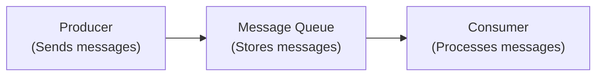
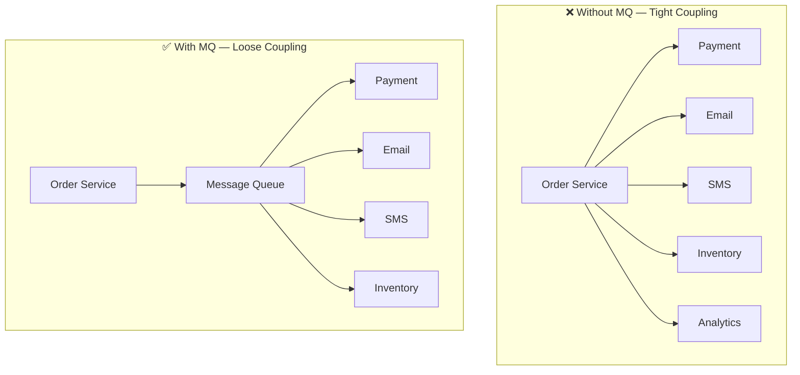
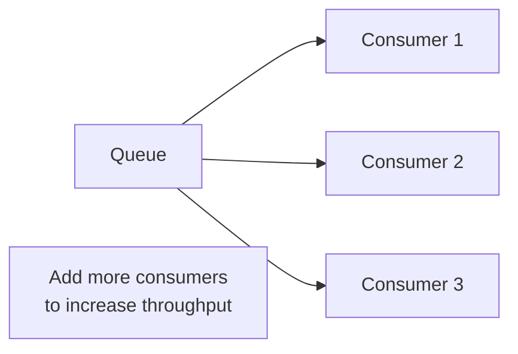
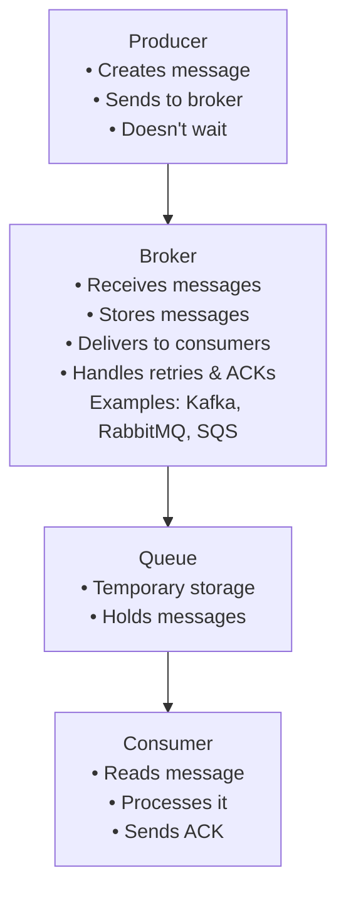
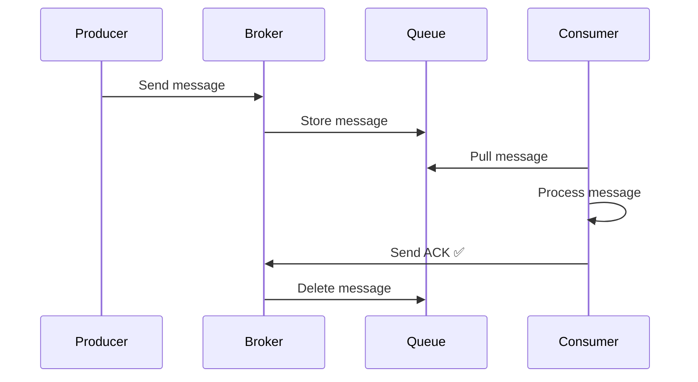
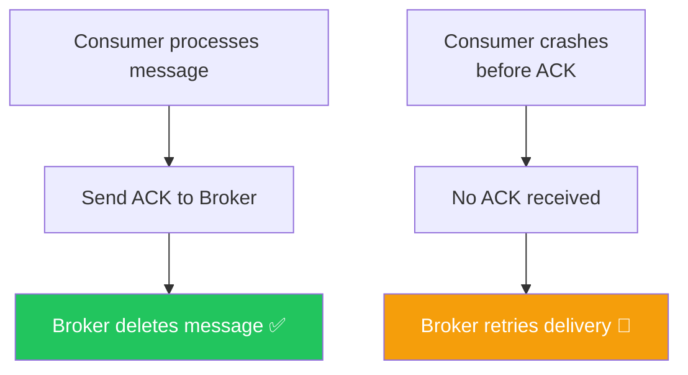
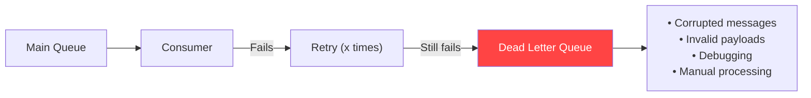
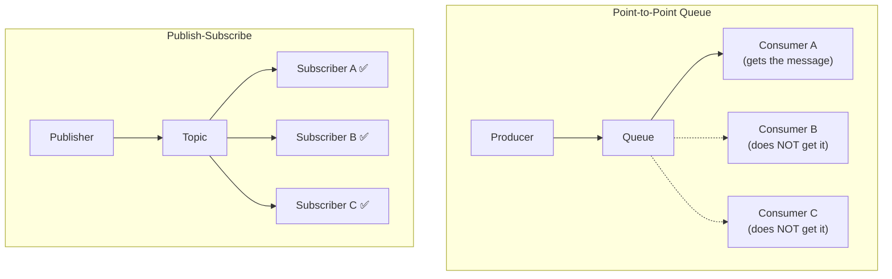
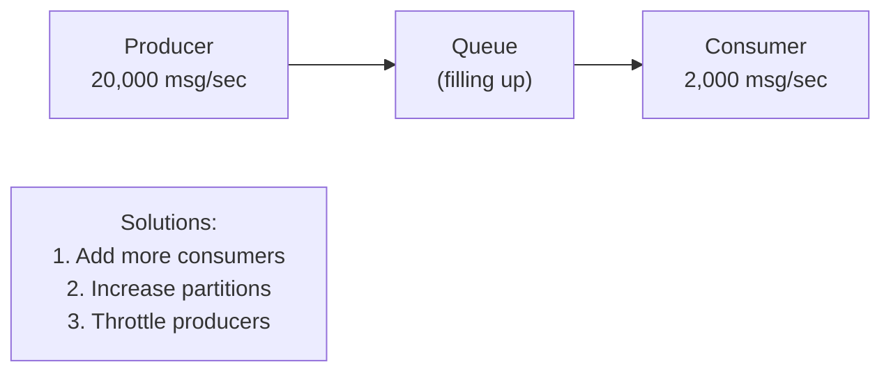

# 📨 Message Queue Basics

A **Message Queue (MQ)** is middleware that enables **asynchronous communication** between services.

Instead of one service calling another directly, it sends a **message** to the queue. Another service consumes the message whenever it is ready.

---

## Core Architecture



---

## Why Use Message Queues?

### 1. Decoupling



Each service works **independently**. If Email service is down, Order service is unaffected.

### 2. Asynchronous Processing
Producer sends the message and **immediately continues**. Consumer processes it later at its own pace.

### 3. Traffic Spike Handling
```
Producer: 20,000 messages/sec
Consumer:  2,000 messages/sec
              ↓
Queue buffers the excess 18,000 messages
until consumers catch up
```

### 4. Reliability
If a consumer is unavailable, messages remain in the queue until processing resumes.

### 5. Scalability


---

## Core Components



---

## Message Lifecycle



---

## Acknowledgement (ACK)

Consumer informs the broker that processing completed successfully.



---

## Retry Mechanism

If processing fails, the broker retries delivery:

```
Attempt 1 → Failed ❌
Attempt 2 → Failed ❌
Attempt 3 → Failed ❌
      ↓
Move to Dead Letter Queue (DLQ)
```

Retry count and backoff intervals are configurable.

---

## Dead Letter Queue (DLQ)

Messages that exceed retry limits are moved to a **Dead Letter Queue**.



---

## Delivery Guarantees

| Guarantee | Description | Duplicates? | Loss? |
|-----------|-------------|-------------|-------|
| **At Most Once** | 0 or 1 delivery | ❌ No | ✅ Possible |
| **At Least Once** | 1 or more deliveries | ✅ Possible | ❌ No |
| **Exactly Once** | Exactly 1 delivery | ❌ No | ❌ No |

> **Exactly Once** is the hardest to achieve in distributed systems — requires transactions, idempotency, and offset management.

---

## Idempotency

Processing the same message **multiple times** should produce the **same final state**.

Required when using **At Least Once** delivery (to handle duplicates safely).

```python
# Idempotent payment processing
def process_payment(message):
    if db.payment_already_processed(message.id):
        return  # Skip duplicate
    db.process_payment(message)
```

Usually implemented using:
- Unique transaction ID
- Message ID
- Database unique constraints

---

## Point-to-Point vs Publish-Subscribe



| Pattern | Each message received by | Used For |
|---------|--------------------------|---------|
| **Point-to-Point** | Only ONE consumer | Background jobs, task processing |
| **Pub/Sub** | ALL subscribers | Notifications, events, broadcasting |

---

## Back Pressure

Occurs when the **Producer rate > Consumer rate**.



---

## FIFO (Ordering)

First In, First Out — messages are processed in the order they were sent.

- **RabbitMQ** — Provides FIFO queues by default
- **Kafka** — Guarantees ordering only **within a partition**

---

## Popular Message Queue Systems

| System | Type | Best For |
|--------|------|---------|
| **Apache Kafka** | Distributed event streaming | High throughput, analytics, event sourcing |
| **RabbitMQ** | AMQP message broker | Background jobs, task queues, routing |
| **Amazon SQS** | Managed cloud queue | AWS workloads, simple queues |
| **Google Pub/Sub** | Managed pub/sub | GCP workloads |

---

## 💡 30-Second Interview Answer

> A **Message Queue** enables asynchronous communication between services by decoupling producers from consumers. The producer sends a message to a broker, which stores it until a consumer is ready to process it. After successful processing, the consumer sends an **ACK** and the broker deletes the message. If processing fails, the broker retries; after repeated failures, the message moves to a **Dead Letter Queue**.

---

## 🔑 Key Interview Points

- **Producer** → sends messages; **Consumer** → processes them; **Broker** → manages delivery
- **ACK** confirms successful processing; without it, broker retries
- **DLQ** stores permanently failed messages for debugging
- **Point-to-Point** → one consumer per message; **Pub/Sub** → all subscribers get a copy
- **At Least Once** is the most common guarantee (requires idempotent consumers)
- **Back Pressure** = producer faster than consumer; add consumers or throttle producer

---

## 🔗 Related Topics

- [Kafka](./kafka.md) — Distributed event streaming platform
- [RabbitMQ](./rabbitmq.md) — AMQP-based message broker
- [Caching](../04-caching/caching-basics.md) — Alternative to reduce DB load
