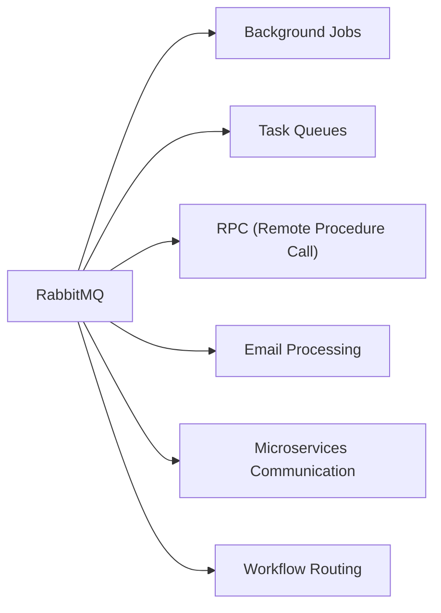
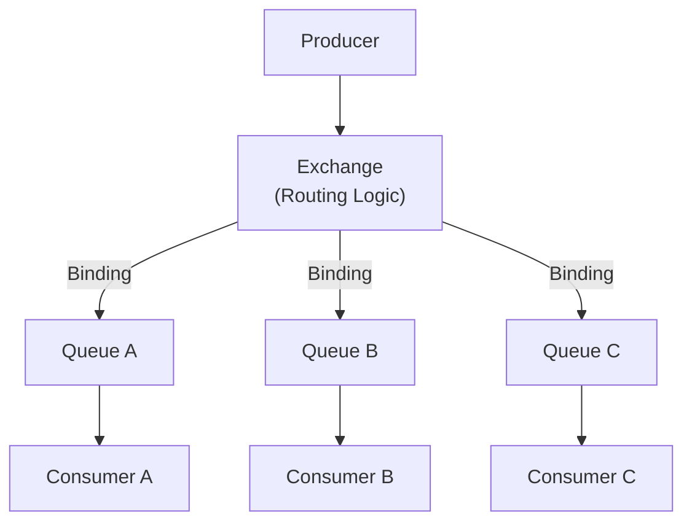
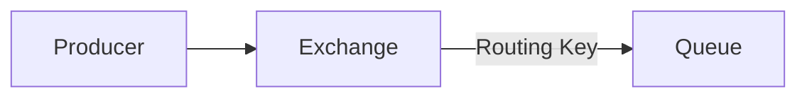
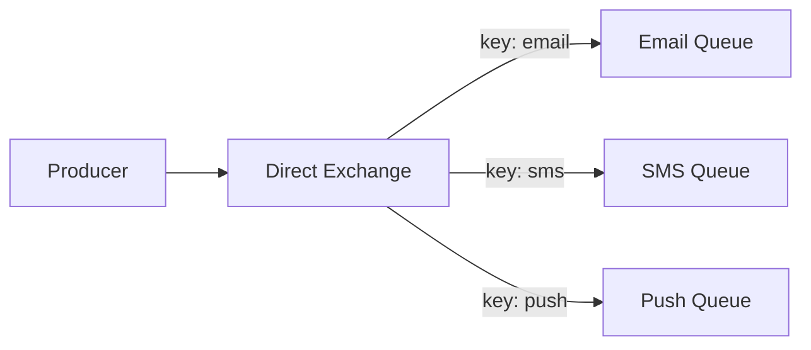
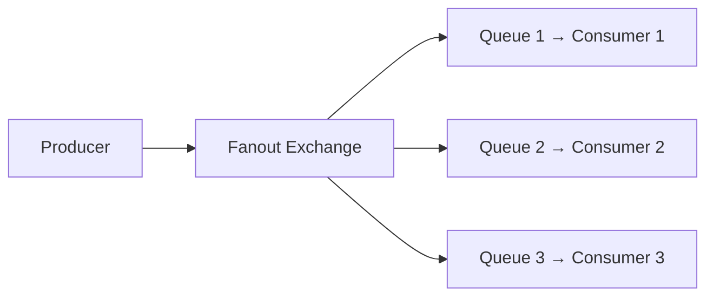
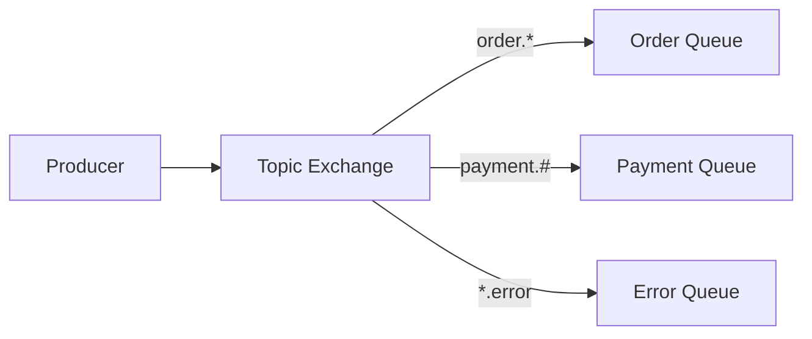
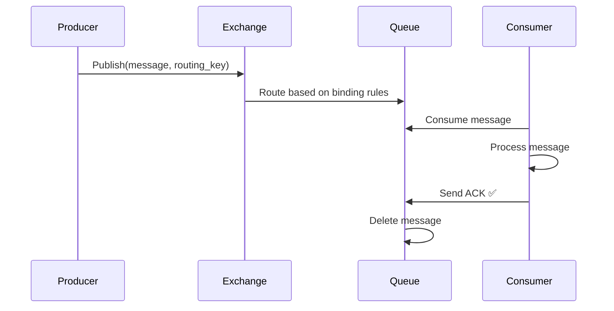
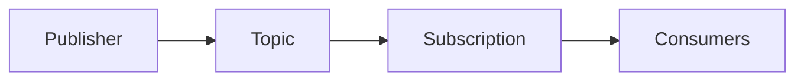

# 🐇 RabbitMQ

**RabbitMQ** is a general-purpose **message broker** implementing the AMQP (Advanced Message Queuing Protocol).

---

## What is RabbitMQ Best For?



---

## RabbitMQ Architecture



> **Key Difference from Kafka:** Producers in RabbitMQ **never** send directly to queues — they always go through an **Exchange**.

---

## Core Components

### Producer
- Publishes messages to an **Exchange**
- Never sends directly to queues

### Exchange
The **routing engine** in RabbitMQ.



### Queue
Stores messages until consumers process them. Messages are **deleted after ACK**.

### Consumer
Reads and processes messages from queues.

### Binding
Connects an **Exchange** to a **Queue** with optional routing rules.

---

## Exchange Types

### 1. Direct Exchange
Routes messages using an **exact routing key** match.



**Use case:** Route specific event types to specific queues.

---

### 2. Fanout Exchange
**Broadcasts** to every bound queue — ignores routing keys.



**Use case:** Broadcasting events (e.g., user signup → send to email, SMS, and analytics queues simultaneously).

---

### 3. Topic Exchange
Routes using **wildcard pattern** matching on routing keys.

```
order.*      → matches order.created, order.shipped
payment.#    → matches payment.success, payment.refund.processed
```



**Use case:** Flexible routing based on event type patterns.

---

### 4. Headers Exchange
Routes based on **message headers** (not routing key). Rarely used.

---

## Exchange Type Comparison

| Exchange | Routing By | Use Case |
|----------|-----------|---------|
| **Direct** | Exact routing key | Route to specific queue |
| **Fanout** | Broadcast (no key) | Notify all subscribers |
| **Topic** | Wildcard pattern | Flexible event routing |
| **Headers** | Message headers | Complex routing (rarely used) |

---

## RabbitMQ Message Flow



---

## ✅ RabbitMQ Advantages

| Advantage | Description |
|-----------|-------------|
| **Low Latency** | Very fast message delivery |
| **Reliable Delivery** | Persistent messages survive broker restart |
| **Rich Routing** | 4 exchange types for flexible routing |
| **Easy Retries** | Built-in retry and DLQ support |
| **Simple Deployment** | Easy to set up and operate |
| **AMQP Standard** | Interoperable with many languages/frameworks |

---

## ❌ RabbitMQ Limitations

| Limitation | Description |
|------------|-------------|
| **Lower Throughput** | Not designed for millions of messages/sec (vs Kafka) |
| **No Event Streaming** | Not intended for event replay/streaming use cases |
| **Limited Message Replay** | Messages deleted after ACK; no offset tracking |

---

## Kafka vs RabbitMQ

| Feature | Kafka | RabbitMQ |
|---------|-------|----------|
| **Primary Model** | Distributed Log | Message Queue |
| **Storage** | Persistent Log (retained) | Queue (deleted after ACK) |
| **Throughput** | Extremely High | High |
| **Latency** | Low | Very Low |
| **Ordering** | Per Partition | FIFO Queue |
| **Routing** | Basic (by topic/partition) | Advanced (4 exchange types) |
| **Message Replay** | ✅ Yes | ❌ No |
| **Consumer Model** | Pull | Push (default) |
| **Message Retention** | Configurable duration | Removed after ACK |
| **Scalability** | Partition-based | Consumer/Queue-based |
| **Best For** | Event Streaming, Analytics | Task Queues, Routing |

---

## When to Choose RabbitMQ vs Kafka

| Scenario | Choose |
|----------|--------|
| Background email jobs | ✅ RabbitMQ |
| Complex routing logic | ✅ RabbitMQ |
| RPC patterns | ✅ RabbitMQ |
| Microservice task queues | ✅ RabbitMQ |
| High-throughput event streaming | ✅ Kafka |
| Analytics/log pipelines | ✅ Kafka |
| Message replay needed | ✅ Kafka |
| Event sourcing | ✅ Kafka |

---

## Amazon SQS & Google Pub/Sub

### Amazon SQS (Simple Queue Service)
Managed cloud queue service by AWS.

| Type | Description |
|------|-------------|
| **Standard Queue** | Best-effort ordering, at-least-once delivery |
| **FIFO Queue** | Strict ordering, exactly-once delivery |

**Features:** Fully managed, highly available, durable, auto-scaling.

### Google Cloud Pub/Sub


---

## 💡 30-Second Interview Answer

> **RabbitMQ** is an AMQP-based message broker that routes messages from producers to queues via an **Exchange**. The four exchange types — Direct, Fanout, Topic, and Headers — allow flexible message routing. It excels at task queues, background jobs, and microservice communication. Unlike Kafka, messages are deleted after ACK, making RabbitMQ unsuitable for event replay, but it is simpler to operate and has very low latency.

---

## 🔑 Key Interview Points

- Producers publish to **Exchanges**, never directly to queues
- **Binding** connects Exchange → Queue with routing rules
- **Direct** = exact match; **Fanout** = broadcast; **Topic** = wildcard pattern
- Messages **deleted after ACK** (no replay, unlike Kafka)
- Best for: **background jobs, task queues, complex routing**
- Choose Kafka for **streaming, replay, analytics, high throughput**

---

## 🔗 Related Topics

- [Message Queue Basics](./message-queue-basics.md) — ACK, DLQ, delivery guarantees
- [Kafka](./kafka.md) — High-throughput alternative; full comparison table
