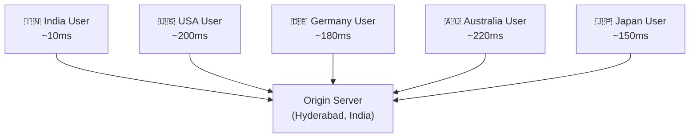
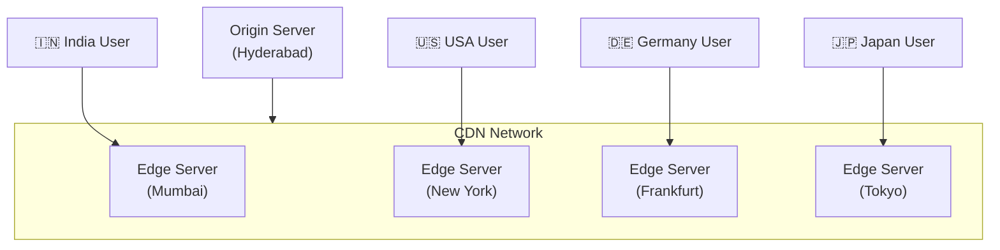
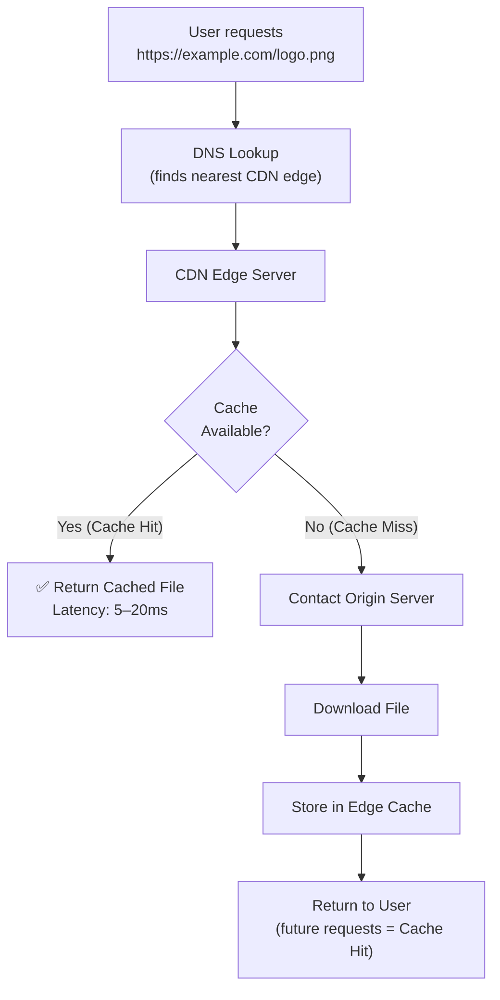
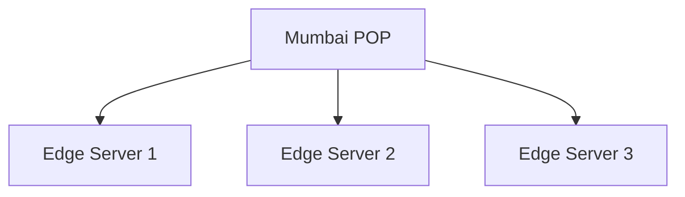
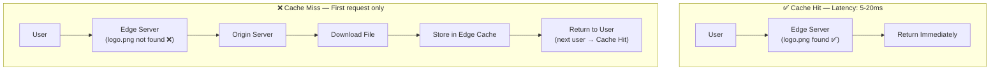
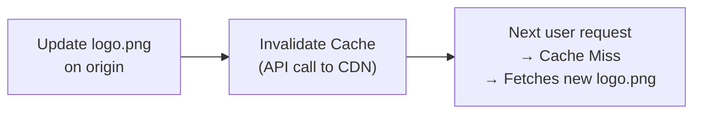
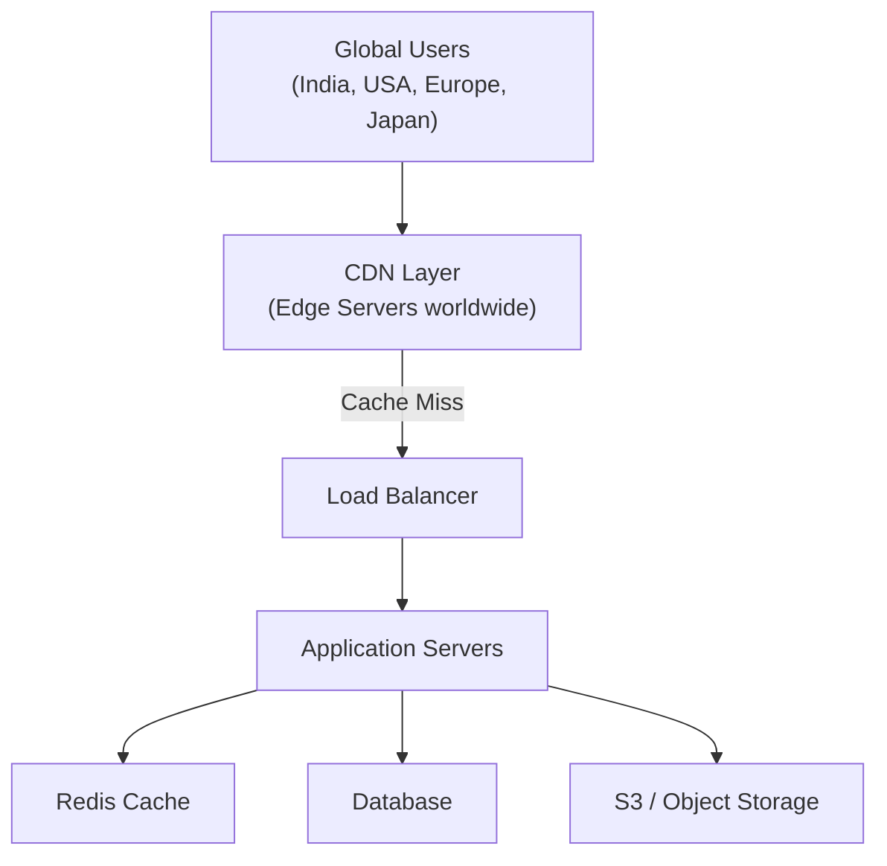

# 🌐 Content Delivery Network (CDN)

A **Content Delivery Network (CDN)** is a globally distributed network of **Edge Servers** that cache copies of content closer to end users.

Instead of every request going to the origin server, users receive content from the **nearest edge server** — reducing latency and improving load times.

---

## Why Do We Need a CDN?

Imagine your application is hosted in **Hyderabad, India**, but users access it from all over the world.



Without a CDN, every request for images, CSS, JS, and videos must travel to Hyderabad.

**Problems:**
- High latency for distant users
- Slow website loading
- Heavy load on origin server
- High bandwidth costs

---

## CDN Solution



Users always download content from the **nearest Edge Server**.

---

## CDN Architecture — Request Flow



---

## Components of CDN

### 1. Origin Server
The original source of all content.
- Contains the backend application, images, videos, CSS, JS, databases
- Whenever an edge server doesn't have the file, it fetches from origin
- **Examples:** EC2, S3, Nginx, Apache

### 2. Edge Server
A cache server located **close to users**.
- Stores cached files
- Serves users quickly
- Reduces requests reaching the origin

### 3. POP (Point of Presence)
A **physical CDN location** or data center containing multiple Edge Servers.



| | POP | Edge Server |
|--|-----|------------|
| What it is | Physical location | Actual machine |
| Contains | Multiple servers | Cached content |

---

## Cache Hit vs Cache Miss



---

## TTL (Time To Live)

Every cached object has an **expiry time**.

```
logo.png  →  TTL = 24 hours

For 24 hours:   Edge serves cached copy
After 24 hours: Edge requests latest version from Origin → updates cache
```

**TTL ensures stale content is eventually refreshed.**

---

## Cache Invalidation

If you update `logo.png` but TTL is 30 days, users still see the old image.

**Solution:** Invalidate the cache immediately.



---

## Versioning (Best Practice)

Instead of modifying files in-place, use versioned names:

```html
<!-- ❌ Old approach (cache issues) -->
<link href="style.css" />

<!-- ✅ Better — query string versioning -->
<link href="style.css?v=2" />

<!-- ✅ Best — content hash in filename -->
<link href="style.a3f7c2.css" />
```

**Benefits:**
- Users automatically receive the latest version
- No need to purge CDN cache
- Standard in all production deployments

---

## What Can Be Cached?

| ✅ Static (Great for CDN) | ❌ Dynamic (Don't Cache) |
|--------------------------|------------------------|
| Images (PNG, JPG, SVG) | Shopping cart |
| Videos | User profile |
| CSS files | Bank balance |
| JavaScript files | Order history |
| Fonts | OTP |
| PDFs, ZIP files | Payment status |
| Audio files | Dashboard data |

### Can APIs be cached?

```
GET /countries        → ✅ Same for everyone → Cache it
GET /exchange-rates   → ✅ Cache for 1 minute
GET /my-orders        → ❌ User-specific → Do NOT cache
```

---

## Complete Production Architecture



---

## Benefits of CDN

| Benefit | Description |
|---------|-------------|
| **Lower Latency** | Users receive content from nearby servers |
| **Faster Website** | Static assets load significantly faster |
| **Reduced Origin Load** | Thousands of requests never reach the app server |
| **Lower Bandwidth Cost** | Cached content is served by Edge Servers |
| **Better UX** | Pages load faster → better customer satisfaction |
| **Higher Availability** | Edge servers serve cached content even if origin is down |
| **DDoS Protection** | CDN absorbs traffic spikes (Cloudflare, etc.) |

---

## Popular CDN Providers

| Provider | Notes |
|----------|-------|
| **Cloudflare** | Most popular; includes DDoS protection & security |
| **Amazon CloudFront** | Integrates with AWS (S3, EC2, ALB) |
| **Akamai** | Enterprise-grade; massive global network |
| **Fastly** | Programmable edge; great for APIs |
| **Google Cloud CDN** | Integrates with GCP |
| **Azure CDN** | Integrates with Azure services |

---

## CDN in System Design Interviews

When designing systems like **Netflix, YouTube, Amazon, Instagram, Spotify**:

> Always mention a CDN for static assets (images, videos, CSS, JS, fonts). This reduces latency, minimizes origin server load, lowers bandwidth costs, and improves scalability.

---

## 💡 30-Second Interview Answer

> A **CDN** is a globally distributed network of Edge Servers that cache static content close to users. When a user requests a file, DNS resolves to the nearest edge server. If the file is in the cache (**Cache Hit**), it's returned immediately (5–20ms). If not (**Cache Miss**), the edge fetches it from the Origin, caches it, and returns it. TTL controls how long content stays cached; **Cache Invalidation** forces fresh content before TTL expires.

---

## 🔑 Key Interview Points

- **Edge Server** = cache server near users; **POP** = physical location with multiple edge servers
- **Cache Hit** = fast response from edge; **Cache Miss** = fetches from origin
- **TTL** = cache expiry time; after TTL, edge fetches fresh content
- **Cache Invalidation** = force-remove cached content before TTL
- **Versioning** = preferred approach for static assets (no manual purge needed)
- CDN serves **static content** (images, CSS, JS); dynamic content generally not cached
- Popular CDNs: Cloudflare, Amazon CloudFront, Akamai

---

## 🔗 Related Topics

- [Caching Basics](../04-caching/caching-basics.md) — Application-level caching (Redis)
- [Cache Invalidation](../04-caching/cache-invalidation.md) — TTL and invalidation strategies
- [Load Balancer](../02-load-balancing/load-balancer.md) — Behind the CDN
