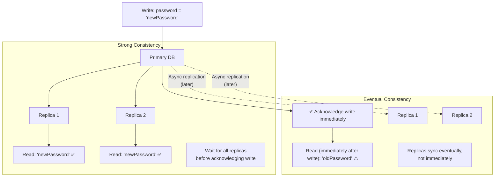
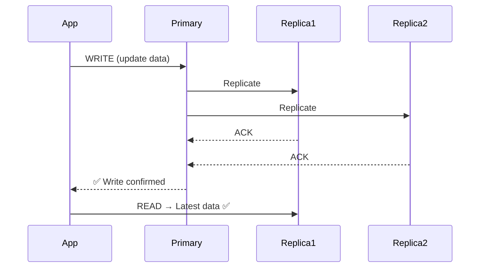
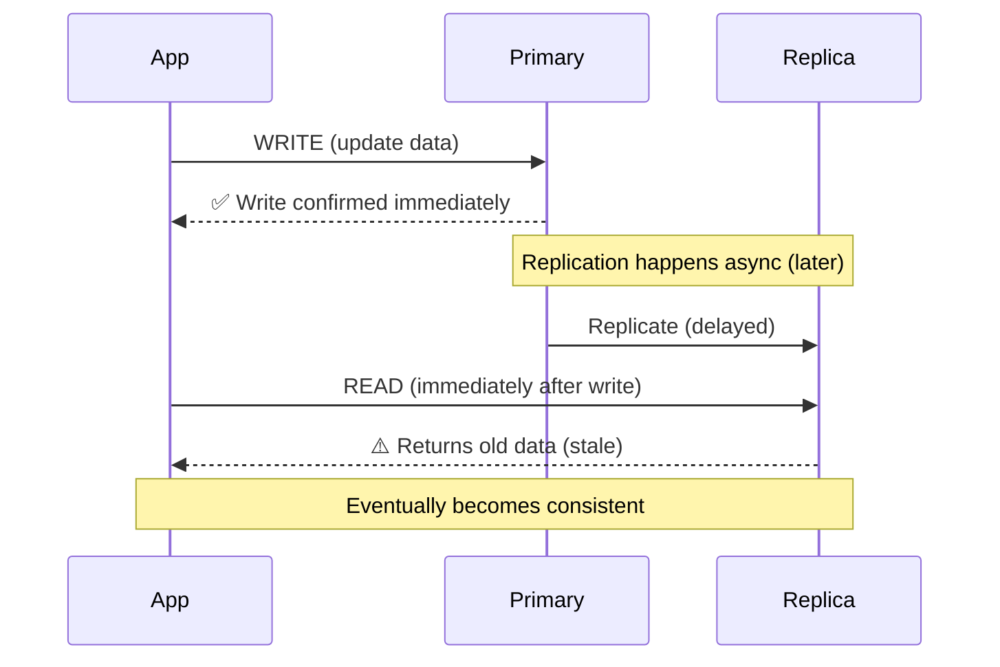
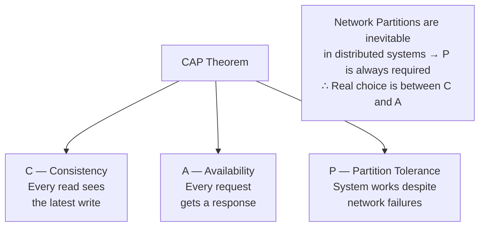
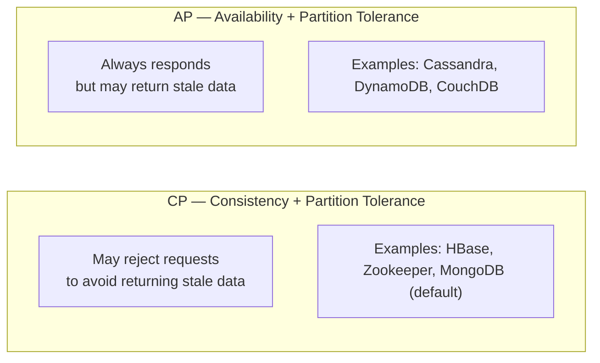
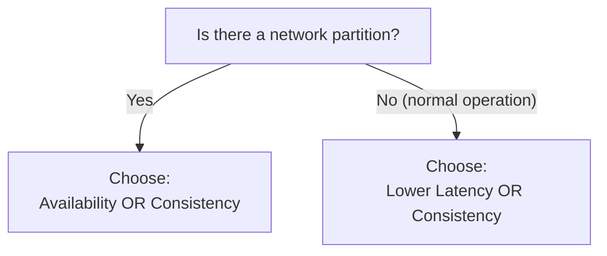

# 🔄 Consistency

**Consistency** in distributed systems refers to whether all nodes in a system return the **same, up-to-date data** at any given time.

The core problem: when you have **multiple database replicas**, they may temporarily have different data.

---

## Strong Consistency vs Eventual Consistency



---

## Strong Consistency

**Every read sees the latest write** — no stale reads possible.



### Characteristics
- Every read reflects the most recent write
- Waits for all replicas to sync before confirming write
- **Higher latency** (must wait for replication)
- No stale reads

### When to Use Strong Consistency
- Banking / financial transactions
- Payment systems
- Ticket booking (avoid double-booking)
- User authentication (login after password change)

---

## Eventual Consistency

**Replicas synchronize over time** — reads may temporarily return stale data.



### Characteristics
- Reads may return stale data **temporarily**
- Replicas synchronize asynchronously over time
- **Lower latency** (write confirmed immediately)
- **Higher availability** (no blocking on replica sync)

### When to Use Eventual Consistency
- Social media feeds (likes, views)
- DNS resolution
- CDN cache metadata
- Product catalogs
- User profile views (not critical if slightly stale)

---

## Strong vs Eventual — Comparison

| Feature | Strong Consistency | Eventual Consistency |
|---------|-------------------|---------------------|
| Read freshness | Always latest | May be stale temporarily |
| Write latency | Higher (waits for replicas) | Lower (confirms immediately) |
| Availability | Lower | Higher |
| Use case | Banking, Payments, Auth | Social Media, DNS, CDN |

---

## CAP Theorem

In a **distributed system**, you can only guarantee **2 out of 3** properties simultaneously:



> **Network Partitions are always possible** in distributed systems. Therefore, **P (Partition Tolerance)** is always required. The real trade-off is between **C** and **A**.

### During a Network Partition:



| Choice | Behavior | Examples |
|--------|----------|----------|
| **CP** | Prefers consistency; may reject requests | HBase, Zookeeper, MongoDB |
| **AP** | Prefers availability; may return stale data | Cassandra, DynamoDB, CouchDB |
| **CA** | Not realistic for distributed systems | Traditional single-server DBs |

> Pure **CA** is not realistic for distributed systems because network partitions are always possible.

---

## PACELC Theorem

An **extension of CAP** that also considers latency trade-offs when no partition is occurring.

```
If Partition:
    Choose between Availability (A) or Consistency (C)
Else (normal operation):
    Choose between Latency (L) or Consistency (C)
```



| System | Partition | Normal |
|--------|-----------|--------|
| DynamoDB | AP | EL (eventual, lower latency) |
| Cassandra | AP | EL |
| MongoDB | CP | EC (consistent, higher latency) |
| MySQL | CP | EC |

---

## Consistency in Practice

### Strong Consistency — Implementation

```
Write → Wait for ALL replicas to confirm → Acknowledge
```

### Eventual Consistency — Implementation

```
Write → Acknowledge immediately → Replicate asynchronously
```

---

## 💡 30-Second Interview Answer

> **Strong Consistency** ensures every read returns the latest write, but with higher latency. **Eventual Consistency** confirms writes immediately but replicas may temporarily serve stale data. The **CAP Theorem** states that distributed systems can guarantee at most 2 of: Consistency, Availability, and Partition Tolerance. Since partitions are inevitable, the real trade-off is between C and A. **PACELC** extends CAP by also considering the Latency vs Consistency trade-off during normal operation.

---

## 🔑 Key Interview Points

- **Strong Consistency** — no stale reads; higher latency; banking/payments
- **Eventual Consistency** — stale reads temporarily; lower latency; social media/CDN
- **CAP Theorem** — can only guarantee 2 of 3 (C, A, P); P is always required
- **CP systems** — reject requests during partition to stay consistent
- **AP systems** — respond even during partition; may return stale data
- **PACELC** — extends CAP with Latency vs Consistency trade-off for normal operation
- **Replication lag** is the root cause of eventual consistency in replica setups

---

## 🔗 Related Topics

- [Replication](../03-databases/replication.md) — Replication lag causes eventual consistency
- [Caching](../04-caching/caching-basics.md) — Cache-aside causes temporary stale data
- [CDN](../06-cdn/cdn.md) — CDN edge caches are eventually consistent
