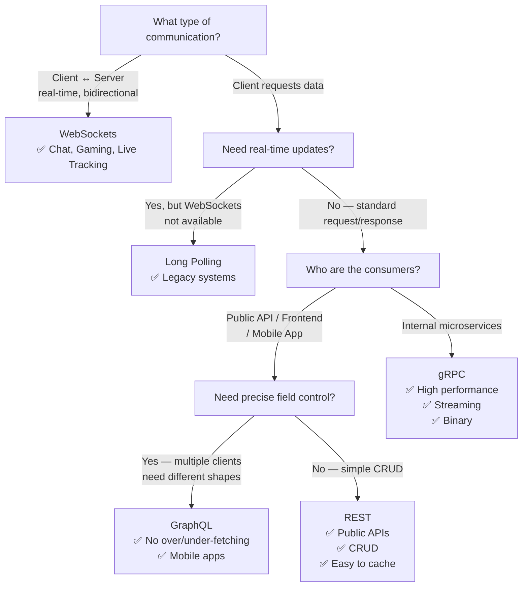
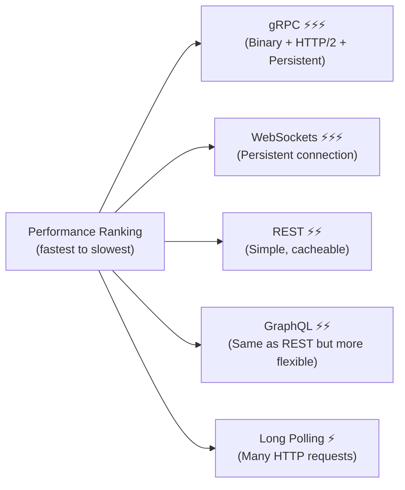

# 📊 API Comparison: REST vs GraphQL vs gRPC vs WebSockets vs Long Polling

A complete comparison of all major API and communication technologies.

---

## Quick Mental Models

| Technology | Remember It As |
|------------|---------------|
| **REST** | *"Give me this resource."* |
| **GraphQL** | *"Give me exactly these fields."* |
| **gRPC** | *"Call this remote function."* |
| **WebSockets** | *"Let's stay connected and talk anytime."* |
| **Long Polling** | *"I'll wait here until you have something for me."* |

---

## Full Comparison Table

| Feature | REST | GraphQL | gRPC | WebSockets | Long Polling |
|---------|------|---------|------|------------|-------------|
| **What is it?** | API Architecture | Query Language for APIs | RPC Framework | Communication Protocol | HTTP Technique |
| **Main Purpose** | CRUD operations | Fetch exactly required data | Fast service-to-service comms | Real-time two-way comms | Near real-time over HTTP |
| **Communication Style** | Request → Response | Request → Response | Function Call | Persistent Connection | Request waits → Response |
| **Protocol** | HTTP/1.1 | HTTP/1.1 | HTTP/2 | WebSocket Protocol | HTTP |
| **Data Format** | JSON | JSON | Protocol Buffers (Binary) | Text / Binary Frames | JSON / XML / Text |
| **Connection** | Opens/closes each request | Opens/closes each request | Persistent HTTP/2 | One long-lived connection | Open until data/timeout, then closes |
| **Who Initiates?** | Client | Client | Client | Both Client & Server | Client |
| **Server Push?** | ❌ No | ❌ No (except Subscriptions) | ✅ Yes (Streaming) | ✅ Yes | ✅ Yes (after client waits) |
| **Real-Time Support** | ❌ No | ❌ No | ✅ Yes (Streaming) | ✅ Excellent | ✅ Moderate |
| **Streaming** | ❌ No | Subscriptions only | ✅ Built-in (4 types) | ✅ Continuous | ❌ No |
| **Latency** | Medium | Medium | Low | Very Low | Medium |
| **Performance** | Good | Good | Excellent | Excellent | Better than polling |
| **Human-Readable?** | ✅ Yes | ✅ Yes | ❌ No (binary) | Usually Yes | ✅ Yes |
| **Strong Contract?** | ❌ No | Schema | ✅ `.proto` file | ❌ No | ❌ No |
| **Caching Support** | ✅ Excellent | ⚠️ Complex | ❌ Rare | ❌ No | ❌ No |
| **State** | Stateless | Stateless | Stateless | Stateful (connection open) | Stateless |
| **Scalability** | Easy | Easy | Easy | Harder (persistent connections) | Moderate |
| **Learning Curve** | Easy | Medium | Medium–High | Medium | Easy |
| **Browser Support** | ✅ Full | ✅ Full | ⚠️ Limited | ✅ Full | ✅ Full |
| **Best For** | Public APIs, CRUD | Mobile apps, Dashboards | Internal Microservices | Chat, Gaming, Live Tracking | Legacy real-time |

---

## Decision Flowchart

---

## When to Use Each

### REST
✅ Public APIs · CRUD applications · E-commerce · Banking APIs · Mobile and Web apps · Microservices (external)

### GraphQL
✅ Social media apps · Mobile apps · Dashboards · Analytics · Fetching from multiple resources · Complex UIs

### gRPC
✅ Internal microservices · High-performance backends · Distributed systems · Real-time streaming · Low-latency systems

### WebSockets
✅ Chat apps · Multiplayer games · Live dashboards · Live notifications · Collaborative editing · Stock trading

### Long Polling
✅ Legacy apps · Environments where WebSockets are blocked · Infrequent real-time updates

---

## Performance Summary

---

## 🔗 Individual Topic Files

- [REST](./rest.md)
- [GraphQL](./graphql.md)
- [gRPC](./grpc.md)
- [WebSockets](../09-realtime-communication/websockets.md)
- [Long Polling](../09-realtime-communication/long-polling.md)
