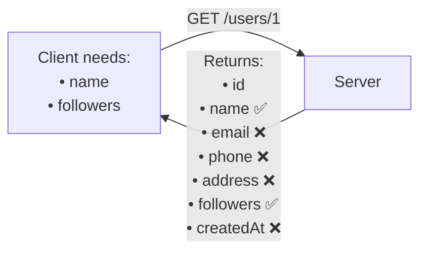
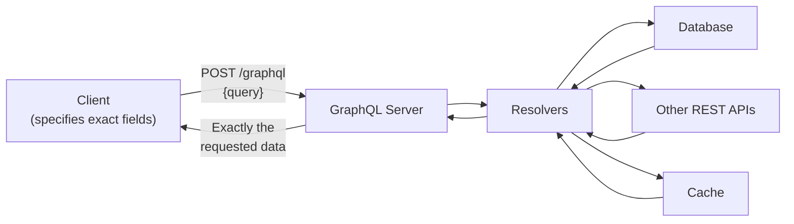
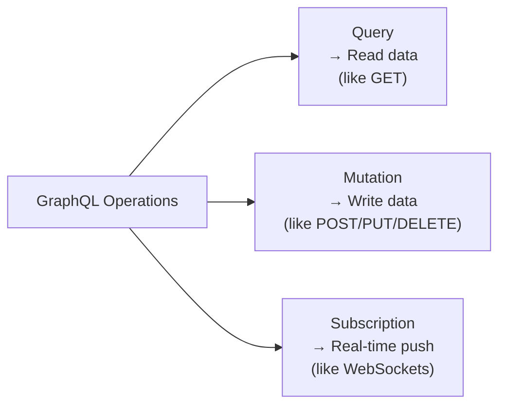

# 📊 GraphQL

**GraphQL** is a **query language for APIs** that allows clients to request exactly the data they need — nothing more, nothing less.

Developed by **Facebook** to overcome the limitations of REST APIs.

---

## Why Was GraphQL Introduced?

### Problem 1: Over-fetching

The server returns **more data than the client needs**.



**Wasted bandwidth** — client only needed `name` and `followers`.

### Problem 2: Under-fetching

A single API response is **not enough** — the client must make multiple requests.

```
GET /product/10       → product details
GET /seller/5         → seller info
GET /reviews/10       → reviews
GET /ratings/10       → ratings

4 round trips → 4x latency
```

---

## What is GraphQL?

- Client specifies **exactly which fields** it wants
- Server returns **only those fields**
- Eliminates over-fetching and greatly reduces under-fetching
- Uses a **single endpoint**: `/graphql`



---

## How GraphQL Works

The client writes a **query** that describes exactly what data it needs:

```graphql
# Client sends this query
query {
  user(id: 1) {
    name
    followers
  }
}

# Server returns ONLY this
{
  "data": {
    "user": {
      "name": "Rahul",
      "followers": 500
    }
  }
}
```

No extra fields, no missing fields.

---

## Resolvers

Resolver functions **fetch the requested data** for each field in the query.

- Every field in a GraphQL query is resolved by a resolver
- Resolvers can retrieve data from: Database, REST APIs, Microservices, External APIs, Cache

```javascript
// Example resolver
const resolvers = {
  Query: {
    user: (_, { id }) => db.findUserById(id),
  }
}
```

---

## Types of Operations

### 1. Query — Read Data

```graphql
query {
  user(id: 1) {
    name
    email
  }
}
```

Similar to `HTTP GET` in REST.

### 2. Mutation — Create / Update / Delete

```graphql
mutation {
  createUser(name: "Rahul") {
    id
    name
  }
}
```

Similar to `POST, PUT, PATCH, DELETE` in REST.

### 3. Subscription — Real-Time Updates

```graphql
subscription {
  messageReceived(chatId: "123") {
    content
    sender
  }
}
```

- Maintains a **persistent connection**
- Server **pushes updates** automatically
- Common use cases: Chat, live notifications, stock prices, sports scores, live dashboards

---

## Operations Summary



---

## ✅ Advantages

| Advantage | Description |
|-----------|-------------|
| **No over-fetching** | Client gets only what it asks for |
| **Less under-fetching** | One query can fetch data from multiple resources |
| **Single endpoint** | `/graphql` handles everything |
| **Client controls shape** | Frontend decides the response structure |
| **Fewer network requests** | Combine multiple resource queries into one |
| **Great for mobile** | Mobile apps can request minimal data |
| **Schema-driven** | Self-documenting via introspection |

---

## ❌ Disadvantages

| Disadvantage | Description |
|-------------|-------------|
| **More complex than REST** | Schema, resolvers, types to manage |
| **Hard to cache** | GET requests are easily cached; GraphQL POST is not |
| **Expensive queries** | Clients can write deeply nested queries that overload the DB |
| **Query validation needed** | Must limit query depth/complexity |
| **Harder to monitor** | All requests go to one endpoint |

---

## REST vs GraphQL

| Feature | REST | GraphQL |
|---------|------|---------|
| Endpoints | Multiple (`/users`, `/orders`) | Single (`/graphql`) |
| Response control | Server decides | **Client decides** |
| Over-fetching | ✅ Possible | ❌ No |
| Under-fetching | ✅ Possible | ❌ Greatly reduced |
| Caching | ✅ Easy (HTTP cache) | ⚠️ Complex |
| Implementation | Simpler | More complex |
| Best For | Public APIs, CRUD | Mobile apps, Dashboards |

---

## When to Use GraphQL

| ✅ Use GraphQL | ❌ Don't Use GraphQL |
|--------------|---------------------|
| Social media apps | Simple CRUD apps |
| Mobile apps (minimal data) | Small APIs |
| Dashboards & analytics | Public APIs where REST is sufficient |
| Apps fetching from multiple sources | Simple microservices |
| Frontends needing different data shapes | |

---

## 💡 30-Second Interview Answer

> **GraphQL** is a query language for APIs developed by Facebook. Unlike REST's multiple endpoints, GraphQL uses a **single endpoint** (`/graphql`) where clients specify exactly the fields they need. This eliminates **over-fetching** and greatly reduces **under-fetching**. It supports three operations: **Query** (read), **Mutation** (write), and **Subscription** (real-time push). The main trade-offs are caching complexity and the risk of expensive queries.

---

## 🔑 Key Interview Points

- GraphQL is a **query language**, not a protocol
- Client controls the **response shape**
- Uses a **single endpoint** (`/graphql`)
- Solves **over-fetching** (no extra data)
- Greatly reduces **under-fetching** (combine multiple resources in one query)
- **Resolvers** fetch data for each field
- **Query** = Read; **Mutation** = Write; **Subscription** = Real-time
- Harder to cache than REST; risk of expensive nested queries

---

## 🔗 Related Topics

- [REST](./rest.md) — Comparison: REST vs GraphQL
- [gRPC](./grpc.md) — High-performance alternative for microservices
- [WebSockets](../09-realtime-communication/websockets.md) — Alternative for real-time (vs GraphQL Subscriptions)
- [API Comparison](./api-comparison.md) — Full comparison table
