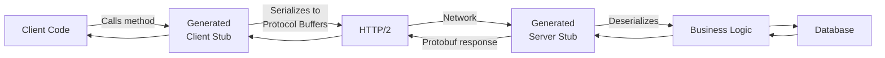
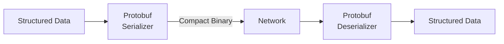
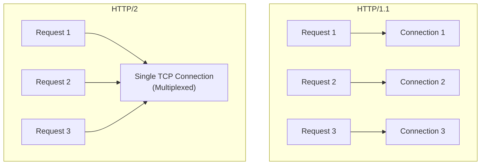
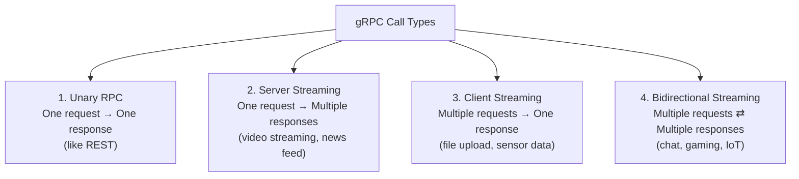

# ⚡ gRPC (Google Remote Procedure Call)

**gRPC** is a high-performance, open-source **Remote Procedure Call (RPC) framework** developed by Google for efficient communication between microservices.

---

## Why Was gRPC Introduced?

REST APIs are simple but become **inefficient for large-scale internal microservice communication**:

| Problem with REST in Microservices | gRPC Solution |
|------------------------------------|---------------|
| JSON is text-based (larger payloads) | **Protocol Buffers** (binary, compact) |
| JSON parsing consumes more CPU | Faster serialization/deserialization |
| HTTP/1.1 overhead | Uses **HTTP/2** |
| No built-in streaming | Built-in streaming support |
| No enforced contract | **Strong typed contracts** via `.proto` files |

Google wanted: Faster communication · Smaller payloads · Lower latency · Less CPU usage · Streaming support · Strong contracts between services

---

## What is RPC?

**RPC (Remote Procedure Call)** lets you call a function running on **another machine** as if it were a local function call.

```
Normal local function:
  result = add(5, 3)

RPC (runs on a different server):
  user = GetUser(10)
  ← looks like a local call, actually calls a remote server
```

---

## How gRPC Works



Client and server code is **automatically generated** from the `.proto` file.

---

## Protocol Buffers (Protobuf)

Google's **binary serialization format** — the core of gRPC's efficiency.



### JSON vs Protobuf

| | JSON | Protobuf |
|--|------|---------|
| Format | Text (human-readable) | Binary (compact) |
| Size | Larger | **3–10x smaller** |
| Speed | Slower to parse | **Much faster** |
| Readability | ✅ Human-readable | ❌ Binary |
| Type safety | ❌ Runtime | ✅ Compile-time |

### .proto File — Defines the contract

```protobuf
// user.proto
syntax = "proto3";

service UserService {
  rpc GetUser(UserRequest) returns (UserResponse);
  rpc ListUsers(ListRequest) returns (stream UserResponse);
}

message UserRequest {
  int32 id = 1;
}

message UserResponse {
  int32  id   = 1;
  string name = 2;
  string email = 3;
}
```

Both client and server **generate code automatically** from this file.

---

## Strong Contract

```mermaid
graph TD
    Rest["REST — Weak Contract"]
    Rest --> J["{\"id\": \"10\"}\nIs id a String or Integer?\nCannot know until runtime ❌"]

    gRPC["gRPC — Strong Contract"]
    gRPC --> P["int32 id = 1;\nType is fixed, validated at compile time ✅"]
```

---

## HTTP/2 Advantages

gRPC uses **HTTP/2** by default, which provides:

| Feature | Benefit |
|---------|---------|
| **Multiplexing** | Multiple requests share one TCP connection simultaneously |
| **Persistent Connection** | One connection reused for many requests (no reconnection overhead) |
| **Header Compression** | Repeated HTTP headers compressed → less bandwidth |



---

## Types of gRPC Calls



| Type | Pattern | Use Cases |
|------|---------|-----------|
| **Unary** | 1 req → 1 res | GetUser, Login |
| **Server Streaming** | 1 req → many res | Video streaming, log streaming |
| **Client Streaming** | many req → 1 res | File upload, audio upload |
| **Bidirectional** | many req ⇄ many res | Chat, gaming, live collaboration |

---

## REST vs gRPC

| Feature | REST | gRPC |
|---------|------|------|
| **Protocol** | HTTP/1.1 (commonly) | HTTP/2 |
| **Data Format** | JSON (text) | Protocol Buffers (binary) |
| **Performance** | Good | **Excellent** |
| **Human-Readable** | ✅ Yes | ❌ Binary |
| **Contract** | ❌ Loose | ✅ Strong (`.proto`) |
| **Streaming** | ❌ No | ✅ Built-in (4 types) |
| **Debugging** | ✅ Easy (curl, browser) | ❌ Harder (binary) |
| **Browser Support** | ✅ Full | ⚠️ Limited (needs gRPC-Web) |
| **Best For** | Public APIs | Internal microservices |

---

## ✅ Advantages

- Very fast (binary + HTTP/2)
- Small payload size
- Strongly typed (less runtime errors)
- Efficient code generation from `.proto`
- Built-in streaming support
- Excellent for microservices
- Lower CPU and bandwidth usage

---

## ❌ Disadvantages

- Difficult to debug manually (binary data)
- Browser support is limited
- Steeper learning curve
- Requires `.proto` files and code generation step

---

## When to Use gRPC

| ✅ Use gRPC | ❌ Don't Use gRPC |
|------------|-----------------|
| Internal microservices | Public APIs |
| High-performance backends | Browser-based apps |
| Distributed systems | Simple CRUD APIs |
| Real-time streaming | Small projects where REST is sufficient |
| Low-latency requirements | |

---

## 💡 30-Second Interview Answer

> **gRPC** is Google's high-performance RPC framework for microservice communication. It uses **Protocol Buffers** (binary) instead of JSON, making it 3–10x faster and more compact. It runs on **HTTP/2**, enabling multiplexing and persistent connections. Contracts are defined in **`.proto` files**, ensuring strong typing and code generation. It supports 4 types of calls: Unary, Server Streaming, Client Streaming, and Bidirectional Streaming.

---

## 🔑 Key Interview Points

- gRPC = Google Remote Procedure Call
- Uses **Protocol Buffers** (binary) → smaller, faster than JSON
- Runs on **HTTP/2** → multiplexing, persistent connections
- **`.proto` file** defines the contract; code is auto-generated
- Supports **4 streaming patterns**: Unary, Server, Client, Bidirectional
- Best for **internal microservice** communication
- Not ideal for public APIs or browser-based apps (limited browser support)

---

## 🔗 Related Topics

- [REST](./rest.md) — Comparison: REST vs gRPC
- [API Comparison](./api-comparison.md) — Full comparison table
- [WebSockets](../09-realtime-communication/websockets.md) — Alternative for real-time bidirectional communication
