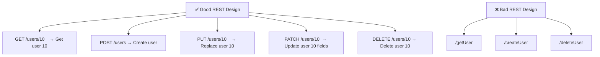
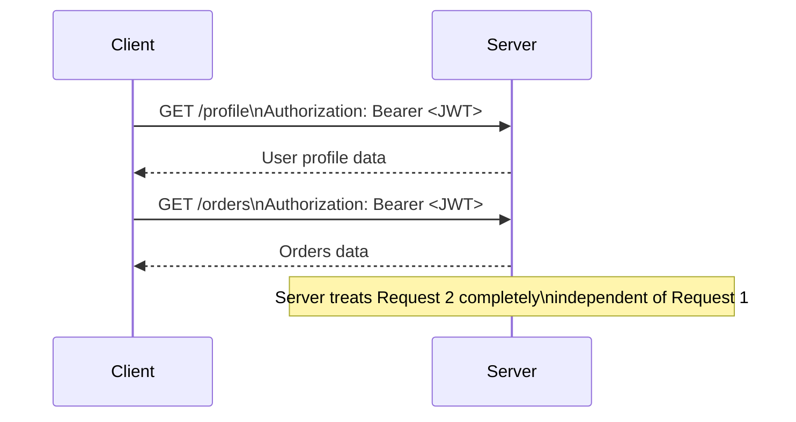
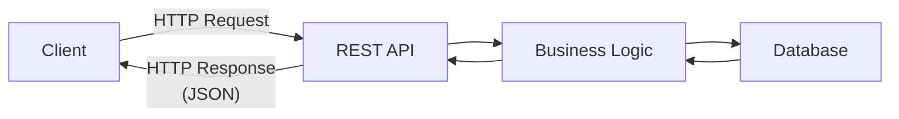

# 🔌 REST API

**REST (Representational State Transfer)** is an architectural style for building APIs that uses standard HTTP methods to perform operations on resources.

---

## Why REST?

- Provides a **standard way** for clients and servers to communicate over HTTP
- Exposes resources through **URLs** and uses HTTP methods for operations
- Most public APIs today are REST APIs

---

## What is a Resource?

A resource is any object or data exposed by the server.

```
Resources:  User, Product, Order, Payment, Comment

URLs:
  /users
  /products
  /orders
  /payments
```

---

## REST is Resource-Based

URLs represent **resources**, not actions.



---

## HTTP Methods (Verbs)

| Method | Action | Example |
|--------|--------|---------|
| **GET** | Retrieve data (no modification) | `GET /users/10` |
| **POST** | Create a new resource | `POST /users` |
| **PUT** | Replace the entire resource | `PUT /users/10` |
| **PATCH** | Update specific fields only | `PATCH /users/10` |
| **DELETE** | Remove a resource | `DELETE /users/10` |

### PUT vs PATCH

```json
// Current data
{ "name": "Rahul", "age": 25 }

// PUT — replaces entire object
PUT /users/10 → { "name": "Rahul", "age": 26 }
// Entire object is replaced (must send all fields)

// PATCH — updates only specified fields
PATCH /users/10 → { "age": 26 }
// Only the age changes; name stays "Rahul"
```

---

## Stateless Nature

REST is **stateless** — the server does not remember previous requests. Every request must contain all required information.



---

## Typical REST Architecture



---

## Data Format

JSON is the most commonly used response format:

```json
{
  "id": 1,
  "name": "Rahul",
  "email": "rahul@example.com"
}
```

---

## HTTP Status Codes

| Code | Name | When to Use |
|------|------|-------------|
| **200** | OK | Request successful |
| **201** | Created | Resource created successfully |
| **204** | No Content | Success but no body (e.g., DELETE) |
| **400** | Bad Request | Invalid request from client |
| **401** | Unauthorized | Authentication required or invalid token |
| **403** | Forbidden | Authenticated but lacks permission |
| **404** | Not Found | Resource does not exist |
| **409** | Conflict | Resource conflict (e.g., duplicate) |
| **429** | Too Many Requests | Rate limit exceeded |
| **500** | Internal Server Error | Server-side error |

---

## ✅ Advantages of REST

- Simple and easy to understand
- Stateless → easy horizontal scaling
- Uses standard HTTP protocol
- Widely supported across languages and frameworks
- GET requests are easily cacheable
- Excellent for CRUD operations
- Ideal for public APIs

---

## ❌ Disadvantages of REST

- Multiple endpoints may be required
- **Over-fetching** — server returns more data than the client needs
- **Under-fetching** — client must make multiple API calls to get all data
- Less efficient for complex data relationships (GraphQL handles this better)

---

## When to Use REST

| ✅ Use REST | ❌ Avoid REST |
|------------|-------------|
| Public APIs | Real-time bidirectional apps |
| CRUD applications | High-frequency microservice calls |
| E-commerce | Apps needing precise data control |
| Banking APIs | Streaming data |
| Mobile and Web apps | |
| Microservices (external) | |

---

## 💡 30-Second Interview Answer

> **REST** is a resource-based API architecture that uses standard HTTP methods (GET, POST, PUT, PATCH, DELETE) to perform operations. It is **stateless** — every request is independent and contains all required information. REST uses JSON for data exchange and is ideal for CRUD-based public APIs. Its limitations include over-fetching and under-fetching, which GraphQL addresses.

---

## 🔑 Key Interview Points

- **REST** is resource-based — URLs represent resources, not actions
- Uses standard HTTP methods: `GET, POST, PUT, PATCH, DELETE`
- **Stateless** — server stores no client session; every request is independent
- Typically exchanges data using **JSON**
- Easy to scale because the server stores no session
- **Over-fetching** = getting more data than needed
- **Under-fetching** = needing multiple requests to get all data
- Best suited for **CRUD-based applications and public APIs**

---

## 🔗 Related Topics

- [GraphQL](./graphql.md) — Solves REST's over/under-fetching problems
- [gRPC](./grpc.md) — High-performance alternative for internal microservices
- [API Comparison](./api-comparison.md) — Full comparison table
