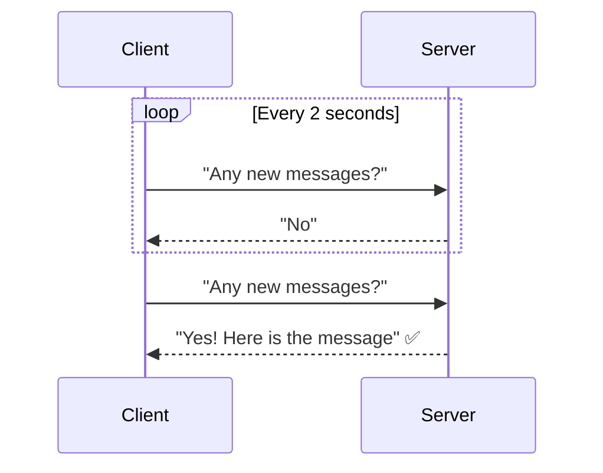
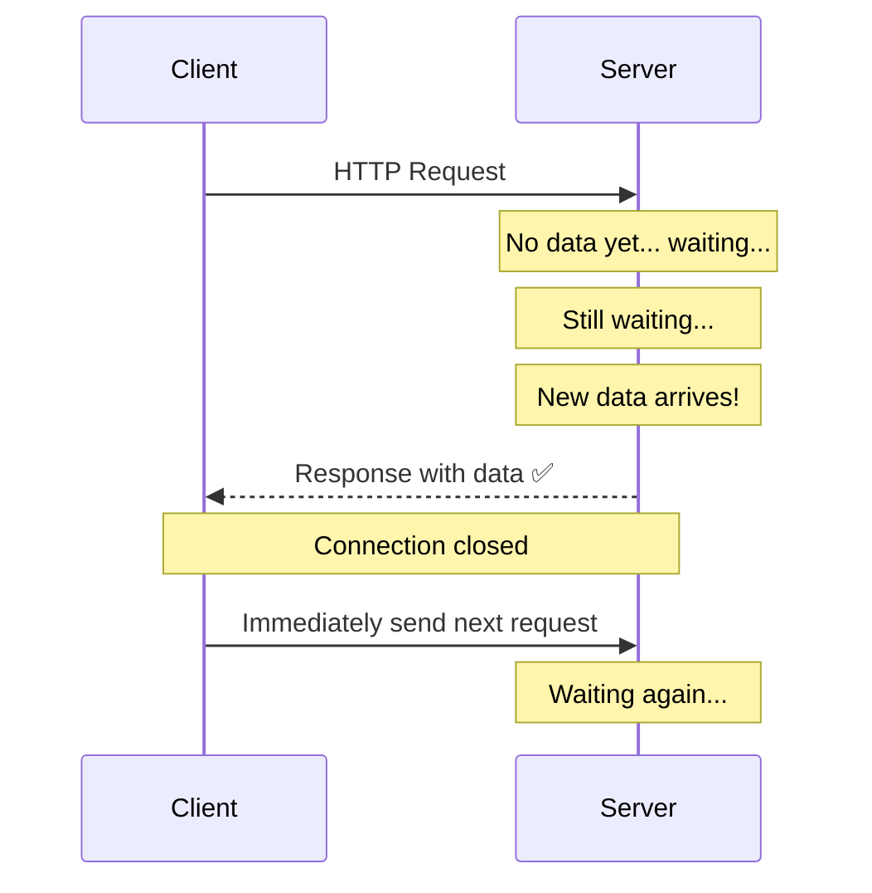
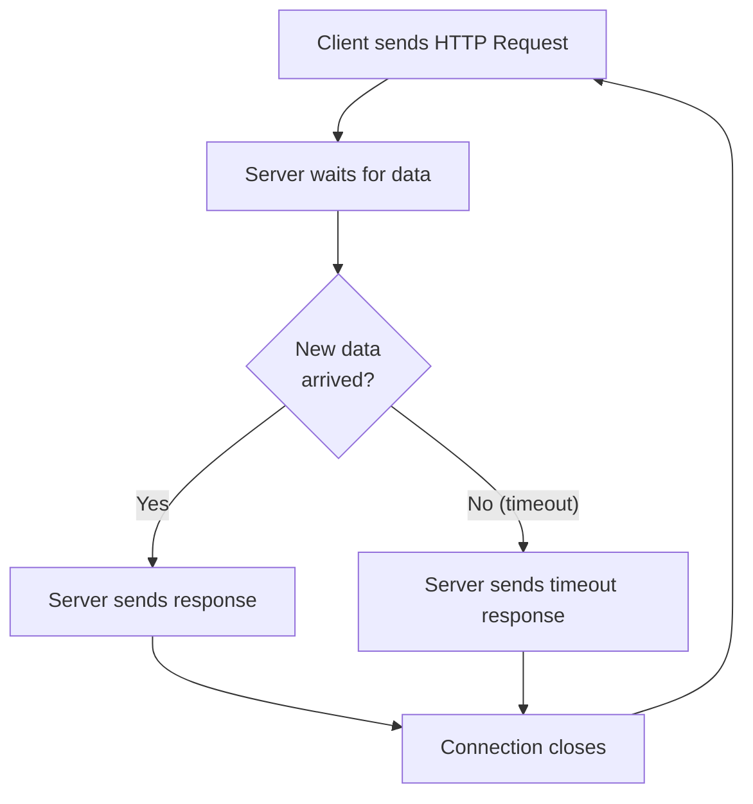
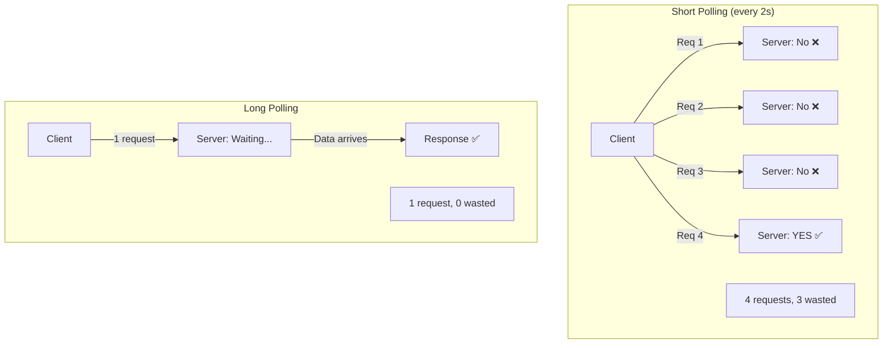

# ⏳ Long Polling

**Long Polling** is an **HTTP-based communication technique** (NOT a separate protocol) that simulates real-time behavior by keeping HTTP requests open until data is available.

---

## Why Was Long Polling Introduced?

### Problem: Normal (Short) Polling

Regular polling sends requests at **fixed intervals**, regardless of whether new data exists:



**Problems:**
- Many unnecessary requests (most return "No")
- Wastes CPU, bandwidth, battery, and server resources
- Higher server load

---

## How Long Polling Works

Instead of responding immediately, the server **holds the request open** until data is available:



---

## Long Polling Lifecycle



1. Client sends HTTP request
2. Server waits (holds connection open)
3. New data arrives → server sends response immediately
4. Timeout → server sends empty/timeout response
5. Connection closes
6. Client immediately sends next request → repeat

---

## Timeout

If no new data arrives within a predefined timeout:

```
Client sends request
Server waits 30 seconds
No data arrives
Server sends: { "status": "timeout" }
Connection closes
Client immediately creates another Long Poll request
```

---

## Normal Polling vs Long Polling



| Feature | Short Polling | Long Polling |
|---------|--------------|-------------|
| Server responds | Immediately (even if no data) | Only when data is available |
| Unnecessary requests | Many | Few |
| Latency | High (fixed interval) | Low (responds immediately on data) |
| Resource usage | High | Moderate |

---

## ✅ Advantages

| Advantage | Description |
|-----------|-------------|
| **Works over HTTP** | No special protocol needed |
| **Easy browser support** | All browsers support it |
| **Fewer unnecessary requests** | Better than short polling |
| **Easier than WebSockets** | Simpler to implement |
| **Better UX than polling** | Lower apparent latency |

---

## ❌ Disadvantages

| Disadvantage | Description |
|-------------|-------------|
| **Still many HTTP requests** | One per data arrival; more overhead than WebSockets |
| **Higher latency than WebSockets** | New connection overhead each time |
| **More server resources than REST** | Holding open connections ties up server threads |
| **Harder to scale** | Many concurrent long-poll requests are expensive |
| **Not true real-time** | Near real-time, not instant like WebSockets |

---

## Long Polling vs WebSockets

| Feature | Long Polling | WebSockets |
|---------|-------------|------------|
| Protocol | HTTP | WebSocket |
| Connection | Closes after each response | Stays open |
| Real-time quality | Near real-time | True real-time |
| Latency | Medium | Very Low |
| Server resource usage | Higher (many connections) | Lower (one persistent) |
| Implementation | Simpler | More complex |
| Browser support | ✅ Universal | ✅ Universal |
| Best For | Legacy / fallback | Chat, gaming, live apps |

---

## When to Use Long Polling

| ✅ Use Long Polling | ❌ Don't Use Long Polling |
|--------------------|--------------------------|
| Legacy applications | Chat apps with heavy traffic |
| Browsers blocking WebSockets | Online gaming |
| Firewalls/proxies blocking WS | Stock trading |
| Infrequent real-time updates | Live dashboards |
| WebSockets not available | Continuous bidirectional comms |

---

## 💡 30-Second Interview Answer

> **Long Polling** is an HTTP technique where the client sends a request and the server holds it open until new data arrives or a timeout occurs. This is better than traditional polling (which fires repeatedly) because it reduces unnecessary requests. However, it creates a new HTTP connection for every data event, making it less efficient than WebSockets. It's mainly used as a **fallback** when WebSockets are unavailable.

---

## 🔑 Key Interview Points

- Long Polling is **NOT a protocol** — it's an HTTP communication technique
- Server **holds the request open** until data arrives or timeout
- Client **immediately sends another request** after every response
- Better than short polling but **less efficient** than WebSockets
- Still uses HTTP → more connection overhead per event than WebSocket
- Used as a **fallback** when WebSockets are unavailable (firewalls, legacy systems)

---

## 🔗 Related Topics

- [WebSockets](./websockets.md) — The preferred real-time alternative
- [REST](../08-api-design/rest.md) — Short polling uses REST under the hood
- [Real-Time Comparison](./realtime-comparison.md) — Full comparison table
