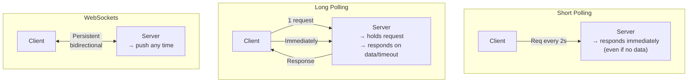
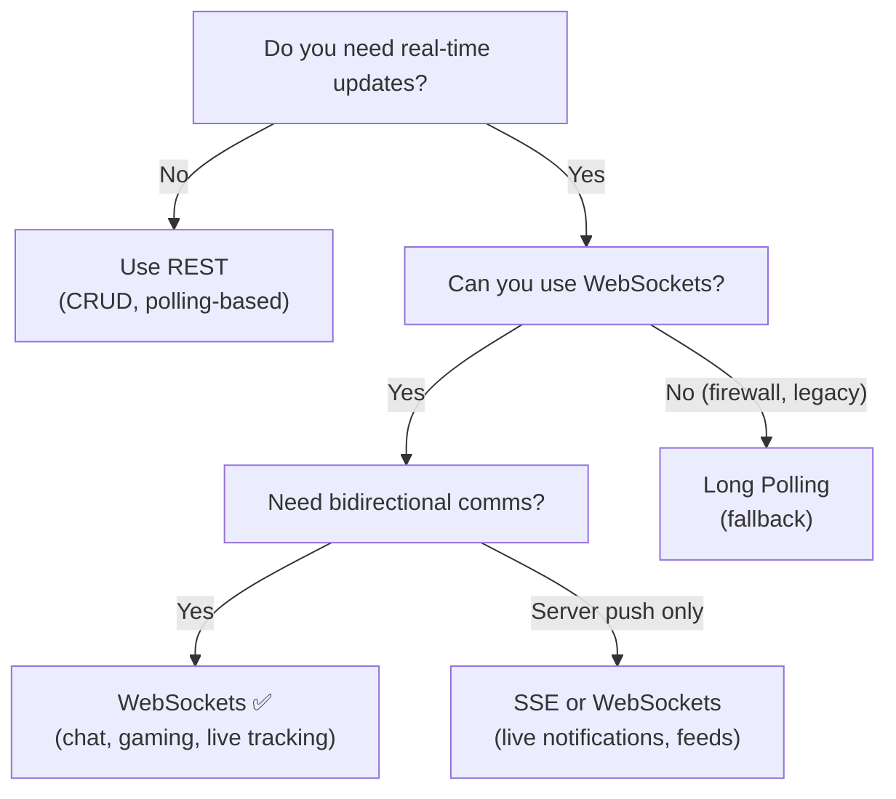

# 📡 Real-Time Communication Comparison

A comparison of techniques for delivering real-time and near real-time data to clients.

---

## At a Glance

| | Short Polling | Long Polling | WebSockets |
|--|--------------|-------------|------------|
| **Protocol** | HTTP | HTTP | WebSocket |
| **Connection** | Open/close per request | Open until data/timeout | One persistent |
| **Server Push?** | ❌ No | ✅ (after client waits) | ✅ Yes |
| **True Real-Time?** | ❌ No | ❌ Near | ✅ Yes |
| **Latency** | High (fixed interval) | Low-Medium | Very Low |
| **Complexity** | Low | Low-Medium | Medium |

---

## How Each Works

---

## Decision Guide

---

## Use Case Matrix

| Use Case | Best Choice | Why |
|----------|------------|-----|
| Chat application | WebSockets | Persistent, bidirectional, low latency |
| Live sports scores | WebSockets | Server pushes updates continuously |
| Stock market tickers | WebSockets | Ultra-low latency required |
| Online multiplayer game | WebSockets | High-frequency bidirectional |
| Collaborative editing (Google Docs) | WebSockets | Real-time sync required |
| Ride tracking (Uber) | WebSockets | Continuous location updates |
| Simple notifications (infrequent) | Long Polling | Simpler than WS; infrequent |
| Legacy browser support | Long Polling | Universal HTTP support |
| Blog comment section | Short Polling | Updates are infrequent |

---

## Full Comparison: All Real-Time Techniques

| Feature | Short Polling | Long Polling | WebSockets | Server-Sent Events (SSE) |
|---------|--------------|-------------|------------|--------------------------|
| Direction | Client → Server | Client → Server | Both ↔ | Server → Client only |
| Protocol | HTTP | HTTP | WebSocket | HTTP |
| Connection | New each time | New per response | Persistent | Persistent |
| Browser support | ✅ | ✅ | ✅ | ✅ (except IE) |
| Server push | ❌ | Limited | ✅ | ✅ |
| Complexity | Low | Low | Medium | Low |
| Best for | Infrequent checks | Near real-time | True real-time bidirectional | Server-to-client streams |

---

## 🔗 Individual Topic Files

- [WebSockets](./websockets.md) — Full WebSockets guide
- [Long Polling](./long-polling.md) — Full Long Polling guide
- [API Comparison](../08-api-design/api-comparison.md) — REST, GraphQL, gRPC, WebSockets, Long Polling
