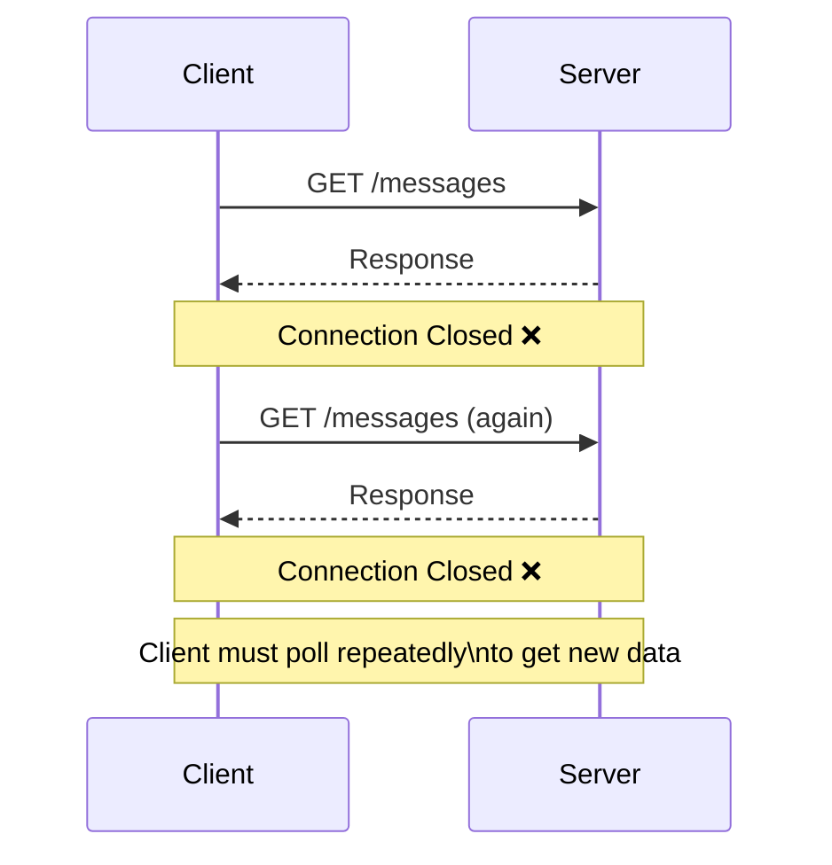
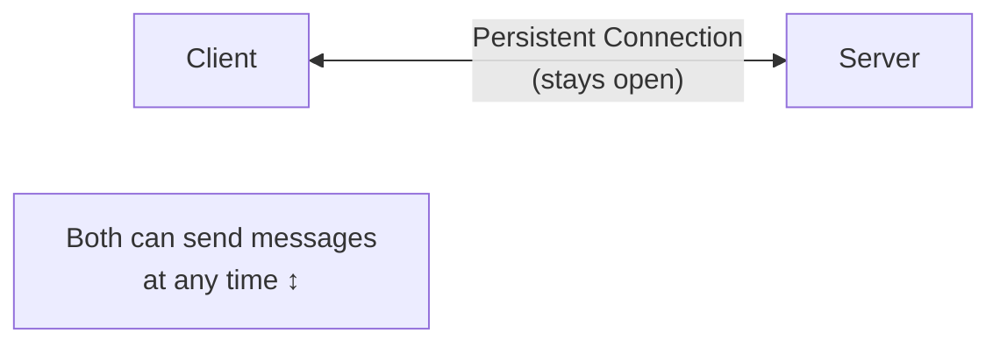
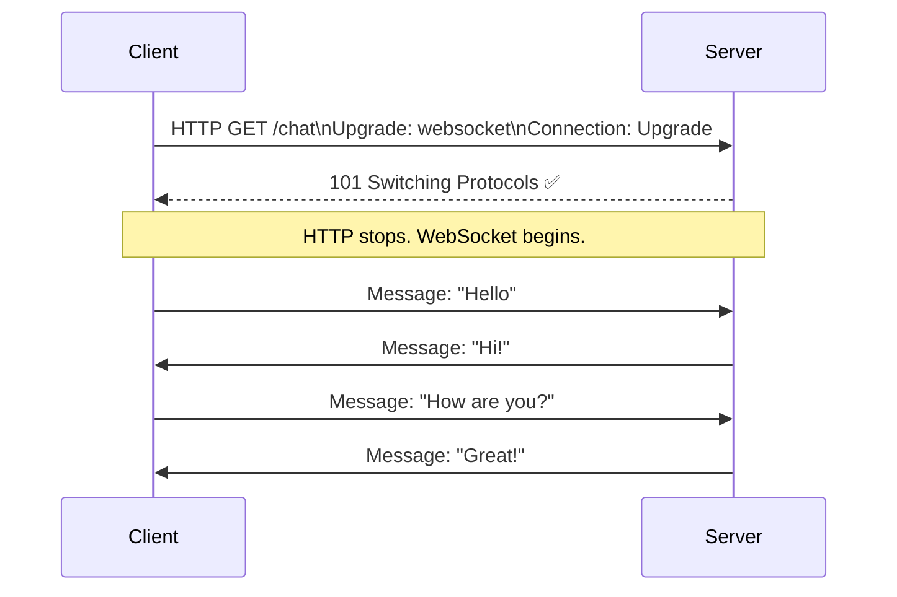
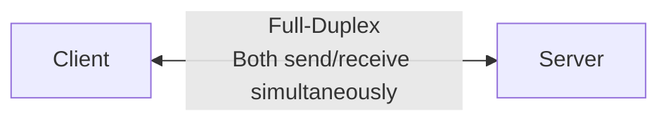
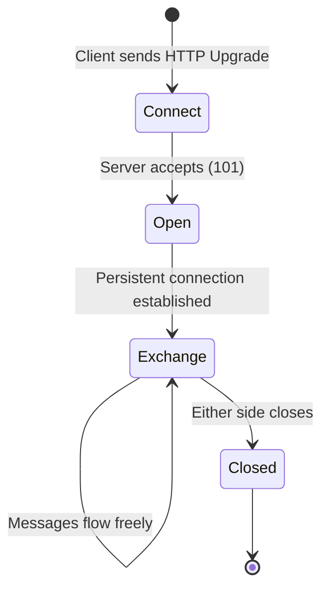
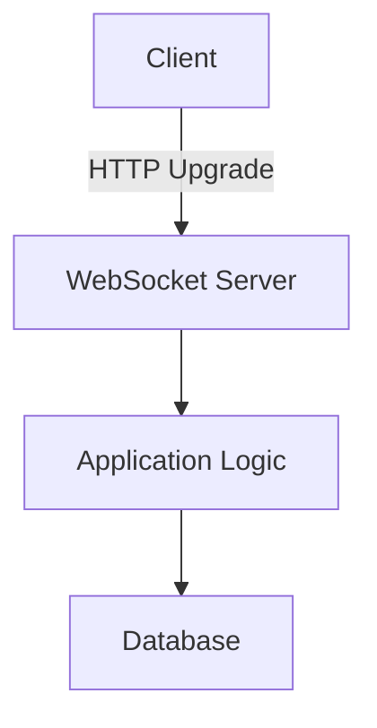
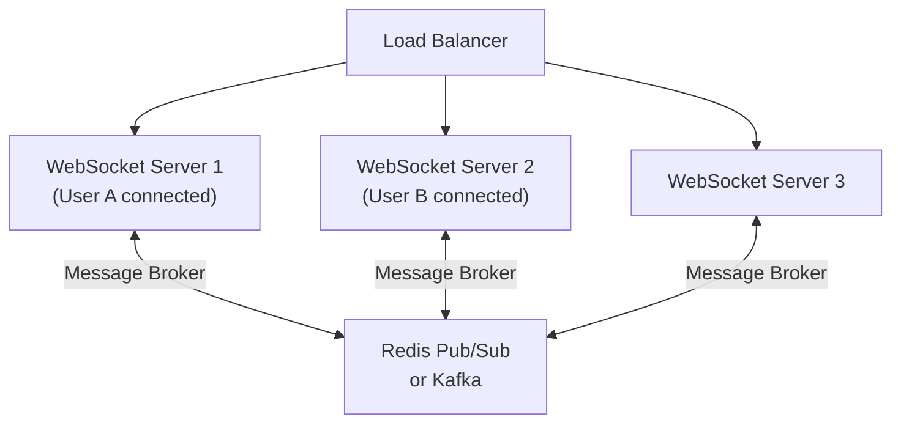
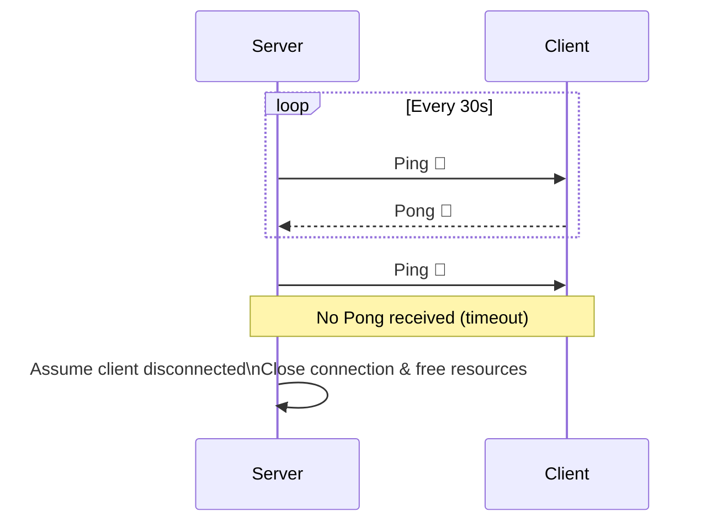
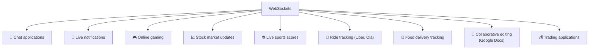

# 🔌 WebSockets

**WebSocket** is a communication protocol that provides a **persistent, full-duplex connection** between client and server.

After the connection is established, **both client and server can send messages at any time** — no need to repeatedly open new HTTP connections.

---

## Why Were WebSockets Introduced?

### The Problem with HTTP



HTTP follows **request-response** model — server cannot push data unless the client asks first. This is inefficient for real-time apps.

### The Real-Time Problem

Imagine Rahul sends a chat message. With HTTP:
- Receiver doesn't automatically get the message
- Client must repeatedly ask: *"Any new messages?"*
- Most responses: *"No."* — wasting CPU, bandwidth, battery, server resources

---

## What is WebSocket?



The connection remains open until **either side** closes it.

---

## WebSocket Handshake

A WebSocket connection begins as an HTTP request:



This upgrade process is called the **WebSocket Handshake**.

---

## Full-Duplex Communication

```
Half-Duplex:  Only one side can send at a time (like walkie-talkie)
Full-Duplex:  Both sides can send simultaneously (like a phone call)
```



This makes WebSockets ideal for **chat and live applications**.

---

## WebSocket Lifecycle



1. **Connect** — Client sends HTTP Upgrade request
2. **Open** — Server accepts; persistent WebSocket connection established
3. **Message Exchange** — Client and server exchange unlimited messages
4. **Close** — Either side closes the connection

---

## Architecture



---

## How WebSockets Scale

### Single Server (Small Scale)
```
Client 1 ─┐
Client 2 ─┤─── WebSocket Server
Client 3 ─┘
```

### Large Scale — Multiple WebSocket Servers



If **User A** (on WS-1) sends a message to **User B** (on WS-2):
- WS-1 publishes to Redis Pub/Sub
- Redis delivers to WS-2
- WS-2 pushes to User B

---

## Heartbeat (Ping-Pong)

**Problem:** A client may disconnect silently (network failure, laptop sleep, Wi-Fi loss).

**Solution:** Periodic Ping-Pong mechanism.



---

## ✅ Advantages

| Advantage | Description |
|-----------|-------------|
| **Real-time communication** | Messages delivered instantly |
| **Very low latency** | No connection establishment overhead per message |
| **Full-duplex** | Both sides send/receive simultaneously |
| **Persistent connection** | One connection reused for all messages |
| **Efficient** | Eliminates repeated HTTP request overhead |

---

## ❌ Disadvantages

| Disadvantage | Description |
|-------------|-------------|
| **Harder to scale** | Persistent connections consume server memory |
| **Load balancing complexity** | Sticky sessions or message broker needed |
| **Reconnection handling** | Client must handle reconnects gracefully |
| **Heartbeat needed** | Must detect dead connections explicitly |

---

## Common Use Cases



---

## REST vs WebSocket

| Feature | REST | WebSocket |
|---------|------|-----------|
| Communication | Request → Response | Persistent connection |
| State | Stateless | Stateful (connection maintained) |
| Connection | Closes after every request | Remains open |
| Initiator | Client only | Both client & server |
| Best For | CRUD operations | Real-time communication |

---

## When to Use WebSockets

| ✅ Use WebSockets | ❌ Don't Use WebSockets |
|-----------------|----------------------|
| Chat applications | Simple CRUD apps |
| Multiplayer games | Public REST APIs |
| Live dashboards | Infrequent communication |
| Live notifications | Static websites |
| Collaborative apps | |
| Financial trading | |

---

## 💡 30-Second Interview Answer

> **WebSocket** is a communication protocol that starts with an HTTP Upgrade handshake and establishes a persistent, **full-duplex connection** between client and server. Once connected, both sides can send messages at any time without the overhead of repeated HTTP requests. For large-scale systems, multiple WebSocket servers use **Redis Pub/Sub** or Kafka as a message broker to route messages between servers.

---

## 🔑 Key Interview Points

- WebSocket is a **communication protocol** (not just HTTP)
- Starts with an **HTTP Upgrade handshake** (101 Switching Protocols)
- One **persistent connection** — reused for all messages
- **Full-duplex** — both sides send/receive simultaneously
- Server can **push data** without waiting for a client request
- Scale with multiple WebSocket servers + **Redis Pub/Sub / Kafka**
- **Heartbeat (Ping-Pong)** detects dead connections

---

## 🔗 Related Topics

- [Long Polling](./long-polling.md) — Simpler alternative; comparison included
- [REST](../08-api-design/rest.md) — Stateless alternative for non-real-time
- [Kafka](../05-message-queues/kafka.md) — Used as message broker for scaling WebSockets
