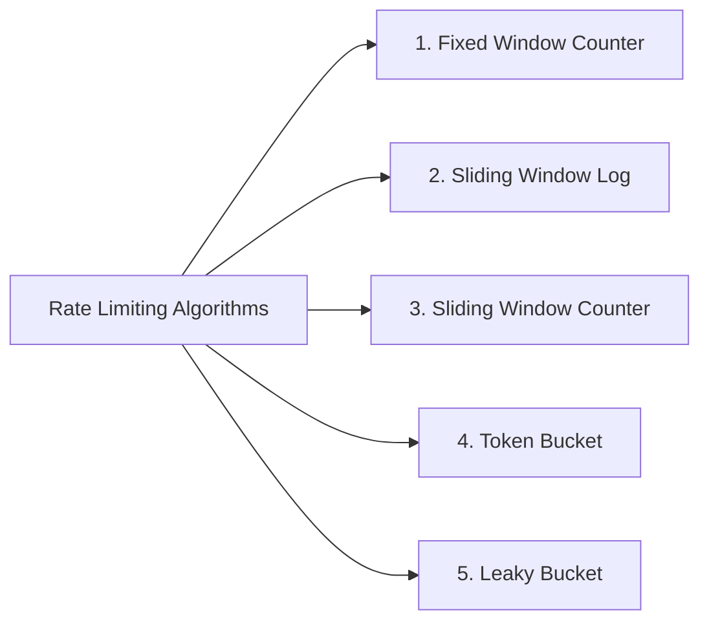
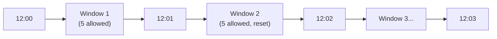
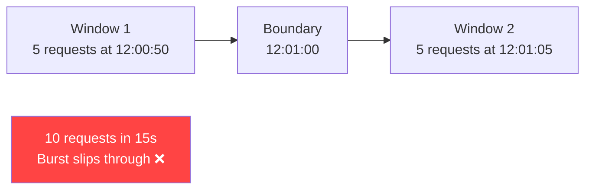
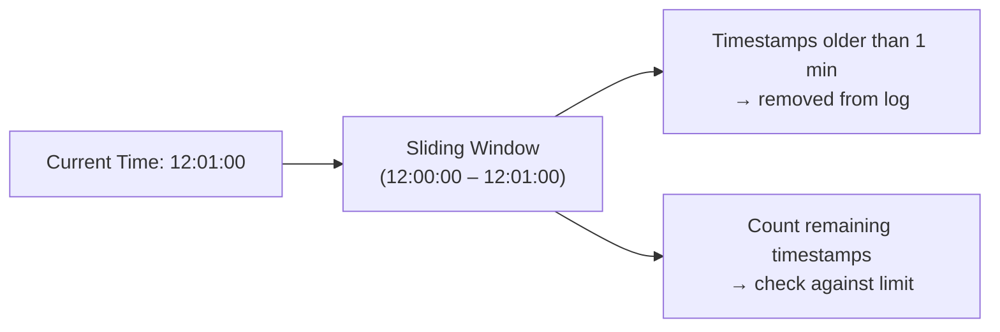
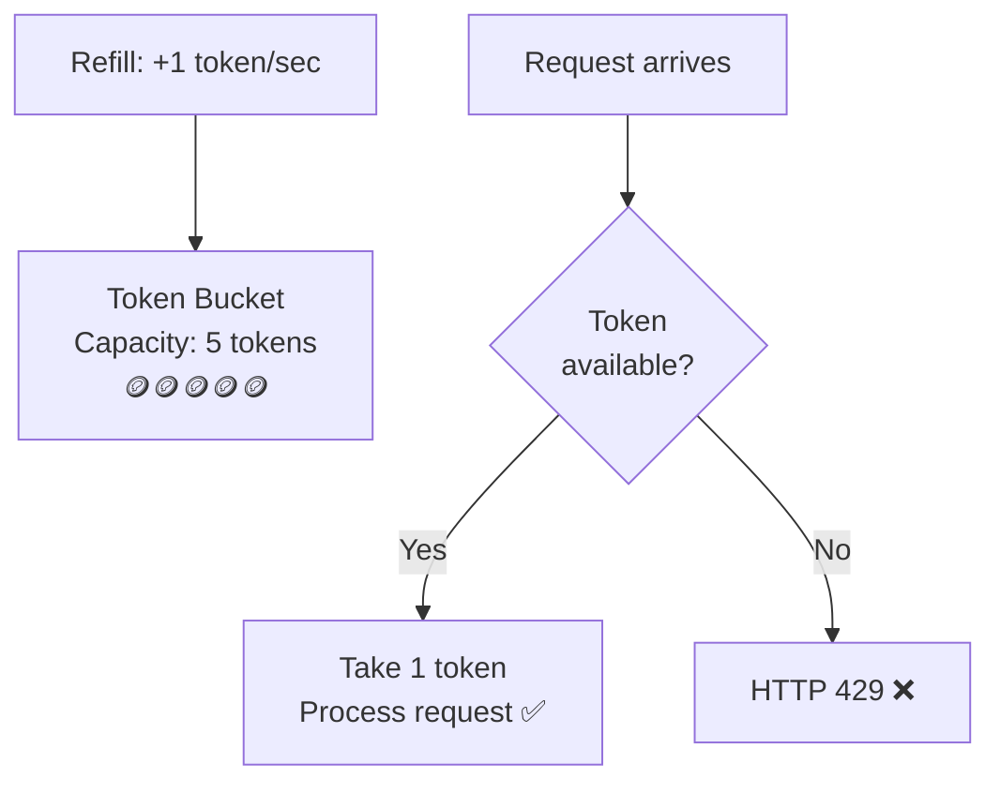
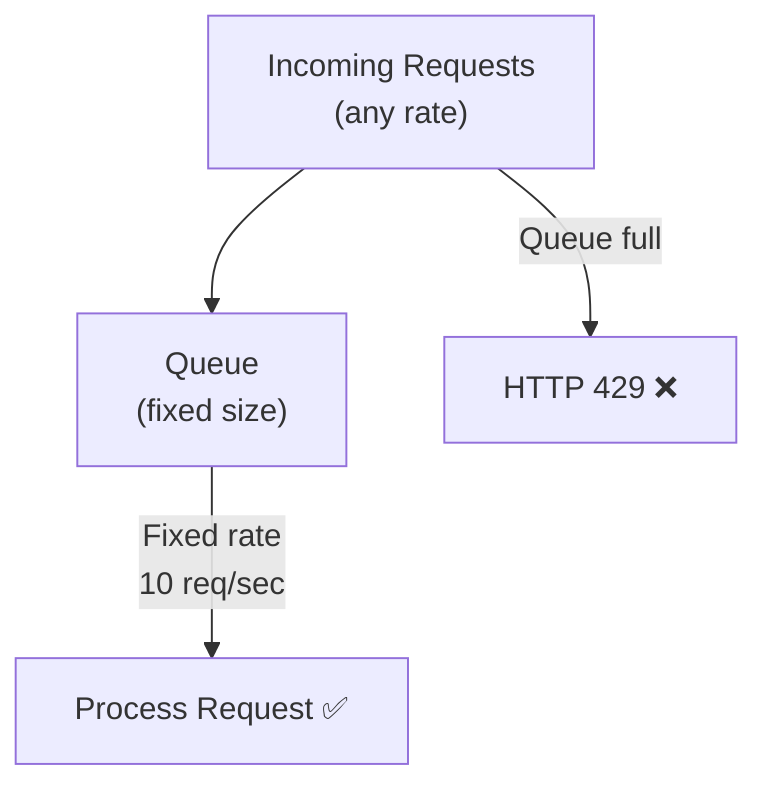
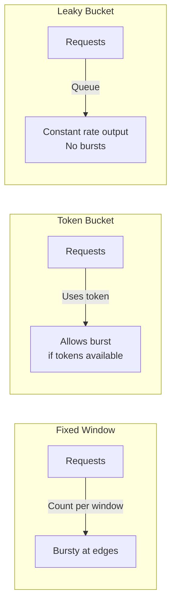
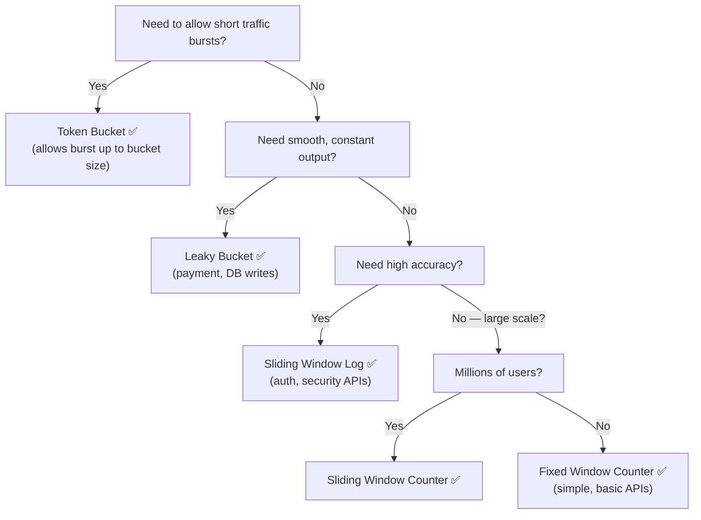

# ⚙️ Rate Limiting Algorithms

The algorithm determines **HOW** request counts are maintained and enforced over time.

---

## Overview



---

## 1. Fixed Window Counter

### Idea
- Count requests in a **fixed time interval**
- Counter resets when the interval ends

### How it Works

```
Limit = 5 Requests / Minute

12:00 – 12:01
  Request 1 → ✅ Allowed (count: 1)
  Request 2 → ✅ Allowed (count: 2)
  Request 3 → ✅ Allowed (count: 3)
  Request 4 → ✅ Allowed (count: 4)
  Request 5 → ✅ Allowed (count: 5)
  Request 6 → ❌ HTTP 429

12:01 – 12:02
  Counter resets to 0 → Requests allowed again
```



### ❌ The Boundary Burst Problem

```
12:00:50 → 5 requests (end of Window 1)
12:01:05 → 5 more requests (start of Window 2)

= 10 requests in 15 seconds — but limit is 5/min!
```



### ✅ Advantages
- Simple to implement
- Fast (just increment a counter)
- Low memory usage

### ❌ Disadvantages
- **Boundary burst problem** — users can double the rate at window boundaries

### Best Used For
- Basic APIs, internal services, simple applications

---

## 2. Sliding Window Log

### Idea
- Store the **timestamp of every request**
- Count requests in the **last N seconds** (sliding window)

### How it Works

```
Limit = 5 Requests / Minute
Current Time = 12:01:00

Check requests between: 12:00:00 → 12:01:00

Stored timestamps:
  12:00:10 ✅ (within window)
  12:00:25 ✅
  12:00:40 ✅
  12:00:55 ✅ (4 total — allow next request)
  12:01:00 ✅ (5 total — allow, then block)
```



### ✅ Advantages
- Very accurate
- Solves the boundary burst problem completely

### ❌ Disadvantages
- **High memory usage** — stores every request timestamp
- For high-traffic APIs, the log can become very large

### Data Structure
**Queue / Deque (FIFO)** — old timestamps are dropped from the front.

### Best Used For
- Authentication APIs, payment APIs, security-sensitive systems

---

## 3. Sliding Window Counter

### Idea
An **optimized version of Sliding Window Log** that uses an estimate instead of exact timestamps.

Stores only:
- **Previous window count**
- **Current window count**

### Formula

```
Estimated request count =
    (Previous window count × overlap fraction)
  + Current window count

where overlap fraction = how much of the previous window
                         overlaps the current sliding window
```

### Example

```
Limit = 10 requests / minute
Previous window (12:00 – 12:01): 8 requests
Current window  (12:01 – 12:02): 3 requests
Current time: 12:01:45 (75% into current window → 25% overlap with previous)

Estimate = (8 × 0.25) + 3 = 2 + 3 = 5 requests → ✅ Under limit
```

### ✅ Advantages
- Low memory usage (only stores 2 counters)
- Better scalability
- Nearly as accurate as Sliding Window Log

### ❌ Disadvantages
- Approximate (not 100% accurate — uses estimation)

### Best Used For
- Large-scale distributed systems, APIs with millions of users

---

## 4. Token Bucket ⭐ Most Common in Production

### Idea
- A **bucket** holds tokens
- Each request **consumes one token**
- Tokens **refill at a fixed rate**
- No token available → **reject request**

### How it Works



### Example

```
Bucket Capacity = 5 Tokens
Refill Rate     = 1 token / second

Start: [🪙🪙🪙🪙🪙] 5 tokens

Request 1 → use token → [🪙🪙🪙🪙] 4 tokens ✅
Request 2 → use token → [🪙🪙🪙] 3 tokens ✅
Request 3 → use token → [🪙🪙] 2 tokens ✅
...
Request 5 → use token → [] 0 tokens ✅
Request 6 → NO TOKEN → HTTP 429 ❌

Wait 1 second → [🪙] refilled → Request allowed ✅
```

### Key Property: **Allows Bursts**
If no requests come for 5 seconds, the bucket fills up to capacity (5 tokens). The next burst of 5 requests is served instantly.

### ✅ Advantages
- Allows **short traffic bursts** (bucket fills up during quiet periods)
- Low memory usage (just a counter + timestamp)
- Widely used in production (AWS, Stripe, etc.)

### ❌ Disadvantages
- Burst traffic is still allowed (may not be desired for all APIs)

### Best Used For
- Public APIs, AI APIs, cloud services, API Gateways

---

## 5. Leaky Bucket

### Idea
- Incoming requests are stored in a **queue**
- Requests are **processed at a fixed, constant rate**
- If the queue is full, new requests are **rejected**

### How it Works



```
100 requests arrive at once
       ↓
   Queue (max: 100)
       ↓
Process 10 requests / second
(takes 10 seconds to drain)
```

### Key Property: **Smooth, Constant Output Rate**
No matter how many requests arrive, the system processes them at a **fixed, steady rate**.

### ✅ Advantages
- **Smooth traffic** — no bursty load on backend
- Prevents sudden spikes from hitting the server
- Stable, predictable server load

### ❌ Disadvantages
- **Does not allow bursts** — even legitimate spikes get queued/rejected
- Requests may wait in the queue (adds latency)

### Best Used For
- Payment systems, database writes, messaging systems, background job processing

---

## Algorithm Comparison

| Algorithm | Memory | Accuracy | Bursts | Best For |
|-----------|--------|----------|--------|---------|
| **Fixed Window** | Low | Medium | ❌ Boundary bursts | Simple APIs |
| **Sliding Window Log** | High | Exact | ❌ No | Auth, Payment APIs |
| **Sliding Window Counter** | Low | ~Accurate | ❌ No | Large-scale distributed |
| **Token Bucket** | Low | Good | ✅ Yes | Public APIs, cloud services |
| **Leaky Bucket** | Medium | Good | ❌ No | Payment, DB writes |

---

## Visual Comparison



---

## Quick Decision Guide



---

## 💡 30-Second Interview Answer

> The main rate limiting algorithms are: **Fixed Window** (simple but has boundary burst issues), **Sliding Window Log** (most accurate but high memory), **Sliding Window Counter** (memory-efficient estimate), **Token Bucket** (allows bursts — most popular in production), and **Leaky Bucket** (smooth constant rate — ideal for payment/DB systems).

---

## 🔑 Key Interview Points

- **Fixed Window** — simple, fast, boundary burst problem
- **Sliding Window Log** — most accurate; high memory; solves boundary issue
- **Sliding Window Counter** — approximate; low memory; scalable
- **Token Bucket** — allows bursts; widely used (AWS, Stripe); ⭐ most common
- **Leaky Bucket** — no bursts; smooth constant rate; payment systems

---

## 🔗 Related Topics

- [Rate Limiting Basics](./rate-limiting-basics.md) — What, why, and distributed implementation
