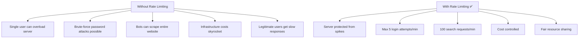
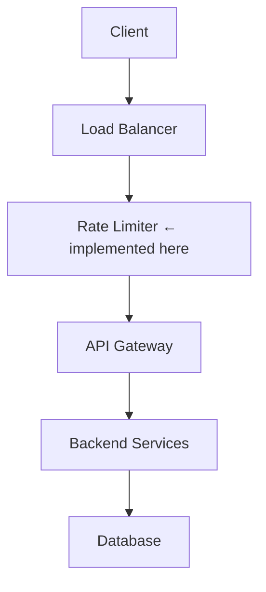
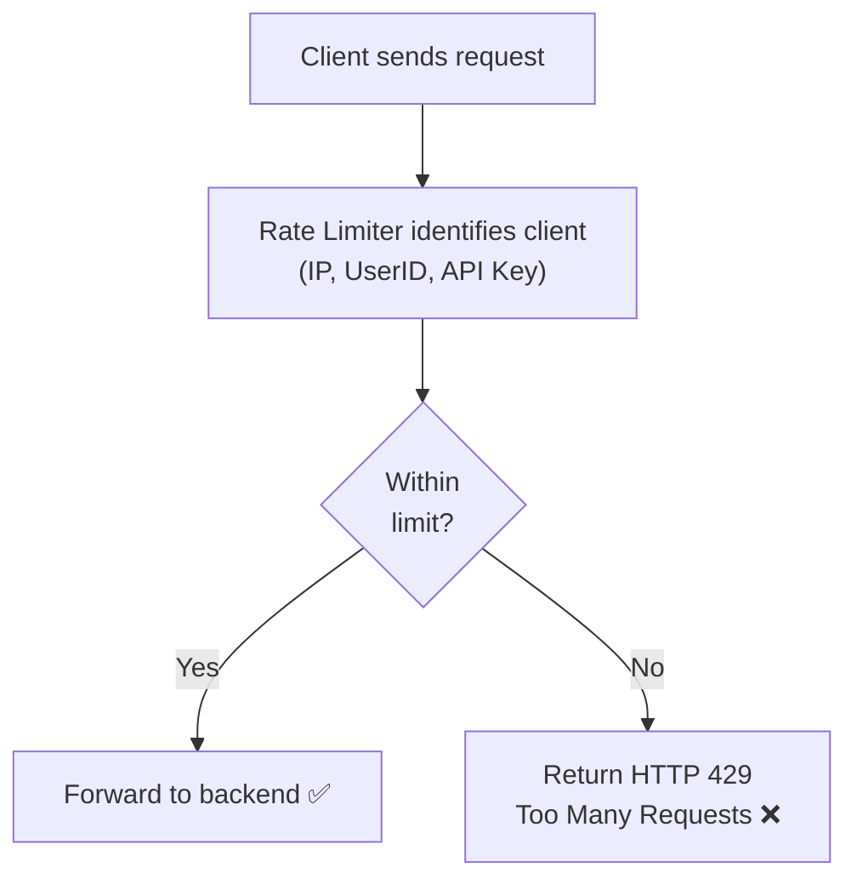
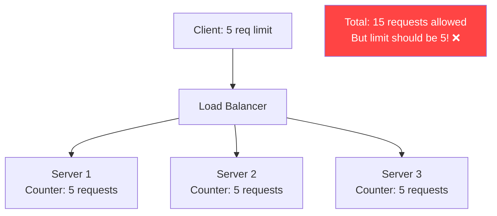
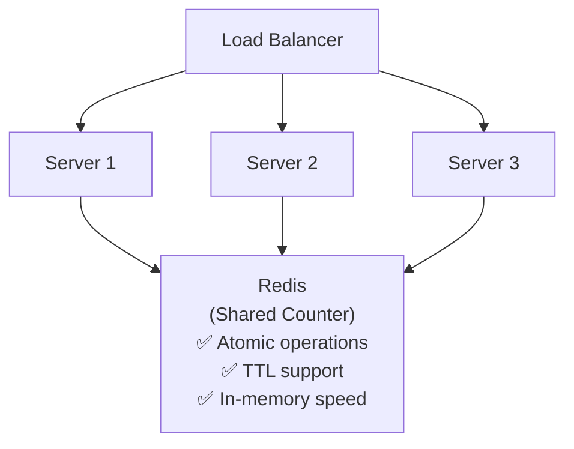
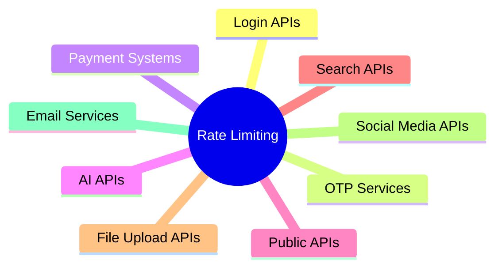

# 🛡️ Rate Limiting

**Rate Limiting** is a technique used to control the **number of requests a client can make within a specified time period**. It protects servers from overload, abuse, and malicious attacks.

---

## What is Rate Limiting?

```
Limit = 100 Requests / Minute

Requests 1–100  → ✅ Allowed
Request 101     → ❌ HTTP 429 Too Many Requests
```

---

## Why Do We Need Rate Limiting?



---

## Problems Rate Limiting Solves

### 1. Prevents Server Overload
Protects CPU, Memory, and Database resources. Prevents traffic spikes from crashing the system.

### 2. Prevents Brute Force Attacks
```
POST /login

Without rate limiting:
  Attacker tries millions of passwords

With rate limiting:
  Only 5 login attempts per minute ✅
```

### 3. Prevents API Abuse
```
Search API

Without limits: Bots scrape the entire website
With limits:    100 requests/minute
```

### 4. Controls Infrastructure Cost
```
AI APIs, SMS APIs, Email APIs
Each request has a cost.
Rate Limiting prevents excessive usage.
```

### 5. Fair Resource Sharing
Ensures one user cannot consume all server resources. Every client gets a fair share.

---

## Real-World Rate Limiting Examples

| API | Limit |
|-----|-------|
| Login API | 5 attempts / minute |
| OTP API | 3 requests / hour |
| Payment API | 10 requests / minute |
| Search API | 100 searches / minute |
| ChatGPT API | RPM (requests/min) + TPM (tokens/min) |
| File Upload | Limit per hour/day |

---

## Where is Rate Limiting Implemented?



**Why before the backend?**
- Reject unwanted requests early
- Save CPU cycles
- Reduce database load
- Improve overall system performance

---

## How Rate Limiting Works



---

## How Does the Server Identify Users?

| Method | Example | When Used |
|--------|---------|-----------|
| **IP Address** | `192.168.x.x` | Anonymous users |
| **User ID** | `user_123` | After login |
| **API Key** | `sk-abc123` | Public API access |
| **JWT Token** | `Bearer eyJ...` | Authenticated apps |
| **Device ID** | `device_abc` | Mobile apps |

---

## HTTP Response When Limit Exceeded

```http
HTTP/1.1 429 Too Many Requests
Retry-After: 60

{
  "error": "Rate limit exceeded",
  "message": "Try again in 60 seconds"
}
```

---

## Distributed Rate Limiting

### The Problem

With multiple servers, each maintaining its own counter:



### The Solution — Shared Redis Counter



Every server checks the **same request count** in Redis.

### Redis Key Structure

```
Key:   user123
Value: 4  (current request count)
TTL:   60 seconds

After 60 seconds → counter resets automatically
```

---

## Rate Limiting Algorithms Overview

| Algorithm | Mechanism | Best For |
|-----------|-----------|---------|
| **Fixed Window Counter** | Count in fixed time window | Simple APIs |
| **Sliding Window Log** | Track exact timestamps | Security-sensitive |
| **Sliding Window Counter** | Estimate with window overlap | Large-scale distributed |
| **Token Bucket** | Tokens refill at fixed rate | Public APIs, bursts allowed |
| **Leaky Bucket** | Fixed outflow rate | Payment systems, smooth traffic |

> See [Algorithms](./algorithms.md) for detailed explanations of each.

---

## ✅ Advantages

- Protects servers from overload
- Prevents abuse and brute-force attacks
- Ensures fairness among users
- Improves availability
- Controls infrastructure cost
- Prevents sudden traffic spikes

---

## ❌ Disadvantages

- Legitimate users may occasionally be throttled
- Wrong algorithm choice can cause unfair limits
- Distributed implementation adds complexity (requires Redis)

---

## Common Use Cases



---

## 💡 30-Second Interview Answer

> **Rate Limiting** controls how many requests a client can make in a given time period. It protects servers from overload and abuse by returning **HTTP 429** when limits are exceeded. In distributed systems, a shared **Redis** instance is used as the counter store so all servers apply the same limit. Common algorithms include **Token Bucket** (allows bursts) and **Sliding Window** (most accurate).

---

## 🔑 Key Interview Points

- Rate limiting controls **request frequency** within a time window
- Common response: **HTTP 429 Too Many Requests**
- **Redis** is used for **distributed rate limiting** (shared atomic counter)
- Implemented **before** backend services (at load balancer or API gateway level)
- Clients identified by: IP, UserID, API Key, JWT, Device ID
- `Retry-After` header tells clients when to retry

---

## 🔗 Related Topics

- [Algorithms](./algorithms.md) — Fixed Window, Sliding Window, Token Bucket, Leaky Bucket
- [Load Balancer](../02-load-balancing/load-balancer.md) — Rate limiting often sits here
- [Caching Basics](../04-caching/caching-basics.md) — Redis also used for caching
