# 🔁 Consistent Hashing

**Consistent Hashing** is a distributed hashing technique that minimizes the number of keys that need to be remapped when servers are added or removed from a cluster.

It is one of the most important concepts in distributed systems design and is used by systems like **Amazon DynamoDB, Apache Cassandra, Akamai CDN, and Discord**.

---

## The Problem — Why Normal Hashing Fails

### Normal (Modulo) Hashing

In a typical distributed cache or database, we use a simple formula to decide which server stores a key:

```
Server = hash(key) % number_of_servers
```

### Example — 3 Servers

```
Server = hash(key) % 3

hash("user:101") % 3 = 1  → Server 1
hash("user:202") % 3 = 2  → Server 2
hash("user:303") % 3 = 0  → Server 0
```

This works fine — until you add or remove a server.

---

## The Massive Rehashing Problem

### Adding a 4th Server

```
Server = hash(key) % 4   ← denominator changed!

hash("user:101") % 4 = 1  → Server 1  (same ✅)
hash("user:202") % 4 = 2  → Server 2  (same ✅)
hash("user:303") % 4 = 3  → Server 3  (DIFFERENT ❌)
hash("user:404") % 4 = 0  → Server 0  (DIFFERENT ❌)
```

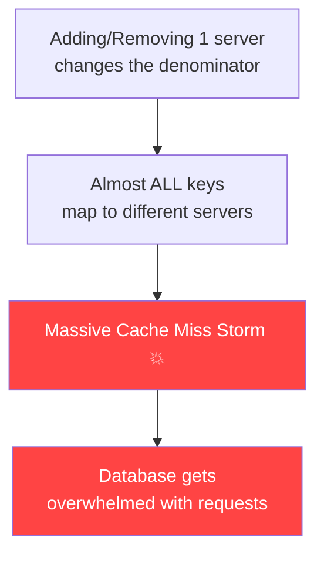

**With N servers:** Adding or removing one server causes **~(N-1)/N ≈ 75–90%** of all keys to be remapped.

This is catastrophic for large distributed caches — it's called a **Cache Miss Storm** or **Thundering Herd**.

---

## The Solution — Consistent Hashing

Consistent Hashing uses a **hash ring** (a circular hash space) to map both servers **and** keys to the same space.

When a server is added or removed, only a **small fraction** of keys need to be remapped.

---

## How Consistent Hashing Works

### Step 1 — Create a Hash Ring

Imagine a circular ring from `0` to `2^32 - 1` (or `0` to `360` for simplicity):

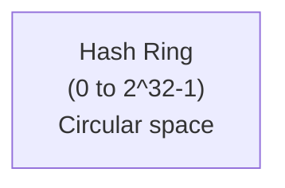

```
         0
    345     15
  330           30
315               45
300               60
285               75
  270           90
    255     105
         180
```

### Step 2 — Place Servers on the Ring

Each server is hashed and placed at a position on the ring:

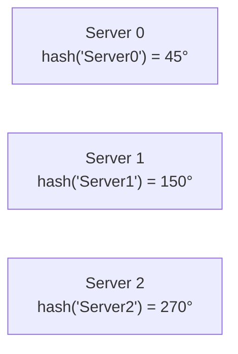

```
              0
         ┌────────┐
    345  │        │  45  ← Server 0
         │        │
  330    │        │   60
         │  Ring  │
315      │        │  90
         │        │
300      │        │  120
         │        │
  285    │        │  150 ← Server 1
    270  └────────┘  180
       ↑
    Server 2
```

### Step 3 — Place Keys on the Ring

Keys are also hashed to positions on the ring:

```
hash("user:101") = 80°
hash("user:202") = 200°
hash("user:303") = 320°
```

### Step 4 — Assign Keys to Servers

**Rule:** Each key is assigned to the **first server encountered by moving clockwise** from the key's position.

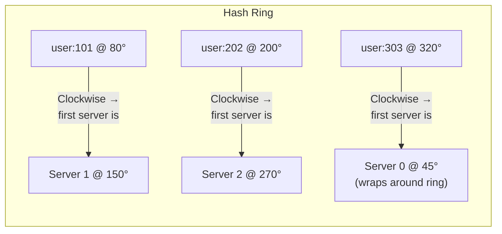

```
Position 80°  (user:101) → clockwise → Server 1 at 150°  ✅
Position 200° (user:202) → clockwise → Server 2 at 270°  ✅
Position 320° (user:303) → clockwise → wraps → Server 0 at 45°  ✅
```

---

## Adding a Server — Only a Small Fraction Remapped

Now add **Server 3** at position `100°`:

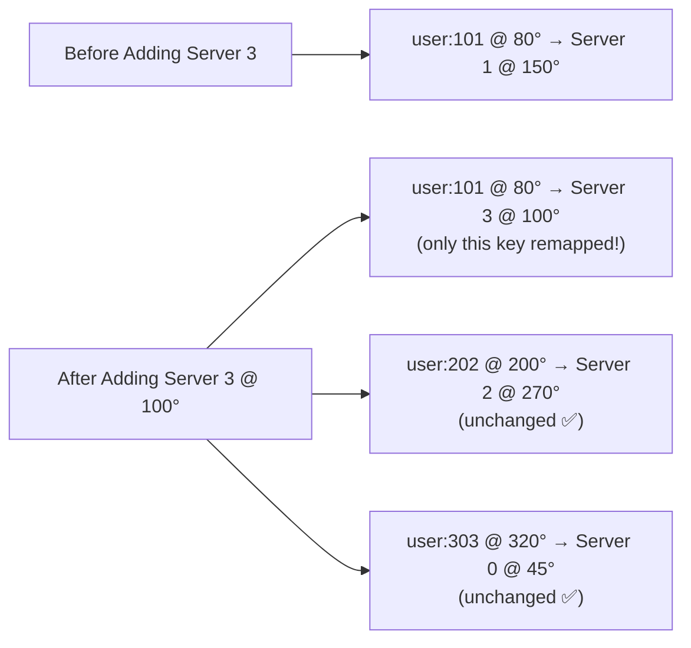

**Only the keys between 45° and 100° move from Server 1 to Server 3.**

Everything else stays the same!

---

## Removing a Server — Same Minimal Impact

If **Server 1 at 150°** is removed:

```
Keys that were on Server 1 (between 100° and 150°)
→ move to next server clockwise: Server 2 at 270°

All other keys: unchanged ✅
```

---

## Comparing Normal Hashing vs Consistent Hashing

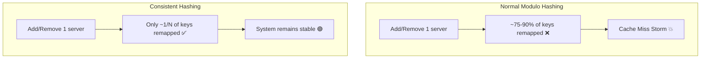

| Scenario | Normal Hashing | Consistent Hashing |
|----------|---------------|-------------------|
| Add 1 server to 4 | ~75% keys remapped ❌ | ~20% keys remapped ✅ |
| Remove 1 server of 4 | ~75% keys remapped ❌ | ~25% keys remapped ✅ |
| No change | 0% remapped ✅ | 0% remapped ✅ |

---

## The Problem with Basic Consistent Hashing — Uneven Distribution

With only 3 servers, their positions on the ring may be unevenly spaced:

```
Server 0 @ 45°    │← 305° gap →│ Server 2 @ 350°
Server 1 @ 50°    │← 5° gap   →│
Server 2 @ 350°   │← 260° gap →│ Server 1 @ 50° (next)
```

Server 0 handles only 5° of the ring while Server 2 handles 260°!

This causes **uneven load distribution** — a "hot server" problem.

---

## Virtual Nodes (VNodes) — The Fix

**Virtual Nodes** solve uneven distribution by placing **each server multiple times** on the ring using different hash values.

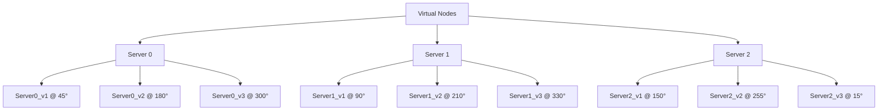

### Result

```
Ring positions (sorted):
 15° → Server 2    │
 45° → Server 0    │ Each server gets ~equal
 90° → Server 1    │ portions of the ring
150° → Server 2    │ due to interleaving
180° → Server 0    │
210° → Server 1    │
255° → Server 2    │
300° → Server 0    │
330° → Server 1    │
```

### Effect of VNodes

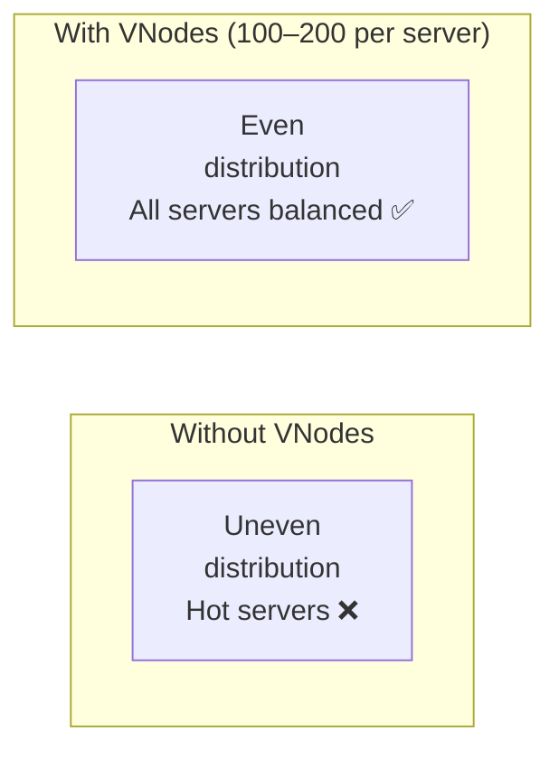

> **Production systems** typically use **100–200 virtual nodes per physical server**. This makes distribution statistically very even.

---

## Consistent Hashing Data Flow

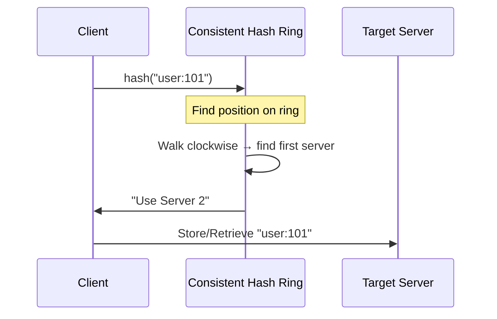

---

## Full Architecture

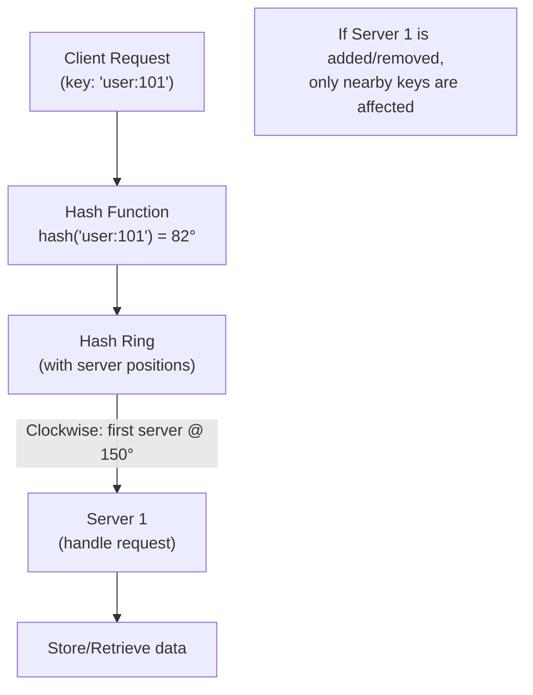

---

## Replication with Consistent Hashing

For fault tolerance, a key is often stored on **multiple consecutive servers** on the ring:

```
hash("user:101") = 80°

Replicas:
  Primary:   Server 1 @ 150°  (first clockwise)
  Replica 1: Server 2 @ 270°  (second clockwise)
  Replica 2: Server 0 @ 45°   (third clockwise, wraps)
```

This is exactly how **Apache Cassandra** and **Amazon DynamoDB** manage replication.

---

## ✅ Advantages of Consistent Hashing

| Advantage | Description |
|-----------|-------------|
| **Minimal Remapping** | Only ~1/N keys remapped when adding/removing a server |
| **No Cache Miss Storm** | System remains stable during scaling |
| **Horizontal Scaling** | Add servers with minimal disruption |
| **Fault Tolerance** | Remove failed servers gracefully |
| **Even Distribution** | Virtual nodes ensure balanced load |
| **Predictable Performance** | No thundering herd problem |

---

## ❌ Disadvantages

| Disadvantage | Description |
|-------------|-------------|
| **More Complex** | Harder to implement than simple modulo hashing |
| **Hotspots without VNodes** | Basic version without VNodes causes uneven distribution |
| **VNode overhead** | Many VNodes increase metadata to track |
| **Not perfectly uniform** | VNodes approximate uniformity, not guarantee it |

---

## Real-World Use Cases

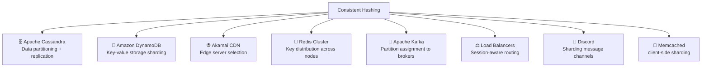

### How Cassandra Uses It

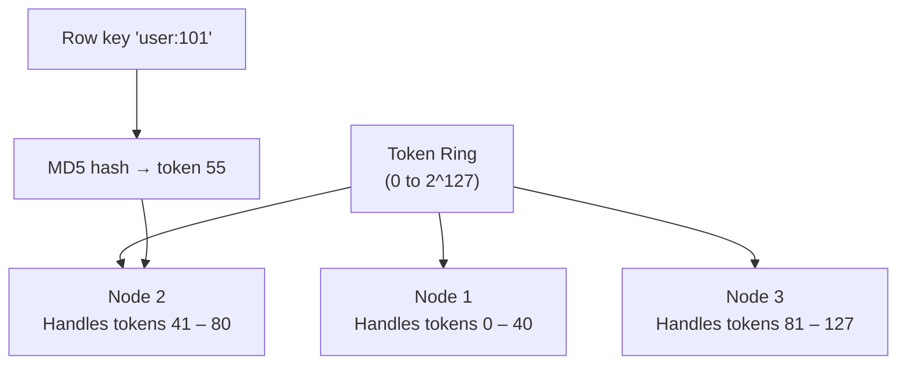

Each node in Cassandra owns a **token range** on the ring. Data is replicated to the next N nodes clockwise (replication factor).

---

## Consistent Hashing vs Other Techniques

| Feature | Modulo Hashing | Consistent Hashing | Sharding |
|---------|---------------|-------------------|---------|
| Keys remapped on change | ~75-90% | ~1/N | Manual config |
| Horizontal scaling | ❌ Disruptive | ✅ Smooth | ✅ But complex |
| Even distribution | ✅ Good | ✅ Good (with VNodes) | Depends on key |
| Implementation | Simple | Medium | Complex |
| Used In | Simple systems | Distributed caches/DBs | Large OLTP systems |

---

## Common Interview Questions

### Q: Why not just use modulo hashing?

> When servers are added or removed, modulo hashing causes the majority of keys to be remapped to different servers. For a distributed cache, this triggers a massive cache miss storm where all clients hit the database simultaneously. Consistent hashing limits remapping to only ~1/N keys.

### Q: What is a Virtual Node and why is it needed?

> A virtual node is a logical copy of a physical server placed at multiple positions on the hash ring. Without virtual nodes, servers may occupy uneven portions of the ring, causing hot spots where one server handles far more traffic than others. With 100–200 virtual nodes per server, load is distributed much more evenly.

### Q: How does Cassandra use consistent hashing?

> Cassandra maps each row key to a position on a token ring (0 to 2^127). Each node owns a token range. Data is written to the node that owns the token, then replicated to the next N-1 nodes clockwise, where N is the replication factor.

### Q: What happens when a server goes down?

> Only the keys that were assigned to that server need to be handled differently. Those keys move to the next server clockwise on the ring. All other keys remain on their current servers — no global rehashing occurs.

---

## 💡 30-Second Interview Answer

> **Consistent Hashing** solves the "massive rehashing" problem of modulo hashing. It places both servers and keys on a circular **hash ring**. Each key is assigned to the first server encountered moving clockwise. When a server is added or removed, only **~1/N keys** are remapped (compared to ~75–90% with modulo hashing). **Virtual Nodes** (multiple ring positions per server) ensure even load distribution. It's used by Cassandra, DynamoDB, Redis Cluster, and CDNs.

---

## 🔑 Key Interview Points

- **Problem solved:** Adding/removing a server in modulo hashing remaps ~75-90% of keys → cache miss storm
- **Solution:** Consistent hashing maps servers and keys to a **circular ring**
- **Key assignment:** Walk clockwise from key's position → first server found
- **Adding a server:** Only keys between the new server and its predecessor move
- **Virtual Nodes:** Each server has 100–200 positions on the ring → even distribution
- **Only ~1/N keys remapped** when a server is added/removed
- **Used by:** Cassandra, DynamoDB, Redis Cluster, Akamai CDN, Memcached

---

## 🔗 Related Topics

- [Sharding](../03-databases/sharding.md) — Consistent hashing is one sharding strategy
- [Replication](../03-databases/replication.md) — Often combined with consistent hashing
- [Load Balancer](../02-load-balancing/load-balancer.md) — IP Hash uses a similar ring concept
- [Caching Basics](../04-caching/caching-basics.md) — Consistent hashing used in distributed caches
