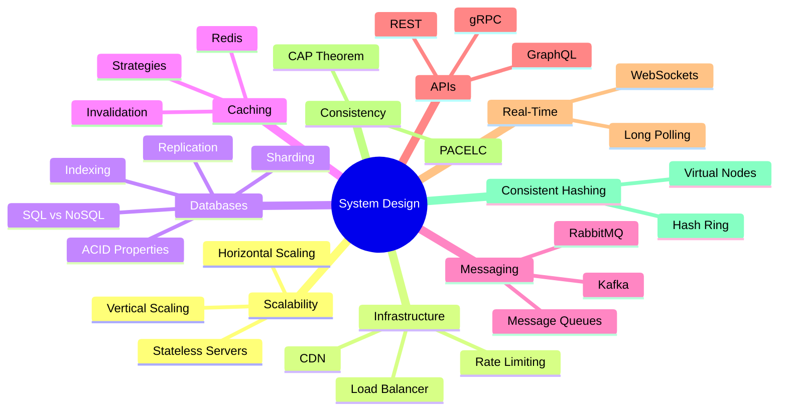

# 📚 System Design Notes

> A comprehensive, structured collection of System Design concepts — curated for backend engineers and interview preparation.

---

## 📖 Table of Contents

### ⚡ Scalability
| Topic | Description |
|-------|-------------|
| [Vertical Scaling](./01-scaling/vertical-scaling.md) | Upgrading a single server's resources |
| [Horizontal Scaling](./01-scaling/horizontal-scaling.md) | Adding more servers to distribute load |
| [Stateless Servers](./01-scaling/stateless-servers.md) | Servers that don't store session state |

### ⚖️ Load Balancing
| Topic | Description |
|-------|-------------|
| [Load Balancer](./02-load-balancing/load-balancer.md) | Distributing requests across servers, algorithms & types |

### 🗄️ Databases
| Topic | Description |
|-------|-------------|
| [SQL vs NoSQL](./03-databases/sql-vs-nosql.md) | Relational vs Non-Relational databases |
| [ACID Properties](./03-databases/acid-properties.md) | Atomicity, Consistency, Isolation, Durability |
| [Indexing](./03-databases/indexing.md) | B-Tree, Hash, Clustered, Composite indexes |
| [Sharding](./03-databases/sharding.md) | Splitting data across multiple databases |
| [Replication](./03-databases/replication.md) | Primary-Replica, Master-Master, Failover |

### 🚀 Caching
| Topic | Description |
|-------|-------------|
| [Caching Basics](./04-caching/caching-basics.md) | Redis, Cache Hit/Miss, cache levels |
| [Cache Strategies](./04-caching/cache-strategies.md) | Cache-Aside, Write-Through, Write-Behind |
| [Cache Invalidation](./04-caching/cache-invalidation.md) | TTL, Event-driven, versioning |

### 📨 Message Queues
| Topic | Description |
|-------|-------------|
| [Message Queue Basics](./05-message-queues/message-queue-basics.md) | Producer, Consumer, Broker, ACK, DLQ |
| [Kafka](./05-message-queues/kafka.md) | Distributed event streaming platform |
| [RabbitMQ](./05-message-queues/rabbitmq.md) | AMQP-based message broker |

### 🌐 CDN
| Topic | Description |
|-------|-------------|
| [Content Delivery Network](./06-cdn/cdn.md) | Edge servers, POP, TTL, cache invalidation |

### 🔄 Consistency
| Topic | Description |
|-------|-------------|
| [Consistency Models](./07-consistency/consistency.md) | Strong vs Eventual, CAP Theorem, PACELC |

### 🔌 API Design
| Topic | Description |
|-------|-------------|
| [REST](./08-api-design/rest.md) | Resource-based API architecture |
| [GraphQL](./08-api-design/graphql.md) | Query language for APIs |
| [gRPC](./08-api-design/grpc.md) | Google Remote Procedure Call |
| [API Comparison](./08-api-design/api-comparison.md) | REST vs GraphQL vs gRPC full comparison |

### 📡 Real-Time Communication
| Topic | Description |
|-------|-------------|
| [WebSockets](./09-realtime-communication/websockets.md) | Persistent two-way communication |
| [Long Polling](./09-realtime-communication/long-polling.md) | HTTP-based near real-time technique |
| [Real-Time Comparison](./09-realtime-communication/realtime-comparison.md) | Full comparison table |

### 🛡️ Rate Limiting
| Topic | Description |
|-------|-------------|
| [Rate Limiting Basics](./10-rate-limiting/rate-limiting-basics.md) | Concepts, use cases, distributed limiting |
| [Algorithms](./10-rate-limiting/algorithms.md) | Fixed Window, Sliding Window, Token Bucket, Leaky Bucket |

### 🔁 Consistent Hashing
| Topic | Description |
|-------|-------------|
| [Consistent Hashing](./11-consistent-hashing/consistent-hashing.md) | Hash ring, virtual nodes, minimal remapping |

---

## 🗺️ System Design Concept Map



---

## ⭐ Quick Interview Cheat Sheet

### Scaling Decision
```
Traffic increasing?
├── Small/Medium App → Vertical Scaling (upgrade server)
└── Large Scale App  → Horizontal Scaling (add servers + Load Balancer)
```

### Database Decision
```
Need strong consistency + relationships? → SQL (MySQL, PostgreSQL)
Need flexible schema + horizontal scale? → NoSQL (MongoDB, Cassandra, Redis)
```

### API Decision
```
Public API / CRUD?           → REST
Mobile app / complex UI?     → GraphQL
Internal microservices?      → gRPC
Real-time chat/gaming?       → WebSockets
Legacy real-time?            → Long Polling
```

### Queue Decision
```
Event streaming / analytics? → Kafka
Background jobs / routing?   → RabbitMQ
Managed cloud queue?         → Amazon SQS / Google Pub/Sub
```

### Hashing Decision
```
Distributing keys across servers? → Consistent Hashing
  Adding/removing servers often?    → Virtual Nodes (100-200 per server)
  Simple static setup?              → Modulo Hashing
```

---

## 📝 Notes

- All diagrams use [Mermaid](https://mermaid.js.org/) and render natively on GitHub
- Each file includes a **30-second interview summary** and **key interview points**
- Topics are cross-linked for easy navigation

---

*Last Updated: 2026 | System Design Interview Preparation*
